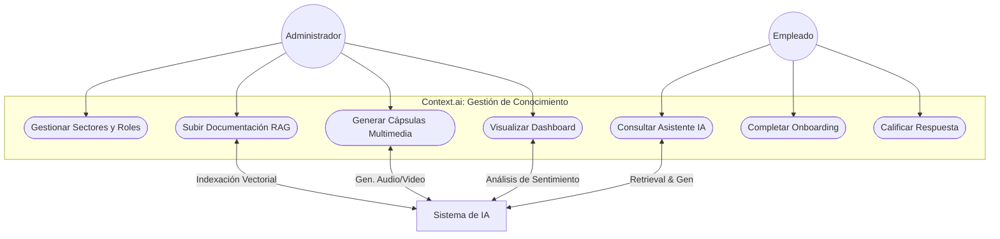

# Diseño de Software: Diagrama de Casos de Uso - Context.ai
---

### 1. Actores del Sistema

1.  **Administrador de Contenido (RRHH/Gestión)**: Usuario responsable de la gestión de la base de conocimiento y la supervisión del feedback.
2.  **Consumidor de Contenido (Empleado/Nuevo Integrante)**: Usuario final que interactúa con la IA para su formación y resolución de dudas.
3.  **Sistema de IA (Actor de Soporte)**: Entidad técnica que procesa el RAG, genera contenido multimedia y realiza el análisis de sentimiento.

---

### 2. Diagrama de Casos de Uso (Mermaid)

---

### 3. Descripción de Casos de Uso Clave

UC1 - Gestionar Sectores y Roles:
Aislamiento de la Información: Permite crear compartimentos para los distintos departamentos de tu startup (RRHH, Tech, Ventas, etc.).

Seguridad y Control de Acceso (RBAC): Es el punto de partida para implementar el control de acceso basado en roles, asegurando que un usuario solo pueda consultar la base de conocimiento de su sector, cumpliendo con los principios de Security by Design.

Contextualización del RAG: Define los límites sobre los cuales el motor de IA (Gemini 1.5 Pro) realizará las búsquedas, evitando que la IA mezcle información de áreas irrelevantes para el usuario.

Lógica de Aplicación: En términos de Clean Architecture, este caso de uso representa la lógica central que orquesta quién tiene permiso para ver qué información.

UC2 - Subir Documentación (RAG): El administrador carga archivos (PDF, MD) que el Sistema de IA procesa para generar embeddings vectoriales, permitiendo una recuperación de información precisa.

UC3 - Generar Cápsulas Multimedia: A partir de la documentación, la IA genera guiones y contenido multimedia (audio/video) para dinamizar el onboarding.

UC5 - Consultar Asistente de IA: El empleado realiza consultas en lenguaje natural. El sistema orquesta la búsqueda en el sector correspondiente para ofrecer una respuesta contextualizada.

UC4 - Visualizar Dashboard de Sentimiento: Proporciona a los administradores una visión analítica del estado de ánimo y las dudas de los empleados, permitiendo la mejora continua de los contenidos.

### Detalle de Casos de Uso de Usuario Final

#### **UC6 - Completar Itinerario Onboarding**
* **Descripción**: El nuevo empleado sigue una ruta de aprendizaje dinámica compuesta por documentos y contenido multimedia generado por IA.
* **Objetivo de Negocio**: Reducir el *Time-to-Productivity* y asegurar una cultura empresarial unificada.
* **Tecnología**: Frontend en Next.js consumiendo recursos multimedia almacenados en la nube.

#### **UC7 - Calificar Respuesta de IA**
* **Descripción**: Mecanismo de feedback donde el usuario puntúa la utilidad de las respuestas del asistente.
* **Objetivo de Negocio**: Identificar vacíos en la documentación interna y mejorar la precisión del RAG.
* **Tecnología**: Persistencia en PostgreSQL y trigger de análisis para el Dashboard de Calidad.