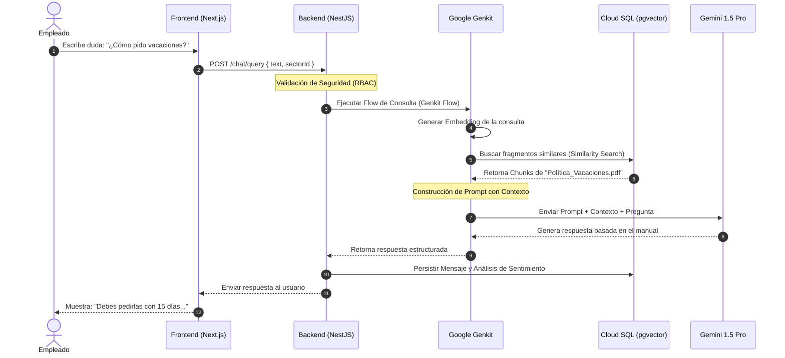

# Detalle del Caso de Uso nº 5: Consultar Asistente de IA

Este caso de uso describe el proceso de Recuperación Generativa Aumentada (RAG) orquestado por Google Genkit para responder dudas del usuario utilizando únicamente la base de conocimiento de su sector.

---

## 1. Definición del Proceso (RAG Flow)

**Actor**: Consumidor (Empleado) o Administrador.

**Propósito**: Resolver dudas específicas sobre procesos, valores o documentación técnica sin recurrir a mentores humanos.

**Precondición**: El usuario debe estar autenticado y tener un sector asignado (ej. "Tech").

---

## 2. Flujo Principal de Pasos (Happy Path)

**a. Entrada de Consulta**: El usuario escribe una duda en la interfaz de chat de Next.js.

**b. Identificación de Contexto**: El backend (NestJS) identifica el `sector_id` del usuario para delimitar la búsqueda.

**c. Generación de Embedding**: La consulta se envía a Google Genkit, que utiliza un modelo de embedding para convertir el texto en un vector numérico.

**d. Búsqueda Semántica**: Se realiza una consulta en Cloud SQL (pgvector) para encontrar los fragmentos (chunks) de documentos más relevantes dentro de ese sector.

**e. Aumentación del Prompt**: Genkit construye un prompt que incluye:
   - Las instrucciones del sistema (System Prompt).
   - Los fragmentos recuperados de la base de datos.
   - La pregunta original del usuario.

**f. Generación de Respuesta**: El modelo procesa el prompt y genera una respuesta basada estrictamente en la información proporcionada para evitar alucinaciones.

**g. Entrega y Trazabilidad**: El sistema muestra la respuesta con sus fuentes y registra la interacción para su posterior evaluación en Sentry/Genkit UI.

---

## 3. Diagrama de Secuencia

---

## 4. Desglose Técnico del Flujo

1. **Entrada y Seguridad**: El proceso comienza con una petición desde Next.js. El backend en NestJS valida que el usuario pertenezca al sector consultado, aplicando principios de Security by Design.

2. **Orquestación con Genkit**: Se utiliza Google Genkit para gestionar el "Flow". Genkit se encarga de llamar al modelo de embeddings y coordinar la búsqueda.

3. **Búsqueda Vectorial (RAG)**: Se realiza una consulta semántica en pgvector filtrando por el `sector_id`. Esto asegura que la IA no "alucine" con información de otros departamentos.

4. **Generación con Modelo**: Gemini 2.5 Flash recibe el contexto recuperado. Gracias a su amplia ventana de contexto, puede procesar múltiples fragmentos para dar una respuesta precisa.

5. **Cierre de Ciclo**: El mensaje se guarda en la base de datos relacional junto con un análisis de sentimiento inicial, preparando los datos para el Dashboard de Calidad.
