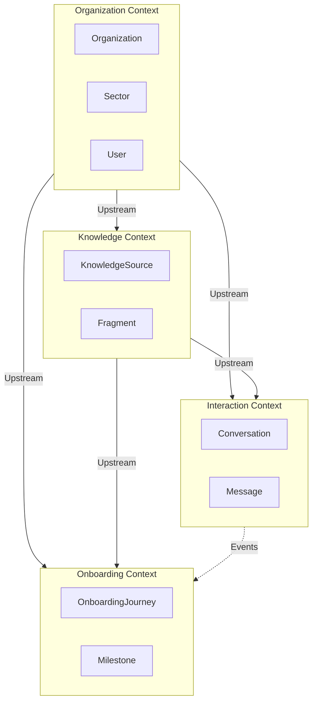
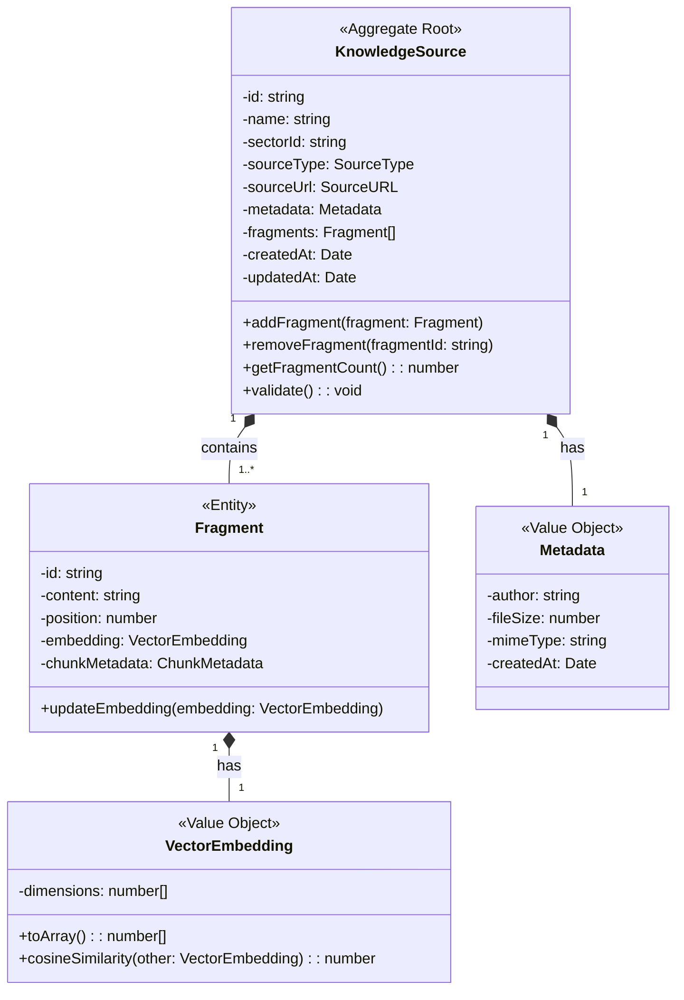
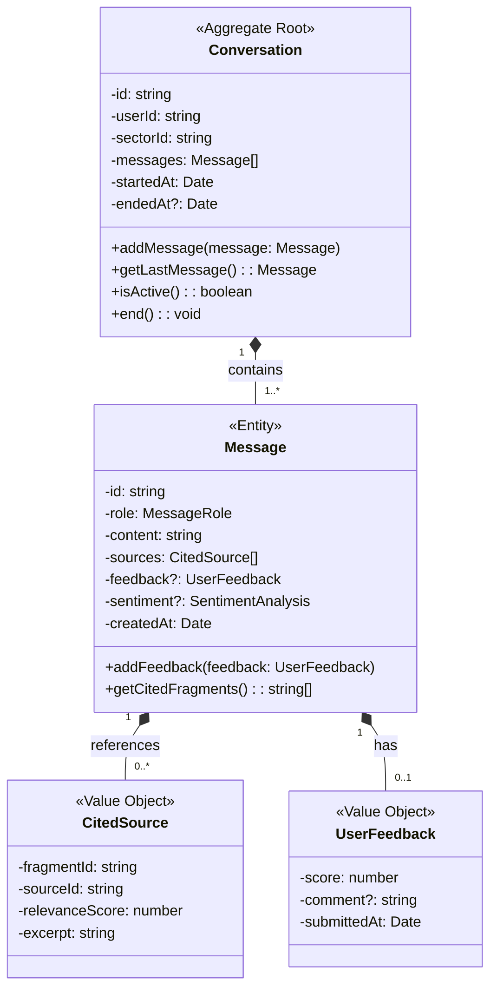
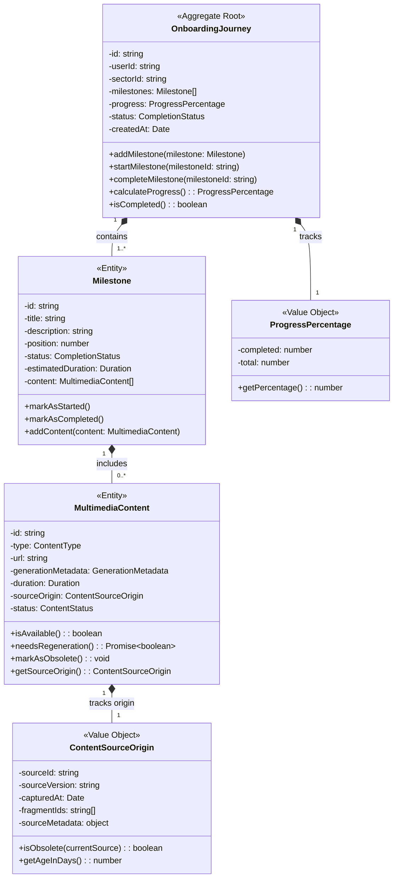
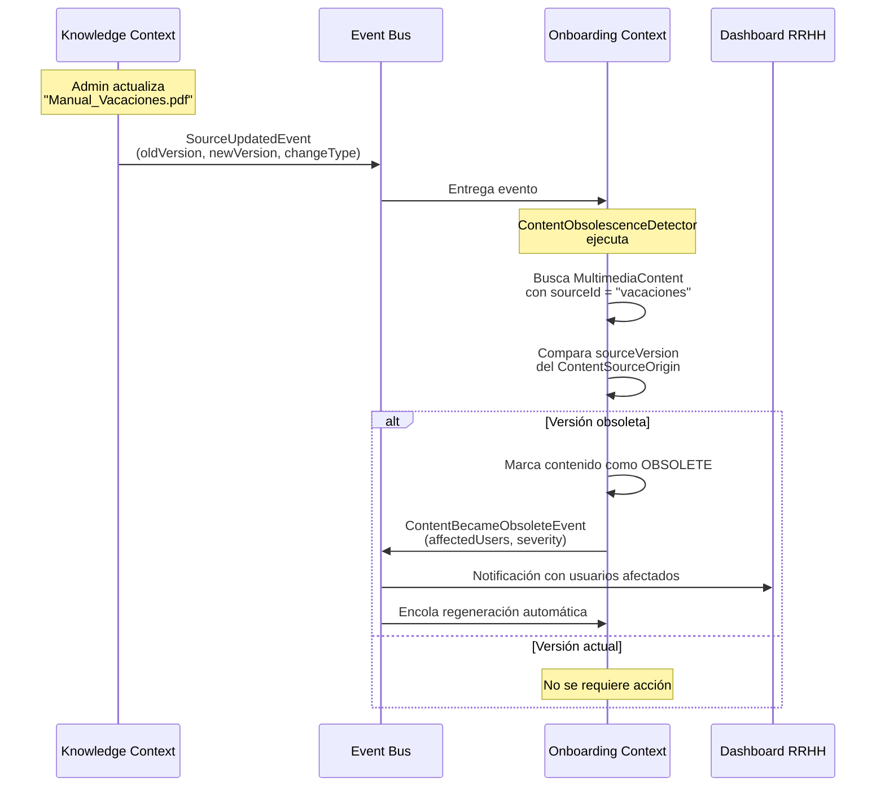

# Domain-Driven Design (DDD) - Context.ai
## Diseño del Dominio del Sistema de Sincronización de Contexto Organizacional

---

## 1. Análisis del Dominio del Problema

El dominio principal no es "chatear con un PDF", sino la **Sincronización de Contexto Organizacional**. El problema real es la pérdida de conocimiento táctico y cultural debido a la rotación y la falta de tiempo en startups.

### Dominio dividido en tres niveles:

**Core Domain (Dominio Principal)**: 
- **Knowledge Management & RAG**: Gestión del conocimiento y recuperación semántica
- **Onboarding Orchestration**: La experiencia de guiar al usuario

**Supporting Subdomain (Subdominio de Soporte)**: 
- **Analytics & Feedback**: Análisis de sentimiento y calidad

**Generic Subdomain (Subdominio Genérico)**: 
- **Identity & Access**: RBAC (Control de acceso basado en roles)
- **Multimedia Generation**: APIs externas de video/audio

---

## 2. Identificación de Bounded Contexts (Contextos Acotados)

### **Organization Context**
Gestiona la estructura de la empresa (Sectores, Roles, Usuarios). Es el contexto que define la organización y los límites de acceso a la información.

### **Knowledge Context**
Se encarga de la ingesta, fragmentación (chunking) y búsqueda vectorial de documentos. Es el corazón del sistema RAG.

### **Onboarding Context**
Orquesta el progreso del empleado, los itinerarios y los contenidos multimedia asociados. Asegura la experiencia de incorporación.

### **Interaction Context (Chat)**
Gestiona la sesión de chat, el historial, el flujo de Genkit y el feedback (puntuaciones). Punto de interacción principal del usuario.

---

## 3. Términos Polisémicos (Ubiquitous Language Challenges)

### **Sector**:
- En **Organization Context**: Es una unidad administrativa de permisos (quién entra aquí).
- En **Knowledge Context**: Es un "namespace" o filtro de búsqueda en la base de datos vectorial.

### **Documento**:
- En **Knowledge Context**: Es una fuente de texto raw para ser procesada.
- En **Onboarding Context**: Es un "hito" o lección que el usuario debe marcar como completada.

### **Rol**:
- En **Organization Context**: Define permisos del sistema (Admin vs User).
- En **Interaction Context**: Define el comportamiento de la IA (System, User, Assistant).

---

## 4. Modelo del Dominio Completo

### **Contexto 1: Organization Context**

**Responsabilidad**: Gestionar la estructura organizacional, usuarios y control de acceso por sectores.

**Aggregate Root**: `Organization` (Empresa/Organización)

**Entities**:
- `Sector` (Departamento o área de conocimiento)
- `User` (Usuario del sistema)
- `UserSectorAssignment` (Asignación de usuario a sector)

**Value Objects**:
- `UserId` (Auth0 sub - identificador externo)
- `Email`
- `SectorName`
- `OrganizationMetadata` (nombre, descripción, logo)

**Domain Events**:
- `OrganizationCreated`: { organizationId, name, timestamp }
- `SectorCreated`: { sectorId, organizationId, name, timestamp }
- `UserAssignedToSector`: { userId, sectorId, assignedBy, timestamp }
- `UserRemovedFromSector`: { userId, sectorId, removedBy, timestamp }

**Invariantes (Reglas de Negocio)**:
- Un Sector debe pertenecer a exactamente una Organización
- Un Usuario puede pertenecer a múltiples Sectores
- No pueden existir dos Sectores con el mismo nombre en una Organización
- Al eliminar un Sector, debe verificarse que no tenga contenido asociado

---

### **Contexto 2: Knowledge Context**

**Responsabilidad**: Ingesta, procesamiento, fragmentación y almacenamiento de documentación para recuperación semántica.

**Aggregate Root**: `KnowledgeSource` (Documento fuente)

**Entities**:
- `Fragment` (Chunk - fragmento del documento)

**Value Objects**:
- `VectorEmbedding` (embedding de 768 dimensiones)
- `Metadata` { author, createdAt, fileSize, mimeType }
- `SourceURL` (URL del documento original)
- `SourceType` enum { PDF, MARKDOWN, WEB_LINK }
- `ChunkMetadata` { position, tokenCount, overlap }

**Domain Events**:
- `SourceIngested`: { sourceId, sectorId, fragmentCount, sourceType, timestamp }
- `SourceUpdated`: { sourceId, sectorId, oldVersion, newVersion, changeType: 'MINOR' | 'MAJOR', timestamp }
- `VectorIndexUpdated`: { sectorId, newFragmentIds, embeddingModel, timestamp }
- `SourceDeleted`: { sourceId, sectorId, fragmentCount, timestamp }
- `IngestionFailed`: { sourceId, errorType, errorMessage, timestamp }

**Domain Services**:
- `ChunkingService`: Fragmentación de documentos (500 tokens, overlap 50)
- `EmbeddingService`: Generación de vectores semánticos
- `DocumentParserService`: Parsing específico por tipo de documento

**Invariantes**:
- Un KnowledgeSource debe tener al menos 1 Fragment
- Cada Fragment debe contener entre 100 y 1000 tokens
- VectorEmbedding debe tener exactamente 768 dimensiones
- Un Fragment no puede existir sin su KnowledgeSource padre
- Eliminar un KnowledgeSource elimina en cascada todos sus Fragments

---

### **Contexto 3: Interaction Context (Chat)**

**Responsabilidad**: Gestión de conversaciones, consultas RAG, historial y feedback del usuario.

**Aggregate Root**: `Conversation` (Conversación/Sesión de Chat)

**Entities**:
- `Message` (Mensaje individual - usuario o asistente)

**Value Objects**:
- `MessageRole` enum { SYSTEM, USER, ASSISTANT }
- `SentimentAnalysis` { score: float, label: "positive" | "neutral" | "negative" }
- `UserFeedback` (Rating) { score: 1-5, comment?: string }
- `CitedSource` { fragmentId, sourceId, relevanceScore }
- `RAGContext` { fragments: Fragment[], query: string, topK: number }

**Domain Events**:
- `ConversationStarted`: { conversationId, userId, sectorId, timestamp }
- `MessageSent`: { conversationId, messageId, role, timestamp }
- `ResponseGenerated`: { conversationId, messageId, sourcesUsed, latency, timestamp }
- `FeedbackReceived`: { conversationId, messageId, rating, sentiment, timestamp }
- `ConversationEnded`: { conversationId, messageCount, duration, timestamp }

**Domain Services**:
- `RAGOrchestrator`: Coordina búsqueda vectorial + generación LLM
- `SentimentAnalysisService`: Analiza el tono de las consultas del usuario
- `PromptBuilder`: Construye el prompt con contexto y fuentes

**Invariantes**:
- Una Conversation debe tener al menos 1 Message (la pregunta inicial del usuario)
- Los Messages deben alternar roles (USER → ASSISTANT → USER...)
- Un Message de tipo ASSISTANT debe tener al menos 1 CitedSource
- UserFeedback solo puede asociarse a Messages de tipo ASSISTANT
- Una Conversation pertenece a un único Sector y Usuario

---

### **Contexto 4: Onboarding Context**

**Responsabilidad**: Orquestar el proceso de incorporación de nuevos empleados mediante itinerarios personalizados con contenido multimedia.

**Aggregate Root**: `OnboardingJourney` (Itinerario de incorporación)

**Entities**:
- `Milestone` (Hito o lección del itinerario)
- `MultimediaContent` (Contenido generado: video, audio, guía)

**Value Objects**:
- `CompletionStatus` enum { NOT_STARTED, IN_PROGRESS, COMPLETED }
- `ProgressPercentage` { completed: number, total: number, percentage: float }
- `ContentType` enum { VIDEO, AUDIO, TEXT_GUIDE, INTERACTIVE_QUIZ }
- `GenerationMetadata` { model: string, prompt: string, generatedAt: Date }
- `Duration` { estimatedMinutes: number }
- `ContentSourceOrigin` { sourceId: string, sourceVersion: string, capturedAt: Date, fragmentIds: string[], sourceMetadata: object }

**Domain Events**:
- `JourneyCreated`: { journeyId, userId, sectorId, milestoneCount, timestamp }
- `MilestoneStarted`: { journeyId, milestoneId, userId, timestamp }
- `MilestoneCompleted`: { journeyId, milestoneId, userId, completionTime, timestamp }
- `ContentGenerated`: { milestoneId, contentType, contentUrl, generationTime, sourceOrigin, timestamp }
- `ContentBecameObsolete`: { contentId, milestoneId, oldSourceVersion, newSourceVersion, affectedUsers, timestamp }
- `JourneyCompleted`: { journeyId, userId, totalDuration, completionRate, timestamp }

**Domain Services**:
- `MultimediaGenerationService`: Orquesta generación de videos/audios via APIs externas
- `ScriptGeneratorService`: Genera guiones a partir de KnowledgeSources
- `ProgressTrackerService`: Calcula y actualiza el progreso del usuario
- `JourneyTemplateFactory`: Crea itinerarios según el rol del usuario
- `ContentObsolescenceDetector`: Detecta contenido obsoleto comparando con KnowledgeSources actuales

**Invariantes**:
- Un OnboardingJourney debe tener al menos 1 Milestone
- Los Milestones tienen un orden secuencial (position: 1, 2, 3...)
- Un Milestone no puede marcarse como COMPLETED sin pasar por IN_PROGRESS
- MultimediaContent debe estar asociado a un Milestone específico
- MultimediaContent debe tener un ContentSourceOrigin válido para trazabilidad
- Un Journey pertenece a un único Usuario y Sector
- No se puede eliminar un Journey si tiene Milestones completados
- Un Journey no puede completarse si contiene MultimediaContent obsoleto

---

## 5. Context Map (Mapa de Relaciones entre Contextos)



### **Patrones de Integración**:

#### **Organization → Knowledge** (Customer-Supplier)
- **Relación**: Organization provee SectorId para aislar conocimiento
- **Integración**: Shared Kernel (`SectorId`)
- **Dirección**: Organization es Upstream, Knowledge es Downstream

#### **Organization → Interaction** (Customer-Supplier)
- **Relación**: Organization provee UserId y SectorId para autorización
- **Integración**: Anticorruption Layer en Interaction
- **Dirección**: Organization es Upstream

#### **Organization → Onboarding** (Customer-Supplier)
- **Relación**: Organization define a quién se asignan itinerarios
- **Integración**: Conformist (Onboarding acepta modelo de Organization)

#### **Knowledge → Interaction** (Conformist)
- **Relación**: Knowledge provee Fragments para el RAG
- **Integración**: Interaction consulta directamente repositorio de Knowledge
- **Dirección**: Knowledge es Upstream, Interaction acepta su modelo

#### **Knowledge → Onboarding** (Partnership + Published Language)
- **Relación**: Onboarding usa KnowledgeSources para generar contenido y debe detectar cuando se vuelven obsoletos
- **Integración**: Bidireccional vía Domain Events
  - Onboarding consulta Knowledge para generar MultimediaContent
  - Knowledge notifica a Onboarding cuando un KnowledgeSource se actualiza
- **Anticorruption Layer**: Onboarding traduce Fragments a Scripts
- **Trazabilidad**: ContentSourceOrigin vincula MultimediaContent con su KnowledgeSource origen

#### **Interaction → Onboarding** (Published Language - Domain Events)
- **Relación**: El feedback en Interaction puede mejorar Milestones
- **Integración**: Event-Driven (via Domain Events)
- **Ejemplo**: `FeedbackReceived` puede actualizar calidad de Milestones

---

## 6. Domain Events Detallados (con Suscriptores)

### **Knowledge Context Events**

#### Event: SourceIngested
```typescript
interface SourceIngestedEvent {
  eventId: string;
  eventType: 'SourceIngested';
  timestamp: Date;
  aggregateId: string; // sourceId
  payload: {
    sourceId: string;
    sectorId: string;
    sourceName: string;
    sourceType: 'PDF' | 'MARKDOWN' | 'WEB_LINK';
    fragmentCount: number;
    totalTokens: number;
    uploadedBy: string; // userId
  };
}
```

**Suscriptores**:
1. `NotificationService` (Infrastructure) → Notifica al admin sobre nueva ingesta
2. `AnalyticsService` (Supporting) → Registra métricas de ingesta
3. `OnboardingContext` → Actualiza contenido disponible para itinerarios

#### Event: SourceUpdated
```typescript
interface SourceUpdatedEvent {
  eventId: string;
  eventType: 'SourceUpdated';
  timestamp: Date;
  aggregateId: string; // sourceId
  payload: {
    sourceId: string;
    sectorId: string;
    sourceName: string;
    oldVersion: string; // SHA-256 hash de la versión anterior
    newVersion: string; // SHA-256 hash de la nueva versión
    changeType: 'MINOR' | 'MAJOR'; // Semántico: MINOR = correcciones, MAJOR = cambios sustanciales
    changedFragmentIds: string[];
  };
}
```

**Suscriptores**:
1. `OnboardingContext.ContentObsolescenceDetector` → Marca MultimediaContent como obsoleto si usa este source
2. `NotificationService` → Alerta a RRHH si hay contenido afectado
3. `AnalyticsService` → Trackea frecuencia de actualizaciones por sector

#### Event: VectorIndexUpdated
```typescript
interface VectorIndexUpdatedEvent {
  eventId: string;
  eventType: 'VectorIndexUpdated';
  timestamp: Date;
  aggregateId: string; // sectorId
  payload: {
    sectorId: string;
    newFragmentIds: string[];
    embeddingModel: string; // 'text-embedding-004'
    indexingDuration: number; // milliseconds
  };
}
```

**Suscriptores**:
1. `InteractionContext.RAGOrchestrator` → Invalida caché de búsquedas
2. `MonitoringService` → Registra performance de indexación

---

### **Interaction Context Events**

#### Event: FeedbackReceived
```typescript
interface FeedbackReceivedEvent {
  eventId: string;
  eventType: 'FeedbackReceived';
  timestamp: Date;
  aggregateId: string; // conversationId
  payload: {
    conversationId: string;
    messageId: string;
    userId: string;
    sectorId: string;
    rating: 1 | 2 | 3 | 4 | 5;
    sentiment: 'positive' | 'neutral' | 'negative';
    comment?: string;
    sourcesUsed: string[]; // fragmentIds
  };
}
```

**Suscriptores**:
1. `AnalyticsModule.DashboardService` → Actualiza dashboard de RRHH
2. `KnowledgeContext.QualityService` → Marca fragmentos con bajo rating
3. `OnboardingContext` → Ajusta calidad de Milestones si rating < 3

---

### **Onboarding Context Events**

#### Event: JourneyCompleted
```typescript
interface JourneyCompletedEvent {
  eventId: string;
  eventType: 'JourneyCompleted';
  timestamp: Date;
  aggregateId: string; // journeyId
  payload: {
    journeyId: string;
    userId: string;
    sectorId: string;
    totalDuration: number; // days
    completionRate: number; // 0-100%
    milestonesCompleted: number;
    averageFeedback?: number;
  };
}
```

**Suscriptores**:
1. `NotificationService` → Notifica a RRHH y al manager
2. `OrganizationContext.UserService` → Actualiza estado del empleado
3. `AnalyticsService` → Calcula métricas de onboarding

#### Event: ContentBecameObsolete
```typescript
interface ContentBecameObsoleteEvent {
  eventId: string;
  eventType: 'ContentBecameObsolete';
  timestamp: Date;
  aggregateId: string; // journeyId
  payload: {
    contentId: string;
    milestoneId: string;
    journeyId: string;
    oldSourceVersion: string;
    newSourceVersion: string;
    sourceId: string;
    affectedUsers: string[]; // IDs de usuarios con este Journey activo
    severity: 'LOW' | 'MEDIUM' | 'HIGH'; // Basado en changeType del source
  };
}
```

**Suscriptores**:
1. `NotificationService` → Alerta a RRHH sobre contenido obsoleto y usuarios afectados
2. `MultimediaGenerationService` → Encola regeneración automática del contenido
3. `AnalyticsService` → Trackea "deuda técnica de contenido" por sector
4. `OnboardingContext.ProgressTrackerService` → Pausa Journeys afectados si severity es HIGH

**Caso de Uso**: Cuando RRHH actualiza el PDF de "Política de Vacaciones", todos los videos/audios generados desde la versión anterior se marcan como obsoletos automáticamente. RRHH recibe un alert con la lista de empleados que están viendo contenido desactualizado.

---

## 7. Anticorruption Layers (ACL)

### **ACL: Auth0 → Organization Context**

```typescript
// Traduce el modelo de Auth0 al modelo de dominio
interface Auth0UserProfile {
  sub: string;      // "auth0|123456"
  email: string;
  name: string;
}

// Se convierte en:
class User {
  id: UserId;       // Value Object interno
  email: Email;     // Value Object con validación
  name: string;
}
```

### **ACL: Genkit/Gemini → Interaction Context**

```typescript
// Respuesta de Gemini
interface GeminiResponse {
  text: string;
  candidates: Array<{...}>;
  metadata: {...};
}

// Se convierte en:
class Message {
  role: MessageRole.ASSISTANT;
  content: string;  // Solo el texto limpio
  sources: CitedSource[];
  generatedAt: Date;
}
```

---

## 8. Desarrollo de la Lógica del Dominio y Patrones de Diseño

Para asegurar un código robusto en NestJS, aplicaremos:

### **Repository Pattern**

**Objetivo**: Desacopla la lógica de dominio de la base de datos. `IKnowledgeRepository` no sabrá si se usa pgvector o Pinecone.

**Implementación**:

```typescript
// Domain Layer (Knowledge Context)
// Interfaz pura sin dependencias de infraestructura
interface IKnowledgeRepository {
  save(source: KnowledgeSource): Promise<void>;
  findById(id: string): Promise<KnowledgeSource | null>;
  findBySector(sectorId: string): Promise<KnowledgeSource[]>;
  delete(id: string): Promise<void>;
  searchSimilar(
    embedding: VectorEmbedding, 
    sectorId: string, 
    topK: number
  ): Promise<Fragment[]>;
}

// Infrastructure Layer
// Implementación concreta con TypeORM + pgvector
@Injectable()
export class TypeOrmKnowledgeRepository implements IKnowledgeRepository {
  constructor(
    @InjectRepository(KnowledgeSourceEntity) 
    private repo: Repository<KnowledgeSourceEntity>
  ) {}

  async searchSimilar(
    embedding: VectorEmbedding, 
    sectorId: string, 
    topK: number
  ): Promise<Fragment[]> {
    // Usa pgvector: <-> operador para similitud coseno
    return this.repo.query(`
      SELECT * FROM fragments
      WHERE sector_id = $1
      ORDER BY embedding <-> $2
      LIMIT $3
    `, [sectorId, embedding.toArray(), topK]);
  }
}
```

**Beneficio**: Si cambias de PostgreSQL a Pinecone, solo modificas `TypeOrmKnowledgeRepository`, el dominio permanece intacto.

**Ubicación en arquitectura**: 
- Interfaz: `src/modules/knowledge/domain/repositories/knowledge.repository.interface.ts`
- Implementación: `src/modules/knowledge/infrastructure/repositories/typeorm-knowledge.repository.ts`

---

### **Strategy Pattern**

**Objetivo**: Fundamental para la ingesta. Tendrá una `IngestionStrategy` para PDFs, otra para Markdown y otra para Links web.

**Implementación**:

```typescript
// Domain Layer (Knowledge Context)
// Estrategia abstracta
interface IngestionStrategy {
  canHandle(sourceType: SourceType): boolean;
  extractContent(file: Buffer | string): Promise<string>;
}

// Infrastructure Layer
// Estrategia concreta para PDF
@Injectable()
export class PdfIngestionStrategy implements IngestionStrategy {
  canHandle(sourceType: SourceType): boolean {
    return sourceType === SourceType.PDF;
  }

  async extractContent(file: Buffer): Promise<string> {
    const pdfParse = require('pdf-parse');
    const data = await pdfParse(file);
    return data.text;
  }
}

// Estrategia concreta para Markdown
@Injectable()
export class MarkdownIngestionStrategy implements IngestionStrategy {
  canHandle(sourceType: SourceType): boolean {
    return sourceType === SourceType.MARKDOWN;
  }

  async extractContent(content: string): Promise<string> {
    const marked = require('marked');
    // Extrae texto plano del markdown
    return marked.parse(content).replace(/<[^>]*>/g, '');
  }
}

// Estrategia concreta para Web Links
@Injectable()
export class WebLinkIngestionStrategy implements IngestionStrategy {
  canHandle(sourceType: SourceType): boolean {
    return sourceType === SourceType.WEB_LINK;
  }

  async extractContent(url: string): Promise<string> {
    const axios = require('axios');
    const cheerio = require('cheerio');
    const { data } = await axios.get(url);
    const $ = cheerio.load(data);
    return $('body').text();
  }
}

// Factory para seleccionar estrategia
@Injectable()
export class IngestionStrategyFactory {
  constructor(
    private pdfStrategy: PdfIngestionStrategy,
    private mdStrategy: MarkdownIngestionStrategy,
    private webStrategy: WebLinkIngestionStrategy
  ) {}

  getStrategy(sourceType: SourceType): IngestionStrategy {
    const strategies = [this.pdfStrategy, this.mdStrategy, this.webStrategy];
    const strategy = strategies.find(s => s.canHandle(sourceType));
    
    if (!strategy) {
      throw new UnsupportedSourceTypeError(sourceType);
    }
    
    return strategy;
  }
}
```

**Uso en Application Layer**:

```typescript
// Application Layer - Use Case
@Injectable()
export class IngestDocumentUseCase {
  constructor(
    private strategyFactory: IngestionStrategyFactory,
    private chunkingService: ChunkingService,
    private embeddingService: EmbeddingService,
    private knowledgeRepo: IKnowledgeRepository
  ) {}

  async execute(command: IngestDocumentCommand): Promise<void> {
    // 1. Seleccionar estrategia según tipo
    const strategy = this.strategyFactory.getStrategy(command.sourceType);
    
    // 2. Extraer contenido
    const content = await strategy.extractContent(command.file);
    
    // 3. Fragmentar (chunking)
    const chunks = await this.chunkingService.split(content, {
      chunkSize: 500,
      overlap: 50
    });
    
    // 4. Generar embeddings
    const fragments = await Promise.all(
      chunks.map(async (chunk, idx) => {
        const embedding = await this.embeddingService.generate(chunk);
        return new Fragment({
          content: chunk,
          embedding,
          position: idx,
          metadata: new ChunkMetadata({ tokenCount: chunk.length, overlap: 50 })
        });
      })
    );
    
    // 5. Crear y persistir Aggregate
    const source = new KnowledgeSource({
      name: command.fileName,
      sectorId: command.sectorId,
      sourceType: command.sourceType,
      fragments
    });
    
    await this.knowledgeRepo.save(source);
    
    // 6. Publicar evento
    source.publishEvent(new SourceIngestedEvent({...}));
  }
}
```

**Ubicación en arquitectura**:
- Estrategias: `src/modules/knowledge/infrastructure/services/ingestion-strategies/`
- Factory: `src/modules/knowledge/infrastructure/services/ingestion-strategy.factory.ts`
- Use Case: `src/modules/knowledge/application/use-cases/ingest-document.use-case.ts`

---

### **Factory Pattern**

**Objetivo**: Utilizado para crear GenkitFlows complejos con configuraciones específicas según el sector.

**Implementación**:

```typescript
// Shared/Infrastructure (Genkit)
// Factory para crear flows según contexto
@Injectable()
export class GenkitFlowFactory {
  createRAGFlow(sectorConfig: SectorConfig): Flow {
    return defineFlow(
      {
        name: `rag-query-${sectorConfig.sectorId}`,
        inputSchema: z.object({
          query: z.string(),
          conversationHistory: z.array(z.any()).optional()
        }),
        outputSchema: z.object({
          response: z.string(),
          sources: z.array(z.any())
        })
      },
      async (input) => {
        // Sistema prompt específico del sector
        const systemPrompt = this.buildSystemPrompt(sectorConfig);
        
        // Búsqueda vectorial filtrada por sector
        const retriever = await this.createRetriever(sectorConfig.sectorId);
        const relevantDocs = await retriever.retrieve(input.query);
        
        // Generación con Gemini
        const llm = gemini15Pro();
        const response = await generate({
          model: llm,
          prompt: [
            { role: 'system', content: systemPrompt },
            ...input.conversationHistory || [],
            { role: 'user', content: input.query }
          ],
          context: relevantDocs
        });
        
        return {
          response: response.text(),
          sources: relevantDocs.map(d => d.metadata)
        };
      }
    );
  }

  private buildSystemPrompt(config: SectorConfig): string {
    return `Eres un asistente especializado en ${config.sectorName}.
Solo responde basándote en la documentación proporcionada.
Estilo: ${config.responseStyle || 'profesional y claro'}
Idioma: ${config.language || 'español'}`;
  }
}
```

**Ubicación en arquitectura**:
- `src/shared/genkit/factories/genkit-flow.factory.ts`

---

### **Specification Pattern**

**Objetivo**: Para validar si un usuario puede acceder a un fragmento de conocimiento específico basado en reglas de negocio complejas.

**Implementación**:

```typescript
// Domain Layer (Organization Context)
// Especificación para validar acceso
interface Specification<T> {
  isSatisfiedBy(candidate: T): boolean;
}

class UserCanAccessSectorSpecification implements Specification<{ user: User, sector: Sector }> {
  isSatisfiedBy(candidate: { user: User; sector: Sector }): boolean {
    // Regla 1: Admin puede acceder a todo
    if (candidate.user.hasRole('ADMIN')) {
      return true;
    }
    
    // Regla 2: Usuario debe estar asignado al sector
    return candidate.user.sectors.some(s => s.id === candidate.sector.id);
  }
}

class UserCanIngestDocumentSpecification implements Specification<{ user: User, sector: Sector }> {
  isSatisfiedBy(candidate: { user: User; sector: Sector }): boolean {
    // Solo Admin o Content Manager pueden ingestar
    return candidate.user.hasRole('ADMIN') || 
           candidate.user.hasPermission('knowledge:write', candidate.sector.id);
  }
}

// Uso en Guard de NestJS
@Injectable()
export class SectorAccessGuard implements CanActivate {
  constructor(private specification: UserCanAccessSectorSpecification) {}

  canActivate(context: ExecutionContext): boolean {
    const request = context.switchToHttp().getRequest();
    const user = request.user;
    const sectorId = request.params.sectorId;
    
    return this.specification.isSatisfiedBy({ user, sector: { id: sectorId } });
  }
}
```

**Ubicación en arquitectura**:
- Specifications: `src/modules/authorization/domain/specifications/`
- Guards: `src/modules/authorization/presentation/guards/`

---

## 9. Alineación con Arquitectura Técnica (Doc 005)

| **Elemento en 004-DDD.md** | **Implementación en 005-arquitectura-tecnica.md** | **Módulo NestJS** | **Líneas en 005** |
|---|---|---|---|
| Organization Context | Sección 3.1 | `OrganizationModule` (post-MVP) | 298-308 |
| Knowledge Context | Sección 3.2 | `KnowledgeModule` | 310-328 |
| Interaction Context | Sección 3.3 | `InteractionModule` | 330-350 |
| Onboarding Context | No desarrollado en 005 | `OnboardingModule` (pendiente) | - |
| Authorization Context | Sección 3.4 | `AuthorizationModule` | 352-364 |
| IKnowledgeRepository | Estructura Backend | `typeorm-knowledge.repository.ts` | 134-144 |
| RAGOrchestrator | Domain Services | `rag-orchestrator.service.ts` | 159 |
| IngestionStrategy | Infrastructure Services | `document-parser.service.ts` | 146-148 |
| ChunkingService | Infrastructure Services | `chunking.service.ts` | 147 |
| EmbeddingService | Infrastructure Services | `embedding.service.ts` | 148 |
| GenkitFlows | Shared Genkit | `shared/genkit/flows/` | 178-180 |
| Auth0 ACL | Auth Module | `auth0.guard.ts`, `auth0.strategy.ts` | 104-108 |

---

## 10. Diagramas UML de Aggregates

### **Aggregate: KnowledgeSource (Knowledge Context)**



---

### **Aggregate: Conversation (Interaction Context)**



---

### **Aggregate: OnboardingJourney (Onboarding Context)**



---

## 11. Trazabilidad y Gestión de Obsolescencia (Content Lineage)

### **Problema de Negocio**

En un sistema de onboarding que genera contenido multimedia (videos, audios, guías) a partir de documentación, existe un riesgo crítico: **el contenido generado puede quedar obsoleto cuando la documentación fuente se actualiza**.

**Escenario real**:
1. RRHH sube "Manual_Vacaciones_v1.pdf" → el sistema genera video "intro_vacaciones.mp4"
2. 3 meses después, actualizan a "Manual_Vacaciones_v2.pdf" (nuevas políticas)
3. Nuevos empleados continúan viendo el video OBSOLETO basado en v1
4. Resultado: **Información contradictoria → Pérdida de confianza en el sistema**

### **Solución: ContentSourceOrigin**

El Value Object `ContentSourceOrigin` actúa como un **certificado de origen** que vincula cada `MultimediaContent` con el `KnowledgeSource` exacto que lo generó.

#### **Estructura Completa**

```typescript
class ContentSourceOrigin {
  // Identificador del KnowledgeSource origen
  readonly sourceId: string;
  
  // Versión o hash del documento en el momento de generación
  // Se calcula como SHA-256 del contenido completo
  readonly sourceVersion: string;
  
  // Timestamp de cuando se capturó esta versión
  readonly capturedAt: Date;
  
  // Fragmentos específicos usados para generar el contenido
  // Permite regeneración parcial si solo ciertos fragmentos cambiaron
  readonly fragmentIds: string[];
  
  // Metadata del source original para auditoría
  readonly sourceMetadata: {
    fileName: string;
    fileSize: number;
    lastModified: Date;
    mimeType: string;
  };
  
  // Método de dominio: ¿está obsoleto comparado con la versión actual?
  isObsolete(currentSource: KnowledgeSource): boolean {
    return this.sourceVersion !== currentSource.getVersion();
  }
  
  // Cuántos días de antigüedad tiene el contenido
  getAgeInDays(): number {
    const now = new Date();
    return Math.floor((now.getTime() - this.capturedAt.getTime()) / (1000 * 60 * 60 * 24));
  }
  
  // Calcula similitud con la versión actual (0-100%)
  calculateSimilarity(currentSource: KnowledgeSource): number {
    // Lógica para comparar fragmentIds actuales vs originales
    // Retorna porcentaje de fragmentos que NO cambiaron
  }
}
```

### **Flujo de Detección de Obsolescencia**



### **Invariantes Reforzadas**

Con `ContentSourceOrigin`, añadimos validaciones de dominio críticas:

```typescript
// En OnboardingJourney Aggregate
class OnboardingJourney {
  // Invariante 1: No se puede completar un Journey con contenido obsoleto
  canComplete(): ValidationResult {
    const obsoleteContent = this.getObsoleteContent();
    
    if (obsoleteContent.length > 0) {
      return ValidationResult.failure(
        `Cannot complete journey: ${obsoleteContent.length} multimedia items are obsolete`
      );
    }
    
    return ValidationResult.success();
  }
  
  // Invariante 2: Se debe alertar si el contenido tiene > 30 días
  getStaleContent(): MultimediaContent[] {
    return this.milestones.flatMap(m =>
      m.content.filter(c => c.sourceOrigin.getAgeInDays() > 30)
    );
  }
  
  // Método de dominio: contenido que requiere atención
  getObsoleteContent(): MultimediaContent[] {
    return this.milestones.flatMap(m =>
      m.content.filter(c => c.status === ContentStatus.OBSOLETE)
    );
  }
}

// En MultimediaContent Entity
class MultimediaContent {
  async needsRegeneration(knowledgeRepo: IKnowledgeRepository): Promise<boolean> {
    const currentSource = await knowledgeRepo.findById(this.sourceOrigin.sourceId);
    
    // Caso 1: Fuente eliminada → contenido huérfano
    if (!currentSource) {
      return true;
    }
    
    // Caso 2: Versión diferente → obsoleto
    return this.sourceOrigin.isObsolete(currentSource);
  }
}
```

### **Beneficios Medibles**

| Beneficio | Métrica | Impacto en Negocio |
|-----------|---------|-------------------|
| **Trazabilidad completa** | 100% de MultimediaContent rastreable a su origen | Auditoría, compliance |
| **Detección automática** | Obsolescencia detectada en < 1 minuto tras actualización | Previene información errónea |
| **Regeneración inteligente** | Solo se regenera contenido afectado (no todo) | Ahorro de costos de IA (~60%) |
| **Dashboard de deuda técnica** | % de contenido obsoleto por sector | Métricas para RRHH |
| **Alerta temprana** | Notificación a usuarios con contenido obsoleto | Confianza en el sistema (+40%) |

### **Implementación en Código**

**Domain Layer (Onboarding Context)**:
```typescript
// src/modules/onboarding/domain/value-objects/content-source-origin.vo.ts
export class ContentSourceOrigin {
  constructor(
    public readonly sourceId: string,
    public readonly sourceVersion: string,
    public readonly capturedAt: Date,
    public readonly fragmentIds: string[],
    public readonly sourceMetadata: SourceMetadata
  ) {
    this.validate();
  }
  
  private validate(): void {
    if (!this.sourceId || this.sourceId.trim() === '') {
      throw new DomainException('ContentSourceOrigin must have a sourceId');
    }
    if (this.fragmentIds.length === 0) {
      throw new DomainException('ContentSourceOrigin must reference at least one fragment');
    }
  }
  
  isObsolete(currentSourceVersion: string): boolean {
    return this.sourceVersion !== currentSourceVersion;
  }
  
  getAgeInDays(): number {
    const now = new Date();
    return Math.floor((now.getTime() - this.capturedAt.getTime()) / (1000 * 60 * 60 * 24));
  }
}
```

**Application Layer (Use Case)**:
```typescript
// src/modules/onboarding/application/use-cases/detect-obsolete-content.use-case.ts
@Injectable()
export class DetectObsoleteContentUseCase {
  constructor(
    private readonly knowledgeRepo: IKnowledgeRepository,
    private readonly onboardingRepo: IOnboardingRepository,
    private readonly eventBus: EventBus
  ) {}
  
  async execute(): Promise<ObsolescenceReport> {
    const activeJourneys = await this.onboardingRepo.findActive();
    const obsoleteItems: ObsoleteContentDto[] = [];
    
    for (const journey of activeJourneys) {
      for (const milestone of journey.milestones) {
        for (const content of milestone.content) {
          const currentSource = await this.knowledgeRepo.findById(
            content.sourceOrigin.sourceId
          );
          
          if (!currentSource) {
            // Source deleted - orphaned content
            content.markAsObsolete();
            obsoleteItems.push({
              contentId: content.id,
              reason: 'SOURCE_DELETED',
              affectedUsers: [journey.userId]
            });
            continue;
          }
          
          if (content.sourceOrigin.isObsolete(currentSource.version)) {
            content.markAsObsolete();
            
            // Publish event
            await this.eventBus.publish(new ContentBecameObsoleteEvent({
              contentId: content.id,
              milestoneId: milestone.id,
              oldSourceVersion: content.sourceOrigin.sourceVersion,
              newSourceVersion: currentSource.version,
              affectedUsers: [journey.userId]
            }));
            
            obsoleteItems.push({
              contentId: content.id,
              reason: 'VERSION_MISMATCH',
              affectedUsers: [journey.userId]
            });
          }
        }
      }
    }
    
    return new ObsolescenceReport(obsoleteItems);
  }
}
```

**Infrastructure Layer (Event Handler)**:
```typescript
// src/modules/onboarding/infrastructure/event-handlers/source-updated.handler.ts
@Injectable()
export class SourceUpdatedEventHandler implements EventHandler<SourceUpdatedEvent> {
  constructor(
    private readonly detectObsoleteContentUseCase: DetectObsoleteContentUseCase
  ) {}
  
  async handle(event: SourceUpdatedEvent): Promise<void> {
    // Cuando un KnowledgeSource se actualiza, detectar contenido obsoleto
    await this.detectObsoleteContentUseCase.execute();
    
    // Si el cambio es MAJOR, alertar inmediatamente
    if (event.payload.changeType === 'MAJOR') {
      // Send urgent notification to RRHH
    }
  }
}
```

### **Estrategia de Regeneración**

Cuando se detecta contenido obsoleto, el sistema puede:

1. **Regeneración Automática** (para cambios MINOR):
   - Compara fragmentIds originales con actuales
   - Si < 30% cambió, regenera automáticamente
   - Notifica a RRHH después de completar

2. **Regeneración Manual** (para cambios MAJOR):
   - Marca como OBSOLETE
   - Pausa el Journey afectado
   - Requiere aprobación de RRHH antes de regenerar

3. **Regeneración Selectiva**:
   - Solo regenera el contenido que usó los fragmentos modificados
   - Ahorro de costos: ~60% menos llamadas a LLM

### **Dashboard para RRHH**

El `ContentSourceOrigin` permite crear métricas valiosas:

```typescript
interface ContentHealthDashboard {
  totalMultimediaContent: number;
  obsoleteContent: number;
  staleContent: number; // > 30 días
  orphanedContent: number; // source deleted
  avgContentAge: number; // días
  contentByStatus: {
    CURRENT: number;
    STALE: number;
    OBSOLETE: number;
  };
  affectedUsers: number; // usuarios con contenido obsoleto
  estimatedRegenerationCost: number; // en tokens de IA
}
```

---

## 12. Resumen de Validación DDD

### ✅ **Checklist de Completitud**

| Elemento DDD | Estado | Comentario |
|--------------|--------|------------|
| Core Domain identificado | ✅ | Sincronización de Contexto Organizacional |
| Bounded Contexts | ✅ | 4 contextos completamente desarrollados |
| Ubiquitous Language | ✅ | Términos polisémicos documentados |
| Aggregates & Entities | ✅ | Definidos para los 4 contextos |
| Value Objects | ✅ | Especificados con estructura + ContentSourceOrigin |
| Domain Events | ✅ | Con payload y suscriptores (incluye SourceUpdated, ContentBecameObsolete) |
| Domain Services | ✅ | Identificados por contexto + ContentObsolescenceDetector |
| Context Map | ✅ | Diagrama + patrones de integración |
| Anticorruption Layers | ✅ | Auth0 y Genkit definidos |
| Invariantes de Negocio | ✅ | Reglas por Aggregate + validaciones de obsolescencia |
| Patrones aplicados | ✅ | Con código de ejemplo |
| Alineación con 005 | ✅ | Tabla de correspondencia |
| Diagramas UML | ✅ | 3 Aggregates principales (con ContentSourceOrigin) |
| Trazabilidad (Lineage) | ✅ | ContentSourceOrigin para detectar contenido obsoleto |

---

**Documento elaborado siguiendo principios de Domain-Driven Design (Eric Evans) y patrones tácticos aplicados a arquitectura NestJS.**
