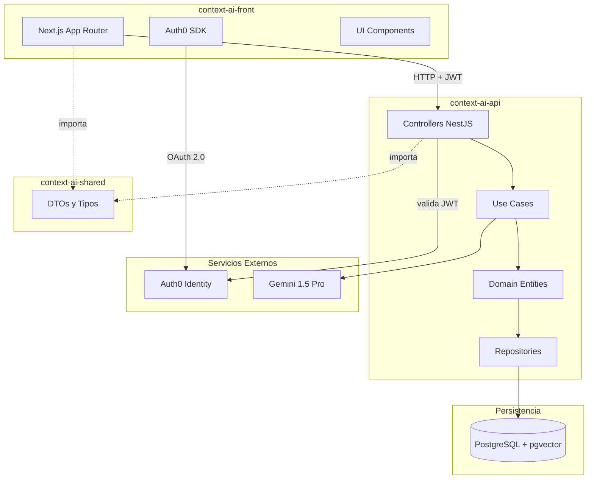
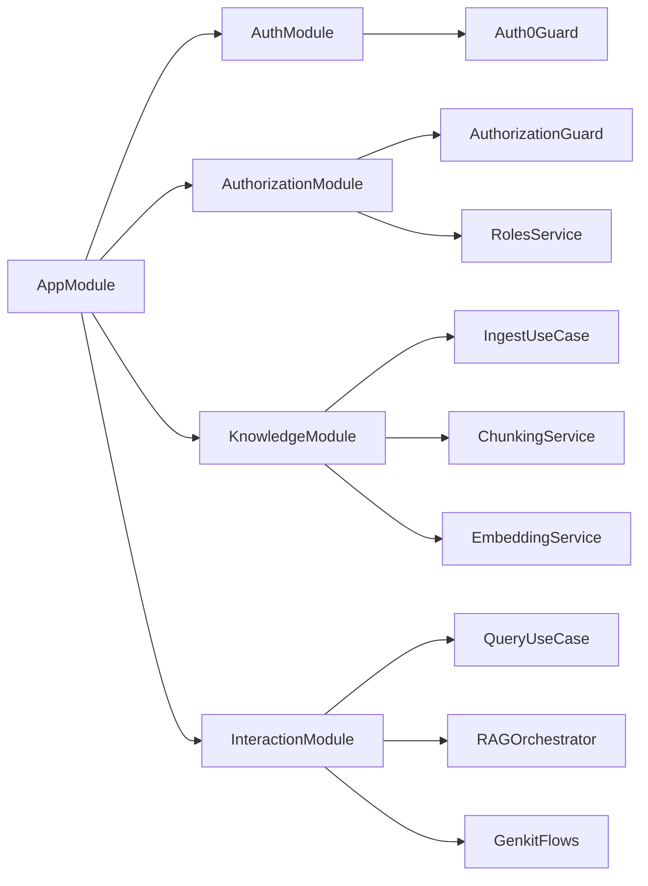

# Arquitectura Técnica - Context.ai

## 1. Visión General de la Arquitectura

Context.ai implementa una arquitectura **multi-repositorio** con tres proyectos independientes que siguen los principios de **Clean Architecture** (Arquitectura Limpia) y **Domain-Driven Design (DDD)**.

### Principios Arquitectónicos

- **Separación de Responsabilidades**: Backend, Frontend y tipos compartidos en repositorios independientes
- **Clean Architecture**: Dependencias apuntan hacia el dominio, no hacia la infraestructura
- **Arquitectura Hexagonal**: El dominio es el núcleo, infraestructura es intercambiable
- **SOLID**: Aplicado en cada capa y módulo
- **TDD (Test-Driven Development)**: Desarrollo guiado por tests con ciclo Red-Green-Refactor

---

## 2. Repositorios del Sistema

### 2.1 context-ai-shared

**Propósito**: Paquete npm con DTOs y tipos TypeScript compartidos entre backend y frontend.

**Tecnologías**:
- TypeScript 5.3+
- class-validator para validaciones
- class-transformer para transformaciones

**Estructura**:

```
context-ai-shared/
├── src/
│   ├── dto/
│   │   ├── auth/
│   │   │   ├── login.dto.ts
│   │   │   └── user.dto.ts
│   │   ├── knowledge/
│   │   │   ├── ingest-document.dto.ts
│   │   │   ├── knowledge-source.dto.ts
│   │   │   └── fragment.dto.ts
│   │   ├── interaction/
│   │   │   ├── chat-query.dto.ts
│   │   │   ├── chat-response.dto.ts
│   │   │   └── message.dto.ts
│   │   └── index.ts
│   ├── types/
│   │   ├── entities/
│   │   │   ├── user.type.ts
│   │   │   ├── sector.type.ts
│   │   │   └── role.type.ts
│   │   ├── enums/
│   │   │   ├── source-type.enum.ts
│   │   │   ├── role-type.enum.ts
│   │   │   └── message-role.enum.ts
│   │   └── index.ts
│   ├── validators/
│   │   └── index.ts
│   └── index.ts
├── .npmrc
├── package.json
├── pnpm-lock.yaml
├── tsconfig.json
└── README.md
```

**Publicación**: GitHub Packages como `@context-ai/shared`

---

### 2.2 context-ai-api

**Propósito**: Backend del sistema que implementa la lógica de negocio, RAG, y gestión de conocimiento.

**Tecnologías**:
- **Framework**: NestJS 10+
- **Runtime**: Node.js 22+
- **Lenguaje**: TypeScript con tipado estricto
- **ORM**: TypeORM
- **Base de Datos**: PostgreSQL 16 + pgvector
- **IA**: Google Genkit + Gemini 1.5 Pro
- **Autenticación**: Auth0 (validación JWT con JWKS)
- **Testing**: Jest + Supertest

**Arquitectura de Capas** (Clean Architecture):

```
┌─────────────────────────────────────────┐
│   Presentation Layer (Controllers)      │ ← HTTP, DTOs, Guards
├─────────────────────────────────────────┤
│   Application Layer (Use Cases)         │ ← Lógica de aplicación
├─────────────────────────────────────────┤
│   Domain Layer (Entities, Rules)        │ ← Lógica de negocio
├─────────────────────────────────────────┤
│   Infrastructure Layer (DB, External)   │ ← TypeORM, Genkit, Auth0
└─────────────────────────────────────────┘
```

**Estructura de Proyecto**:

```
context-ai-api/
├── src/
│   ├── modules/
│   │   ├── auth/
│   │   │   ├── guards/
│   │   │   │   ├── auth0.guard.ts
│   │   │   │   └── auth0.strategy.ts
│   │   │   └── auth.module.ts
│   │   ├── authorization/
│   │   │   ├── domain/
│   │   │   │   ├── entities/
│   │   │   │   │   ├── role.entity.ts
│   │   │   │   │   └── user-role.entity.ts
│   │   │   │   └── repositories/
│   │   │   ├── application/
│   │   │   │   ├── services/
│   │   │   │   │   └── roles.service.ts
│   │   │   │   └── use-cases/
│   │   │   ├── infrastructure/
│   │   │   │   └── repositories/
│   │   │   │       └── typeorm-roles.repository.ts
│   │   │   └── presentation/
│   │   │       ├── controllers/
│   │   │       │   └── authorization.controller.ts
│   │   │       └── guards/
│   │   │           ├── authorization.guard.ts
│   │   │           └── decorators/
│   │   ├── knowledge/
│   │   │   ├── domain/
│   │   │   │   ├── entities/
│   │   │   │   │   ├── knowledge-source.entity.ts (Aggregate Root)
│   │   │   │   │   └── fragment.entity.ts
│   │   │   │   ├── repositories/
│   │   │   │   │   └── knowledge.repository.interface.ts
│   │   │   │   └── value-objects/
│   │   │   │       └── vector-embedding.vo.ts
│   │   │   ├── application/
│   │   │   │   ├── services/
│   │   │   │   └── use-cases/
│   │   │   │       ├── ingest-document.use-case.ts
│   │   │   │       └── list-sources.use-case.ts
│   │   │   ├── infrastructure/
│   │   │   │   ├── repositories/
│   │   │   │   │   └── typeorm-knowledge.repository.ts
│   │   │   │   └── services/
│   │   │   │       ├── document-parser.service.ts
│   │   │   │       ├── chunking.service.ts
│   │   │   │       └── embedding.service.ts
│   │   │   └── presentation/
│   │   │       └── controllers/
│   │   │           └── knowledge.controller.ts
│   │   └── interaction/
│   │       ├── domain/
│   │       │   ├── entities/
│   │       │   │   ├── conversation.entity.ts (Aggregate Root)
│   │       │   │   └── message.entity.ts
│   │       │   ├── repositories/
│   │       │   └── services/
│   │       │       └── rag-orchestrator.service.ts
│   │       ├── application/
│   │       │   ├── prompts/
│   │       │   │   └── system-prompt.ts
│   │       │   └── use-cases/
│   │       │       └── query-assistant.use-case.ts
│   │       ├── infrastructure/
│   │       │   └── repositories/
│   │       │       └── typeorm-conversation.repository.ts
│   │       └── presentation/
│   │           └── controllers/
│   │               └── chat.controller.ts
│   ├── shared/
│   │   ├── decorators/
│   │   │   ├── current-user.decorator.ts
│   │   │   ├── require-permission.decorator.ts
│   │   │   └── require-sector-access.decorator.ts
│   │   ├── guards/
│   │   ├── genkit/
│   │   │   ├── genkit.config.ts
│   │   │   └── flows/
│   │   │       └── rag-query.flow.ts
│   │   └── utils/
│   ├── config/
│   │   ├── database.config.ts
│   │   ├── auth.config.ts
│   │   └── genkit.config.ts
│   └── main.ts
├── test/
│   ├── unit/
│   │   └── modules/
│   │       ├── knowledge/
│   │       └── interaction/
│   ├── integration/
│   │   ├── repositories/
│   │   └── genkit/
│   └── e2e/
│       └── flows/
├── migrations/
├── docker-compose.yml
├── Dockerfile
├── .env.example
├── .npmrc
├── pnpm-lock.yaml
├── jest.config.js
├── tsconfig.json
└── package.json
```

---

### 2.3 context-ai-front

**Propósito**: Frontend de la aplicación con interfaz de usuario para chat, gestión de conocimiento y administración.

**Tecnologías**:
- **Framework**: Next.js 14+ (App Router)
- **Lenguaje**: TypeScript
- **Estilos**: Tailwind CSS
- **State Management**: Zustand
- **Data Fetching**: TanStack Query (React Query)
- **HTTP Client**: Fetch API (nativo)
- **Autenticación**: Auth0 Next.js SDK (cookies HttpOnly)
- **UI Components**: shadcn/ui + Lucide Icons + Playwright
- **Calidad**: ESLint + SonarJS + jsx-a11y
- **Observabilidad**: Sentry
- **Git Hooks**: Husky

**Estructura de Proyecto**:

```
context-ai-front/
├── app/
│   ├── (auth)/
│   │   ├── login/
│   │   │   └── page.tsx
│   │   └── callback/
│   │       └── page.tsx
│   ├── (protected)/
│   │   ├── chat/
│   │   │   └── page.tsx
│   │   ├── knowledge/
│   │   │   ├── page.tsx
│   │   │   └── upload/
│   │   │       └── page.tsx
│   │   └── dashboard/
│   │       └── page.tsx
│   ├── api/
│   │   └── auth/
│   │       ├── [auth0]/
│   │       │   └── route.ts
│   │       └── token/
│   │           └── route.ts
│   ├── layout.tsx
│   ├── page.tsx
│   └── globals.css
├── components/
│   ├── chat/
│   │   ├── MessageList.tsx
│   │   ├── MessageInput.tsx
│   │   ├── SourceCard.tsx
│   │   └── ChatContainer.tsx
│   ├── knowledge/
│   │   ├── DocumentUpload.tsx
│   │   ├── DocumentList.tsx
│   │   └── DocumentCard.tsx
│   ├── ui/
│   │   ├── button.tsx
│   │   ├── dialog.tsx
│   │   ├── dropdown-menu.tsx
│   │   └── avatar.tsx
│   └── shared/
│       ├── Header.tsx
│       ├── Sidebar.tsx
│       └── LoadingSpinner.tsx
├── lib/
│   ├── api/
│   │   ├── client.ts
│   │   ├── chat.api.ts
│   │   └── knowledge.api.ts
│   ├── auth0.config.ts
│   └── utils/
├── stores/
│   ├── chat.store.ts
│   └── user.store.ts
├── public/
├── .env.local.example
├── .npmrc
├── pnpm-lock.yaml
├── Dockerfile
├── middleware.ts
├── next.config.js
├── tailwind.config.ts
├── vitest.config.ts
└── package.json
```

---

## 3. Bounded Contexts (DDD)

### 3.1 Organization Context (Post-MVP)

**⚠️ Nota**: La gestión completa de organizaciones y sectores está **fuera del alcance del MVP**. En el MVP, los sectores se gestionarán de forma simplificada dentro del `AuthorizationModule`.

**Responsabilidad**: Gestionar la estructura organizacional (sectores, usuarios).

**Entidades principales**:
- `Sector` - Departamento o área de conocimiento
- `User` - Usuario del sistema (vinculado a Auth0)

**Estado**: Diseño completo disponible en `004-DDD.md` (sección 4.1).
**Módulo futuro**: `OrganizationModule`

---

### 3.2 Knowledge Context

**Responsabilidad**: Ingesta, procesamiento y almacenamiento de documentación.

**Aggregate Root**: `KnowledgeSource`
**Entidades**: `Fragment`
**Value Objects**: `VectorEmbedding`, `Metadata`
**Domain Events**: `SourceIngested`, `VectorIndexUpdated`

**Flujo**:
1. Recepción de documento (PDF/MD)
2. Parsing y extracción de contenido
3. Chunking (fragmentación en bloques de 500 tokens con overlap de 50)
4. Generación de embeddings vectoriales
5. Almacenamiento en PostgreSQL + pgvector

**Módulo**: `KnowledgeModule`

---

### 3.3 Interaction Context

**Responsabilidad**: Gestionar conversaciones y consultas RAG.

**Aggregate Root**: `Conversation`
**Entidades**: `Message`
**Value Objects**: `SentimentAnalysis`, `UserFeedback`
**Domain Services**: `RAGOrchestrator`

**Flujo RAG**:
1. Recibir consulta del usuario
2. Generar embedding de la consulta
3. Búsqueda semántica en pgvector (filtrada por sector)
4. Recuperar los 5 fragmentos más relevantes
5. Construir prompt con contexto
6. Generar respuesta con Gemini 1.5 Pro
7. Retornar respuesta con fuentes citadas

**Módulo**: `InteractionModule`

---

### 3.4 Authorization Context

**Responsabilidad**: Gestión de roles, permisos y autorización interna.

**Entidades**: `Role`, `UserRole`
**Permisos definidos**:
- `knowledge:read` / `knowledge:write`
- `chat:query`
- `admin:manage_sectors` / `admin:manage_roles`

**Módulo**: `AuthorizationModule`

---

### 3.5 Onboarding Context (Post-MVP)

**⚠️ Nota**: Este contexto está **fuera del alcance del MVP**. Se implementará en fases posteriores.

**Responsabilidad**: Orquestar itinerarios de incorporación con contenido multimedia generado automáticamente.

**Aggregate Root**: `OnboardingJourney`
**Entidades**: `Milestone`, `MultimediaContent`
**Value Objects**: `ContentSourceOrigin` (trazabilidad de contenido), `ProgressPercentage`, `CompletionStatus`
**Domain Services**: `ContentObsolescenceDetector`, `MultimediaGenerationService`

**Concepto clave - ContentSourceOrigin**:
Sistema de trazabilidad que vincula cada contenido multimedia (video/audio) con el `KnowledgeSource` que lo generó. Permite detectar automáticamente cuando el contenido queda obsoleto al actualizarse la documentación fuente.

**Flujo de detección de obsolescencia**:
1. Admin actualiza "Manual_Vacaciones.pdf"
2. Sistema detecta que existe video generado de versión anterior
3. Marca video como obsoleto y notifica a RRHH
4. Encola regeneración automática del contenido

**Estado**: Diseño completo disponible en `004-DDD.md` (secciones 4.4, 6, 11).
**Módulo futuro**: `OnboardingModule`

---

## 4. Diagrama de Arquitectura General



---

## 5. Flujo de Comunicación entre Capas

### Backend (Clean Architecture)

```
Request HTTP
    ↓
[Presentation Layer] - Controllers, Guards, DTOs
    ↓ (DTO validado)
[Application Layer] - Use Cases, Services
    ↓ (Lógica de aplicación)
[Domain Layer] - Entities, Value Objects, Domain Services
    ↓ (Reglas de negocio)
[Infrastructure Layer] - Repositories, External APIs
    ↓
Response HTTP
```

**Regla de dependencias**: Las capas internas NO conocen las externas.
- ❌ Domain NO puede importar Infrastructure
- ✅ Infrastructure implementa interfaces definidas en Domain

---

## 6. Diagrama de Módulos NestJS



---

## 7. Stack Tecnológico Completo

### Backend
- **Runtime**: Node.js 22+
- **Framework**: NestJS 10+
- **Language**: TypeScript 5.3+
- **ORM**: TypeORM
- **Database**: PostgreSQL 16 + pgvector
- **AI Orchestration**: Google Genkit
- **LLM**: Gemini 1.5 Pro
- **Auth**: Auth0 (JWT validation con JWKS)
- **Security**: Helmet, express-rate-limit
- **Testing**: Jest, Supertest
- **Package Manager**: pnpm

### Frontend
- **Framework**: Next.js 14+ (App Router)
- **Language**: TypeScript 5.3+
- **Styling**: Tailwind CSS
- **State**: Zustand
- **Data Fetching**: TanStack Query
- **HTTP Client**: Fetch API
- **Auth**: @auth0/nextjs-auth0
- **UI**: shadcn/ui, Lucide Icons
- **Testing**: Vitest, Testing Library
- **Package Manager**: pnpm

### Shared
- **Language**: TypeScript 5.3+
- **Validation**: class-validator
- **Transformation**: class-transformer
- **Testing**: Jest
- **Package Manager**: pnpm

### Infrastructure
- **Containerization**: Docker
- **Database**: PostgreSQL 16 (pgvector extension)
- **CI/CD**: GitHub Actions (por configurar)
- **Deployment**: Por definir (Railway, Render, Vercel opciones)

---

## 8. Patrones de Diseño Aplicados

### Domain Layer
- **Repository Pattern**: Abstracción de persistencia
- **Factory Pattern**: Creación de GenkitFlows complejos
- **Strategy Pattern**: Diferentes estrategias de ingesta (PDF, MD, URLs)
- **Specification Pattern**: Validación de reglas de acceso

### Application Layer
- **Use Case Pattern**: Casos de uso como clases independientes
- **Command Pattern**: Encapsulación de acciones
- **Observer Pattern**: Domain events (futuro)

### Infrastructure Layer
- **Adapter Pattern**: Adaptadores para servicios externos
- **Dependency Injection**: Inyección de dependencias en todo NestJS

---

## 9. Seguridad

### Autenticación (Auth0)
- JWT tokens validados con JWKS
- Tokens almacenados en cookies HttpOnly cifradas
- Refresh tokens para renovación automática

### Autorización (Interna)
- Sistema de roles y permisos granulares
- Guards de NestJS para verificar permisos
- Aislamiento de información por sectores

### Comunicación
- CORS configurado con `credentials: true`
- Headers de seguridad con Helmet
- HTTPS obligatorio en producción
- Rate limiting en endpoints sensibles

---

## 10. Observabilidad y Monitoreo

### Logging
- Winston para logging estructurado
- Niveles: error, warn, info, debug
- Context tracking con request IDs

### Monitoring
- Sentry para error tracking
- Genkit UI para debug de flows de IA
- Métricas de latencia y uso

### Testing
- **TDD**: Test-Driven Development con ciclo Red-Green-Refactor
- Coverage mínimo: 80% en lines, branches, functions, statements
- Tests unitarios, de integración y E2E

---

## 11. Escalabilidad y Performance

### Estrategias
- Índices en PostgreSQL para búsquedas frecuentes
- Caching de embeddings generados (futuro)
- Lazy loading en frontend
- Server-side rendering con Next.js
- Búsqueda vectorial optimizada con pgvector (índice ivfflat)

### Límites Técnicos
- Ventana de contexto: Gemini 1.5 Pro (~1M tokens)
- Chunk size: 500 tokens con overlap de 50
- Top-K búsqueda vectorial: 5 fragmentos
- Dimensión de embeddings: 768 (según modelo de Genkit)

---

## 12. Decisiones Arquitectónicas

### ¿Por qué Multi-Repo?
- Independencia de deploy
- Equipos pueden trabajar en paralelo
- Versionado independiente
- Permisos granulares por repo

### ¿Por qué Clean Architecture?
- Testabilidad extrema
- Independencia de frameworks
- Reglas de negocio aisladas
- Facilita TDD

### ¿Por qué NestJS?
- Arquitectura modular por defecto
- Soporte nativo para DI y DDD
- TypeScript first
- Ecosistema maduro

### ¿Por qué Next.js?
- SSR y SSG optimizados
- App Router con React Server Components
- Mejor integración con Auth0
- Excelente DX y performance

### ¿Por qué pnpm?
- Ahorro de espacio (~50%)
- Instalaciones más rápidas
- Seguridad mejorada (strict node_modules)
- Mejor soporte para monorepos

---

## 13. Contextos Post-MVP

### Onboarding Context - Fase 2

El diseño completo del **Onboarding Context** está documentado en `004-DDD.md`. Incluye:

**Funcionalidades principales**:
- Creación de itinerarios personalizados por rol
- Generación automática de contenido multimedia (videos, audios, guías)
- Tracking de progreso del empleado
- **Sistema de trazabilidad con ContentSourceOrigin**

**Concepto innovador - Gestión de Obsolescencia**:
El `ContentSourceOrigin` es un Value Object que actúa como "certificado de origen" vinculando cada pieza de contenido multimedia con:
- El `KnowledgeSource` exacto que lo generó
- La versión específica del documento (SHA-256 hash)
- Los fragmentos utilizados para la generación
- Metadata de auditoría

**Problema que resuelve**:
Cuando RRHH actualiza "Manual_Vacaciones.pdf", el sistema:
1. Detecta automáticamente qué videos/audios están basados en la versión anterior
2. Marca el contenido como `OBSOLETE`
3. Notifica a RRHH con lista de usuarios afectados
4. Encola regeneración inteligente (solo del contenido afectado)

**Eventos clave**:
- `SourceUpdatedEvent` → Dispara detección de obsolescencia
- `ContentBecameObsoleteEvent` → Alerta a RRHH y usuarios
- `JourneyCompleted` → Métricas de onboarding

**Beneficios medibles**:
- Previene información contradictoria (confianza +40%)
- Regeneración inteligente (ahorro de costos IA ~60%)
- Dashboard de "deuda técnica de contenido"
- Auditoría completa de trazabilidad

**Referencia completa**: Ver secciones 4.4, 6, y 11 en `004-DDD.md`

---

## 14. Próximos Pasos Técnicos

Una vez implementado el MVP, se evaluarán:
1. **Implementación de Onboarding Context** (UC3, UC6)
2. Migración a arquitectura de eventos (Event Sourcing)
3. Implementación de CQRS para separar lecturas/escrituras
4. Caché distribuida (Redis) para búsquedas vectoriales
5. Queue system para procesamiento asíncrono de embeddings
6. Dashboard de Analytics (UC4, UC7)
7. Microservicios si la complejidad lo requiere

