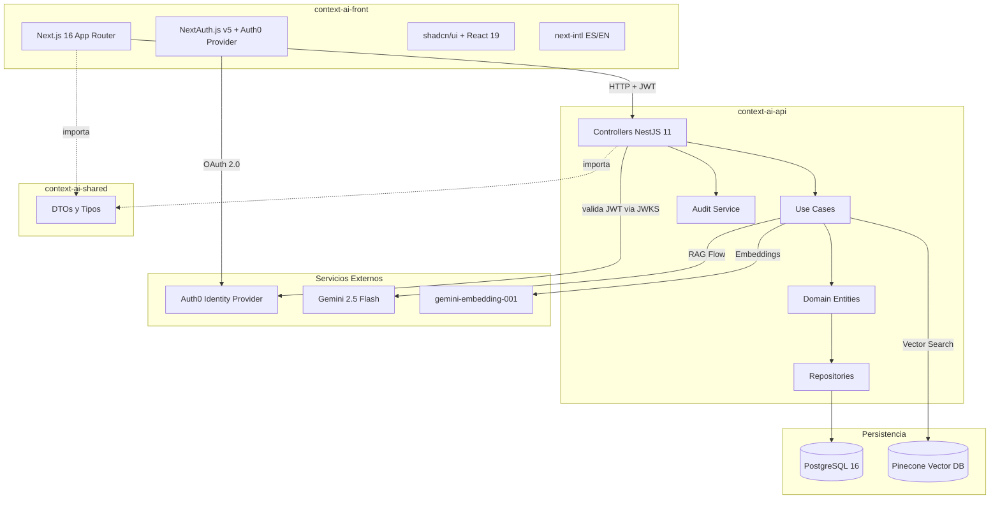
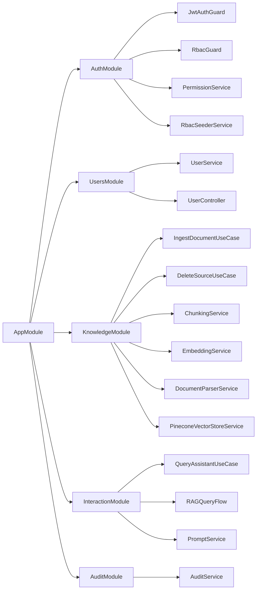

# Arquitectura Técnica - Context.ai
## Actualizado: Febrero 2026

---

## 1. Visión General de la Arquitectura

Context.ai implementa una arquitectura **multi-repositorio** con tres proyectos independientes que siguen los principios de **Clean Architecture** (Arquitectura Limpia) y **Domain-Driven Design (DDD)**.

### Principios Arquitectónicos

- **Separación de Responsabilidades**: Backend, Frontend y tipos compartidos en repositorios independientes
- **Clean Architecture**: Dependencias apuntan hacia el dominio, no hacia la infraestructura
- **Arquitectura Hexagonal**: El dominio es el núcleo, infraestructura es intercambiable
- **SOLID**: Aplicado en cada capa y módulo
- **TDD (Test-Driven Development)**: Desarrollo guiado por tests con ciclo Red-Green-Refactor

---

## 2. Repositorios del Sistema

### 2.1 context-ai-shared

**Propósito**: Paquete npm local con DTOs y tipos TypeScript compartidos entre backend y frontend.

**Tecnologías**:
- TypeScript 5+
- Tipos e interfaces puras (sin dependencias de runtime)

**Estructura**:

```
context-ai-shared/
├── src/
│   ├── dto/
│   │   ├── auth/
│   │   │   ├── login.dto.ts
│   │   │   └── user.dto.ts
│   │   ├── knowledge/
│   │   │   ├── ingest-document.dto.ts
│   │   │   ├── knowledge-source.dto.ts
│   │   │   └── fragment.dto.ts
│   │   ├── interaction/
│   │   │   ├── chat-query.dto.ts
│   │   │   ├── chat-response.dto.ts
│   │   │   ├── message.dto.ts
│   │   │   └── source-fragment.dto.ts
│   │   └── index.ts
│   ├── types/
│   │   ├── entities/
│   │   │   ├── user.type.ts
│   │   │   ├── sector.type.ts
│   │   │   └── role.type.ts
│   │   ├── enums/
│   │   │   ├── source-type.enum.ts
│   │   │   ├── source-status.enum.ts
│   │   │   ├── role-type.enum.ts
│   │   │   └── message-role.enum.ts
│   │   └── index.ts
│   ├── validators/
│   │   └── index.ts
│   └── index.ts
├── package.json
├── tsconfig.json
└── README.md
```

**Consumo**: Se instala vía `link:../context-ai-shared` en ambos proyectos (pnpm link local).

---

### 2.2 context-ai-api

**Propósito**: Backend del sistema que implementa la lógica de negocio, RAG, y gestión de conocimiento.

**Tecnologías**:
- **Framework**: NestJS 11+
- **Runtime**: Node.js 22+
- **Lenguaje**: TypeScript 5+ con tipado estricto
- **ORM**: TypeORM
- **Base de Datos**: PostgreSQL 16 (datos relacionales)
- **Vector Store**: Pinecone (almacenamiento y búsqueda de embeddings)
- **IA**: Google Genkit + Gemini 2.5 Flash (LLM) + gemini-embedding-001 (embeddings, 3072 dimensiones)
- **Autenticación**: Auth0 (validación JWT con JWKS via Passport-JWT)
- **Seguridad**: Helmet, express-rate-limit, @nestjs/throttler, Zod (validación), eslint-plugin-security
- **Validación**: class-validator, class-transformer, Zod
- **PDF Parsing**: pdf-parse
- **Testing**: Jest + Supertest
- **Documentación API**: @nestjs/swagger (OpenAPI)

**Arquitectura de Capas** (Clean Architecture):

```
┌─────────────────────────────────────────┐
│   Presentation Layer (Controllers)      │ ← HTTP, DTOs, Guards, Swagger
├─────────────────────────────────────────┤
│   Application Layer (Use Cases)         │ ← Lógica de aplicación
├─────────────────────────────────────────┤
│   Domain Layer (Entities, Rules)        │ ← Lógica de negocio
├─────────────────────────────────────────┤
│   Infrastructure Layer (DB, External)   │ ← TypeORM, Genkit, Pinecone, Auth0
└─────────────────────────────────────────┘
```

**Estructura de Proyecto (actual)**:

```
context-ai-api/
├── src/
│   ├── modules/
│   │   ├── auth/
│   │   │   ├── application/
│   │   │   │   └── services/
│   │   │   │       ├── permission.service.ts
│   │   │   │       ├── rbac-seeder.service.ts
│   │   │   │       └── token-revocation.service.ts
│   │   │   ├── auth.module.ts
│   │   │   ├── auth.service.ts
│   │   │   ├── decorators/
│   │   │   │   ├── current-user.decorator.ts
│   │   │   │   ├── public.decorator.ts
│   │   │   │   ├── require-permissions.decorator.ts
│   │   │   │   └── require-roles.decorator.ts
│   │   │   ├── domain/
│   │   │   │   └── entities/
│   │   │   │       ├── permission.entity.ts
│   │   │   │       └── role.entity.ts
│   │   │   ├── guards/
│   │   │   │   ├── internal-api-key.guard.ts
│   │   │   │   ├── jwt-auth.guard.ts
│   │   │   │   └── rbac.guard.ts
│   │   │   ├── infrastructure/
│   │   │   │   └── persistence/
│   │   │   │       ├── models/
│   │   │   │       │   ├── permission.model.ts
│   │   │   │       │   └── role.model.ts
│   │   │   │       └── repositories/
│   │   │   │           ├── permission.repository.ts
│   │   │   │           └── role.repository.ts
│   │   │   ├── strategies/
│   │   │   │   └── jwt.strategy.ts
│   │   │   └── types/
│   │   │       └── jwt-payload.type.ts
│   │   ├── users/
│   │   │   ├── api/
│   │   │   │   └── controllers/
│   │   │   │       └── user.controller.ts
│   │   │   ├── application/
│   │   │   │   └── services/
│   │   │   │       └── user.service.ts
│   │   │   ├── domain/
│   │   │   │   └── entities/
│   │   │   │       └── user.entity.ts
│   │   │   ├── infrastructure/
│   │   │   │   └── persistence/
│   │   │   │       ├── models/
│   │   │   │       │   └── user.model.ts
│   │   │   │       └── repositories/
│   │   │   │           └── user.repository.ts
│   │   │   └── users.module.ts
│   │   ├── knowledge/
│   │   │   ├── application/
│   │   │   │   ├── dtos/
│   │   │   │   │   ├── delete-source.dto.ts
│   │   │   │   │   └── ingest-document.dto.ts
│   │   │   │   └── use-cases/
│   │   │   │       ├── delete-source.use-case.ts
│   │   │   │       └── ingest-document.use-case.ts
│   │   │   ├── domain/
│   │   │   │   ├── entities/
│   │   │   │   │   ├── fragment.entity.ts
│   │   │   │   │   └── knowledge-source.entity.ts (Aggregate Root)
│   │   │   │   ├── repositories/
│   │   │   │   │   └── knowledge.repository.interface.ts
│   │   │   │   ├── services/
│   │   │   │   │   └── vector-store.interface.ts
│   │   │   │   └── value-objects/
│   │   │   ├── infrastructure/
│   │   │   │   ├── persistence/
│   │   │   │   │   ├── mappers/
│   │   │   │   │   │   ├── fragment.mapper.ts
│   │   │   │   │   │   └── knowledge-source.mapper.ts
│   │   │   │   │   ├── models/
│   │   │   │   │   │   ├── fragment.model.ts
│   │   │   │   │   │   └── knowledge-source.model.ts
│   │   │   │   │   └── repositories/
│   │   │   │   │       └── knowledge.repository.ts
│   │   │   │   ├── pinecone/
│   │   │   │   │   └── pinecone.module.ts
│   │   │   │   └── services/
│   │   │   │       ├── chunking.service.ts
│   │   │   │       ├── document-parser.service.ts
│   │   │   │       ├── embedding.service.ts
│   │   │   │       └── pinecone-vector-store.service.ts
│   │   │   ├── knowledge.module.ts
│   │   │   └── presentation/
│   │   │       ├── dtos/
│   │   │       │   └── knowledge.dto.ts
│   │   │       └── knowledge.controller.ts
│   │   ├── interaction/
│   │   │   ├── application/
│   │   │   │   └── use-cases/
│   │   │   │       └── query-assistant.use-case.ts
│   │   │   ├── domain/
│   │   │   │   ├── entities/
│   │   │   │   │   ├── conversation.entity.ts (Aggregate Root)
│   │   │   │   │   └── message.entity.ts
│   │   │   │   ├── repositories/
│   │   │   │   │   └── conversation.repository.interface.ts
│   │   │   │   └── value-objects/
│   │   │   │       ├── message-role.vo.ts
│   │   │   │       └── user-context.vo.ts
│   │   │   ├── infrastructure/
│   │   │   │   └── persistence/
│   │   │   │       ├── mappers/
│   │   │   │       ├── models/
│   │   │   │       │   ├── conversation.model.ts
│   │   │   │       │   └── message.model.ts
│   │   │   │       └── repositories/
│   │   │   │           └── conversation.repository.ts
│   │   │   ├── interaction.module.ts
│   │   │   └── presentation/
│   │   │       ├── dtos/
│   │   │       │   ├── conversation.dto.ts
│   │   │       │   ├── get-conversations.dto.ts
│   │   │       │   ├── message.dto.ts
│   │   │       │   └── query-assistant.dto.ts
│   │   │       ├── interaction.controller.ts
│   │   │       └── mappers/
│   │   │           └── interaction-dto.mapper.ts
│   │   └── audit/
│   │       ├── application/
│   │       │   └── services/
│   │       │       └── audit.service.ts
│   │       ├── audit.module.ts
│   │       ├── domain/
│   │       │   └── entities/
│   │       │       └── audit-log.entity.ts
│   │       └── infrastructure/
│   │           └── persistence/
│   │               ├── models/
│   │               │   └── audit-log.model.ts
│   │               └── repositories/
│   │                   └── audit-log.repository.ts
│   ├── shared/
│   │   ├── constants/
│   │   ├── decorators/
│   │   ├── genkit/
│   │   │   ├── genkit.config.ts
│   │   │   └── flows/
│   │   │       └── rag-query.flow.ts
│   │   ├── prompts/
│   │   │   └── prompt.service.ts
│   │   ├── types/
│   │   └── utils/
│   ├── config/
│   └── main.ts
├── test/
│   ├── unit/
│   │   └── modules/
│   │       ├── audit/
│   │       ├── auth/
│   │       ├── knowledge/
│   │       └── interaction/
│   ├── integration/
│   ├── e2e/
│   ├── contract/
│   ├── security/
│   └── performance/
├── docker-compose.yml
├── Dockerfile
├── .env.example
├── jest.config.js
├── tsconfig.json
└── package.json
```

---

### 2.3 context-ai-front

**Propósito**: Frontend de la aplicación con interfaz de usuario para chat, gestión de conocimiento y administración.

**Tecnologías**:
- **Framework**: Next.js 16+ (App Router)
- **Lenguaje**: TypeScript 5+
- **UI**: React 19
- **Estilos**: Tailwind CSS 4
- **State Management**: Zustand 5
- **Data Fetching**: TanStack Query (React Query) v5
- **HTTP Client**: Cliente personalizado basado en fetch con interceptores
- **Autenticación**: NextAuth.js v5 (next-auth 5.0.0-beta.30) con Auth0 como provider OAuth
- **UI Components**: shadcn/ui + Radix UI primitives + Lucide Icons
- **Internacionalización**: next-intl (ES/EN con routing por locale)
- **Markdown Rendering**: react-markdown + remark-gfm + react-syntax-highlighter
- **Validación**: Zod
- **Calidad**: ESLint 9 + Prettier + SonarJS + jsx-a11y + eslint-config-next
- **Observabilidad**: Sentry (@sentry/nextjs)
- **Git Hooks**: Husky + lint-staged
- **Testing Unitario**: Vitest 4 + Testing Library + vitest-axe (accesibilidad)
- **Testing E2E**: Playwright (incluye visual regression)
- **Deployment**: Docker con multi-stage build + docker-entrypoint.sh para runtime env vars

**Estructura de Proyecto (actual)**:

```
context-ai-front/
├── src/
│   ├── app/
│   │   ├── [locale]/
│   │   │   ├── (protected)/
│   │   │   │   ├── chat/
│   │   │   │   │   └── page.tsx
│   │   │   │   ├── knowledge/
│   │   │   │   │   └── upload/
│   │   │   │   │       └── page.tsx
│   │   │   │   ├── dashboard/
│   │   │   │   │   └── page.tsx
│   │   │   │   └── layout.tsx
│   │   │   ├── auth/
│   │   │   │   ├── signin/
│   │   │   │   │   └── page.tsx
│   │   │   │   └── error/
│   │   │   │       └── page.tsx
│   │   │   ├── layout.tsx
│   │   │   └── page.tsx          # Landing page
│   │   ├── api/
│   │   │   └── auth/
│   │   │       ├── [...nextauth]/
│   │   │       │   └── route.ts
│   │   │       └── token/
│   │   │           └── route.ts
│   │   ├── layout.tsx
│   │   └── globals.css
│   ├── components/
│   │   ├── chat/
│   │   │   ├── ChatContainer.tsx
│   │   │   └── MarkdownRenderer.tsx
│   │   ├── dashboard/
│   │   │   └── app-sidebar.tsx
│   │   ├── knowledge/
│   │   ├── user/
│   │   │   └── LogoutButton.tsx
│   │   ├── ui/                    # shadcn/ui components
│   │   └── shared/
│   │       └── ErrorBoundary.tsx
│   ├── lib/
│   │   ├── api/
│   │   │   ├── client.ts          # API client con interceptores
│   │   │   ├── chat.api.ts
│   │   │   ├── user.api.ts
│   │   │   └── error-handler.ts   # APIError, categorización
│   │   ├── providers/
│   │   │   └── query-provider.tsx
│   │   ├── auth0.config.ts
│   │   ├── env-config.ts
│   │   └── utils/
│   │       └── image-config.ts
│   ├── stores/
│   │   ├── chat.store.tsx
│   │   └── user.store.tsx
│   ├── hooks/
│   │   ├── useCurrentUser.ts
│   │   └── use-mobile.ts
│   ├── types/
│   │   ├── message.types.ts
│   │   └── next-auth.d.ts
│   ├── auth.ts                    # NextAuth.js v5 config
│   ├── i18n.ts                    # next-intl config
│   └── test/
│       └── setup.ts
├── e2e/                           # Playwright E2E tests
├── messages/
│   ├── es.json
│   └── en.json
├── scripts/
│   └── docker-entrypoint.sh
├── middleware.ts                   # next-intl locale routing
├── instrumentation.ts             # Server-side env validation
├── Dockerfile
├── env.local.example
├── vitest.config.ts
├── playwright.config.ts
├── next.config.ts
└── package.json
```

---

## 3. Bounded Contexts (DDD)

### 3.1 Organization Context (Post-MVP)

**⚠️ Nota**: La gestión completa de organizaciones y sectores está **fuera del alcance del MVP**. En el MVP, los sectores se gestionan de forma simplificada dentro del `AuthModule`.

**Responsabilidad**: Gestionar la estructura organizacional (sectores, usuarios).

**Entidades principales**:
- `Sector` - Departamento o área de conocimiento
- `User` - Usuario del sistema (vinculado a Auth0)

**Estado**: Diseño completo disponible en `004-DDD.md` (sección 4.1).
**Módulo futuro**: `OrganizationModule`

---

### 3.2 Knowledge Context

**Responsabilidad**: Ingesta, procesamiento, almacenamiento y búsqueda de documentación.

**Aggregate Root**: `KnowledgeSource`
**Entidades**: `Fragment`
**Value Objects**: `Metadata`
**Domain Events**: `SourceIngested`, `VectorIndexUpdated`
**Servicios de Dominio**: `VectorStoreInterface` (interfaz abstracta)

**Flujo**:
1. Recepción de documento (PDF/MD) via upload multipart
2. Parsing y extracción de contenido (`DocumentParserService` con `pdf-parse`)
3. Sanitización de texto (limpieza de markdown syntax)
4. Chunking - fragmentación en bloques de ~500 tokens con overlap de 50 (`ChunkingService`)
5. Generación de embeddings vectoriales con `gemini-embedding-001` (3072 dimensiones) via Genkit
6. Almacenamiento de metadatos en PostgreSQL (tabla `knowledge_sources`, `fragments`)
7. Almacenamiento de vectores en **Pinecone** (vector store externo)

**Módulo**: `KnowledgeModule`

---

### 3.3 Interaction Context

**Responsabilidad**: Gestionar conversaciones y consultas RAG.

**Aggregate Root**: `Conversation`
**Entidades**: `Message`
**Value Objects**: `MessageRole`, `UserContext`

**Flujo RAG** (implementado en `rag-query.flow.ts` con Genkit):
1. Recibir consulta del usuario
2. Generar embedding de la consulta con `gemini-embedding-001`
3. Búsqueda semántica en **Pinecone** (filtrada por sectorId)
4. Recuperar los 5 fragmentos más relevantes
5. Construir prompt con contexto (vía `PromptService` con templates)
6. Generar respuesta con **Gemini 2.5 Flash**
7. Evaluar respuesta con Genkit Evaluators (Faithfulness, Relevancy)
8. Retornar respuesta con fuentes citadas y metadatos de evaluación

**Módulo**: `InteractionModule`

---

### 3.4 Auth & Authorization Context

**Responsabilidad**: Autenticación vía Auth0, gestión de roles, permisos y autorización interna RBAC.

**Nota**: Auth y Authorization se implementaron en un único `AuthModule` (no en módulos separados como se planificó originalmente).

**Entidades**: `Role`, `Permission`
**Servicios**: `PermissionService`, `RbacSeederService`, `TokenRevocationService`
**Guards**: `JwtAuthGuard`, `RbacGuard`, `InternalApiKeyGuard`
**Decorators**: `@CurrentUser()`, `@Public()`, `@RequirePermissions()`, `@RequireRoles()`
**Estrategia JWT**: Passport-JWT con JWKS (`jwks-rsa`)

**Permisos implementados**:
- `knowledge:read` / `knowledge:write` / `knowledge:delete`
- `chat:query`
- `admin:manage_sectors` / `admin:manage_roles` / `admin:manage_users`

**Módulo**: `AuthModule`

---

### 3.5 Users Context

**Responsabilidad**: Gestión y sincronización de usuarios entre Auth0 y la base de datos interna.

**Entidades**: `User`
**Servicios**: `UserService`
**Endpoints**: `POST /users/sync`, `GET /users/profile`

**Módulo**: `UsersModule`

---

### 3.6 Audit Context

**Responsabilidad**: Registro de eventos de auditoría del sistema.

**Entidades**: `AuditLog`
**Servicios**: `AuditService` (método genérico `logEvent`)
**Datos registrados**: eventType, userId, ipAddress, userAgent, metadata

**Módulo**: `AuditModule`

---

### 3.7 Onboarding Context (Post-MVP)

**⚠️ Nota**: Este contexto está **fuera del alcance del MVP**. Se implementará en fases posteriores.

**Responsabilidad**: Orquestar itinerarios de incorporación con contenido multimedia generado automáticamente.

**Aggregate Root**: `OnboardingJourney`
**Entidades**: `Milestone`, `MultimediaContent`
**Value Objects**: `ContentSourceOrigin` (trazabilidad de contenido), `ProgressPercentage`, `CompletionStatus`
**Domain Services**: `ContentObsolescenceDetector`, `MultimediaGenerationService`

**Estado**: Diseño completo disponible en `004-DDD.md` (secciones 4.4, 6, 11).
**Módulo futuro**: `OnboardingModule`

---

## 4. Diagrama de Arquitectura General



---

## 5. Flujo de Comunicación entre Capas

### Backend (Clean Architecture)

```
Request HTTP
    ↓
[Presentation Layer] - Controllers, Guards, DTOs, Swagger
    ↓ (DTO validado)
[Application Layer] - Use Cases, Services
    ↓ (Lógica de aplicación)
[Domain Layer] - Entities, Value Objects, Domain Services
    ↓ (Reglas de negocio)
[Infrastructure Layer] - Repositories, Pinecone, Genkit, Auth0
    ↓
Response HTTP
```

**Regla de dependencias**: Las capas internas NO conocen las externas.
- ❌ Domain NO puede importar Infrastructure
- ✅ Infrastructure implementa interfaces definidas en Domain (ej: `VectorStoreInterface`)

---

## 6. Diagrama de Módulos NestJS



---

## 7. Stack Tecnológico Completo

### Backend
- **Runtime**: Node.js 22+
- **Framework**: NestJS 11+
- **Language**: TypeScript 5+
- **ORM**: TypeORM
- **Database**: PostgreSQL 16 (datos relacionales)
- **Vector Store**: Pinecone (embeddings y búsqueda semántica)
- **AI Orchestration**: Google Genkit (^1.28.0)
- **LLM**: Gemini 2.5 Flash (`googleai/gemini-2.5-flash`)
- **Embeddings**: gemini-embedding-001 (`googleai/gemini-embedding-001`, 3072 dimensiones)
- **Auth**: Auth0 (JWT validation con JWKS via Passport-JWT)
- **Security**: Helmet, express-rate-limit, @nestjs/throttler, eslint-plugin-security
- **Validation**: class-validator, class-transformer, Zod
- **PDF Parsing**: pdf-parse
- **API Docs**: @nestjs/swagger (OpenAPI)
- **Testing**: Jest 30, Supertest
- **Package Manager**: pnpm

### Frontend
- **Framework**: Next.js 16+ (App Router)
- **UI Library**: React 19
- **Language**: TypeScript 5+
- **Styling**: Tailwind CSS 4
- **State**: Zustand 5
- **Data Fetching**: TanStack Query v5
- **HTTP Client**: API client personalizado (fetch-based con interceptores)
- **Auth**: NextAuth.js v5 (next-auth 5.0.0-beta.30) con Auth0 provider
- **UI Components**: shadcn/ui, Radix UI, Lucide Icons
- **i18n**: next-intl (ES/EN con locale routing)
- **Markdown**: react-markdown + remark-gfm + react-syntax-highlighter
- **Validation**: Zod
- **Testing Unitario**: Vitest 4, Testing Library, vitest-axe
- **Testing E2E**: Playwright (incluye visual regression)
- **Observabilidad**: Sentry
- **Code Quality**: ESLint 9, Prettier, SonarJS, jsx-a11y
- **Git Hooks**: Husky + lint-staged
- **Package Manager**: pnpm

### Shared
- **Language**: TypeScript 5+
- **Contenido**: DTOs puros, types, enums, validators
- **Package Manager**: pnpm

### Infrastructure
- **Containerization**: Docker (multi-stage builds)
- **Database**: PostgreSQL 16
- **Vector Store**: Pinecone (managed, cloud)
- **CI/CD**: GitHub Actions (por configurar)
- **Deployment**: Por definir (Railway, Render, Vercel opciones)

---

## 8. Patrones de Diseño Aplicados

### Domain Layer
- **Repository Pattern**: Abstracción de persistencia (interfaces en dominio, implementación en infraestructura)
- **Factory Pattern**: `Fragment.fromPersistence()` para creación de entidades desde persistencia
- **Strategy Pattern**: Diferentes estrategias de ingesta (PDF, Markdown)
- **Specification Pattern**: Validación de reglas de acceso

### Application Layer
- **Use Case Pattern**: Casos de uso como clases independientes (`IngestDocumentUseCase`, `QueryAssistantUseCase`, `DeleteSourceUseCase`)
- **Command Pattern**: Encapsulación de acciones
- **Observer Pattern**: Domain events (futuro)

### Infrastructure Layer
- **Adapter Pattern**: `PineconeVectorStoreService` implementa `VectorStoreInterface`
- **Dependency Injection**: Inyección de dependencias nativo de NestJS
- **Mapper Pattern**: Mappers dedicados para conversión entidad ↔ modelo ↔ DTO

---

## 9. Seguridad

### Autenticación

**Backend**: Auth0 JWT validation via Passport-JWT + JWKS
- Tokens JWT validados con JWKS endpoint de Auth0
- `JwtAuthGuard` como guard global
- `InternalApiKeyGuard` para comunicación server-to-server (sincronización de usuarios)

**Frontend**: NextAuth.js v5 con Auth0 como provider OAuth
- Sesión gestionada por NextAuth.js
- Callbacks JWT y Session para sincronizar usuario con backend
- API route `/api/auth/token` para obtener access token server-side

### Autorización (Interna)
- Sistema RBAC con roles y permisos granulares
- `RbacGuard` verifica permisos en cada request protegido
- Decoradores: `@RequirePermissions()`, `@RequireRoles()`
- `RbacSeederService` para seed inicial de roles y permisos
- Aislamiento de información por sectores (sectorId en queries)

### Comunicación
- CORS configurado con `credentials: true`
- Headers de seguridad con Helmet
- HTTPS obligatorio en producción
- Rate limiting con `@nestjs/throttler` y `express-rate-limit`
- Validación de inputs con class-validator y Zod

---

## 10. Observabilidad y Monitoreo

### Logging
- Winston para logging estructurado (configurado en backend)
- Niveles: error, warn, info, debug
- Context tracking con request IDs

### Monitoring
- **Sentry** para error tracking (frontend y backend)
- **Genkit UI** para debug de flows de IA
- **@nestjs/swagger** para documentación interactiva de API
- Métricas de latencia, uso de tokens, y scores de evaluación en metadatos de respuesta

### Testing
- **TDD**: Test-Driven Development con ciclo Red-Green-Refactor
- Coverage mínimo: 80% en lines, branches, functions, statements
- Tests unitarios (Jest/Vitest), de integración, E2E (Playwright), contract, security, performance
- **Audit Module**: Registro de eventos de seguridad y acceso

---

## 11. Escalabilidad y Performance

### Estrategias
- Índices en PostgreSQL para búsquedas frecuentes
- **Pinecone** como vector store gestionado (escalado automático)
- Lazy loading en frontend
- Server Components con Next.js 16 (RSC)
- Internacionalización con rutas estáticas por locale

### Límites Técnicos
- Ventana de contexto: Gemini 2.5 Flash (~1M tokens)
- Chunk size: 500 tokens con overlap de 50
- Top-K búsqueda vectorial: 5 fragmentos
- Dimensión de embeddings: **3072** (gemini-embedding-001)
- Tipos de embedding soportados: RETRIEVAL_DOCUMENT, RETRIEVAL_QUERY, SEMANTIC_SIMILARITY, CLASSIFICATION, CLUSTERING

---

## 12. Decisiones Arquitectónicas

### ¿Por qué Multi-Repo?
- Independencia de deploy
- Equipos pueden trabajar en paralelo
- Versionado independiente
- Permisos granulares por repo

### ¿Por qué Clean Architecture?
- Testabilidad extrema
- Independencia de frameworks
- Reglas de negocio aisladas
- Facilita TDD

### ¿Por qué NestJS?
- Arquitectura modular por defecto
- Soporte nativo para DI y DDD
- TypeScript first
- Ecosistema maduro (Swagger, Passport, TypeORM)

### ¿Por qué Next.js?
- SSR y SSG optimizados
- App Router con React Server Components
- Mejor integración con NextAuth.js
- Excelente DX y performance

### ¿Por qué Pinecone en lugar de pgvector?
- Escalabilidad gestionada sin necesidad de mantener índices vectoriales
- Búsqueda semántica optimizada con soporte nativo para filtrado por metadatos (sectorId)
- Separación de concerns: datos relacionales en PostgreSQL, vectores en servicio especializado
- La interfaz `VectorStoreInterface` permite cambiar de provider si se necesita

### ¿Por qué NextAuth.js v5 en lugar de @auth0/nextjs-auth0?
- Mejor integración con Next.js App Router y React Server Components
- API más moderna y flexible
- Callbacks JWT y Session para sincronización con backend
- Soporte nativo para múltiples providers (Auth0 como OAuth provider)

### ¿Por qué pnpm?
- Ahorro de espacio (~50%)
- Instalaciones más rápidas
- Seguridad mejorada (strict node_modules)
- Mejor soporte para workspaces y link local

---

## 13. Cambios respecto al Diseño Original

| Aspecto | Diseño Original | Implementación Actual | Razón |
|---------|----------------|----------------------|-------|
| LLM | Gemini 1.5 Pro | Gemini 2.5 Flash | Más rápido y cost-effective |
| Embeddings | text-embedding-004 (768d) | gemini-embedding-001 (3072d) | Mayor precisión semántica |
| Vector Store | pgvector (PostgreSQL) | Pinecone (cloud) | Escalabilidad gestionada |
| Frontend Auth | @auth0/nextjs-auth0 | NextAuth.js v5 + Auth0 provider | Mejor integración App Router |
| Next.js | 14+ | 16+ | Versión más reciente |
| NestJS | 10+ | 11+ | Versión más reciente |
| Auth Module | AuthModule + AuthorizationModule separados | AuthModule unificado | Simplicidad en MVP |
| Módulos extra | No planificados | AuditModule, UsersModule | Necesidades emergentes |
| Backend Testing | Vitest | Jest | Mejor integración con NestJS |

---

## 14. Próximos Pasos Técnicos

Una vez implementado el MVP, se evaluarán:

1. **Implementación de Onboarding Context** (UC3, UC6)
2. Dashboard de Analytics (UC4, UC7)
3. Gestión completa de sectores (UC1)
4. Migración a arquitectura de eventos (Event Sourcing)
5. Implementación de CQRS para separar lecturas/escrituras
6. Caché distribuida (Redis) para búsquedas frecuentes
7. Queue system para procesamiento asíncrono de embeddings (BullMQ)

