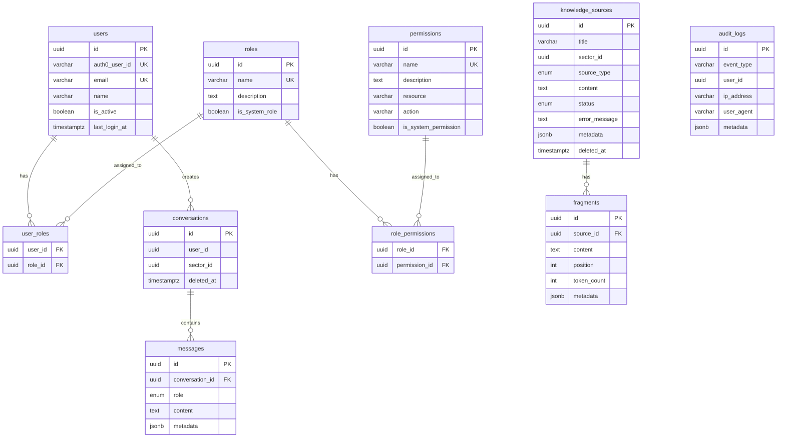

# Modelo de Datos - Context.ai
## Esquema de Base de Datos PostgreSQL + Pinecone
### Actualizado: Febrero 2026

---

## 1. Visión General

Context.ai utiliza una **arquitectura de persistencia híbrida**:

- **PostgreSQL 16**: Datos relacionales (usuarios, roles, permisos, conversaciones, mensajes, fuentes de conocimiento, fragmentos, auditoría)
- **Pinecone**: Almacenamiento y búsqueda de embeddings vectoriales (vector store externo gestionado)

### Stack de Persistencia

- **RDBMS**: PostgreSQL 16+
- **Vector Store**: Pinecone (cloud, gestionado)
- **ORM**: TypeORM 0.3+
- **Migraciones**: TypeORM CLI
- **Gestor de paquetes**: pnpm

> **⚠️ Cambio vs diseño original**: Se planificó usar `pgvector` (extensión de PostgreSQL) para almacenar embeddings. Se implementó **Pinecone** como vector store externo. Los fragmentos en PostgreSQL almacenan solo metadatos y contenido textual; los vectores de embedding se almacenan en Pinecone usando el `fragment.id` como vector ID.

---

## 2. Extensiones Requeridas

```sql
-- No se requiere la extensión vector (embeddings en Pinecone)
-- Solo extensiones para UUID si se usa pg_uuidv7
CREATE EXTENSION IF NOT EXISTS "pg_uuidv7";
```

### ¿Por qué UUID v7?

**UUID v7** (RFC 9562) es superior a UUID v4 para aplicaciones modernas:

- ✅ **Ordenable por timestamp**: Primeros 48 bits son Unix timestamp (ms)
- ✅ **Mejor performance**: Reduce fragmentación de índices B-tree en ~40%
- ✅ **Menor I/O**: Inserciones casi secuenciales = menos page splits
- ✅ **Debugging**: Puedes inferir cuándo se creó el registro
- ✅ **Compatible**: Mismo formato UUID estándar (128 bits)

```
UUID v7: 019405f8-6d84-7000-8000-123456789abc
         └─timestamp─┘ ver └──random────────┘
```

**Nota**: TypeORM genera UUIDs automáticamente con `@PrimaryGeneratedColumn('uuid')`. Si `pg_uuidv7` no está disponible, se usa `uuid-ossp` con UUID v4 como fallback.

---

## 3. Esquema de Tablas (Implementación Actual)

### 3.1 Tabla: `users`

**Responsabilidad**: Almacenar información de usuarios sincronizados desde Auth0.

**Módulo**: `UsersModule`

| Columna | Tipo | Nullable | Default | Descripción |
|---------|------|----------|---------|-------------|
| `id` | UUID | NO | auto | Primary key |
| `auth0_user_id` | VARCHAR(255) | NO | — | ID único de Auth0 (UNIQUE) |
| `email` | VARCHAR(255) | NO | — | Email del usuario (UNIQUE) |
| `name` | VARCHAR(255) | NO | — | Nombre completo |
| `is_active` | BOOLEAN | NO | true | Soft delete flag |
| `created_at` | TIMESTAMPTZ | NO | NOW() | Fecha de creación |
| `updated_at` | TIMESTAMPTZ | NO | NOW() | Última actualización |
| `last_login_at` | TIMESTAMPTZ | SÍ | null | Último login |

**Índices**:
- `UNIQUE` en `auth0_user_id`
- `UNIQUE` en `email`
- Parcial en `is_active` WHERE `is_active = true`

**Relaciones**:
- Many-to-Many con `roles` (a través de `user_roles`)

---

### 3.2 Tabla: `roles`

**Responsabilidad**: Definir roles del sistema (ADMIN, CONTENT_MANAGER, USER, VIEWER).

**Módulo**: `AuthModule`

| Columna | Tipo | Nullable | Default | Descripción |
|---------|------|----------|---------|-------------|
| `id` | UUID | NO | auto | Primary key |
| `name` | VARCHAR(50) | NO | — | Nombre del rol (UNIQUE) |
| `description` | TEXT | SÍ | null | Descripción del rol |
| `is_system_role` | BOOLEAN | NO | false | No puede eliminarse |
| `created_at` | TIMESTAMPTZ | NO | NOW() | Fecha de creación |
| `updated_at` | TIMESTAMPTZ | NO | NOW() | Última actualización |

**Índices**:
- `UNIQUE` en `name`

**Relaciones**:
- Many-to-Many con `users` (a través de `user_roles`)
- Many-to-Many con `permissions` (a través de `role_permissions`)

> **⚠️ Cambio vs diseño original**: Los permisos **no se almacenan como JSONB** en la tabla `roles`. En su lugar, existe una tabla `permissions` separada con relación Many-to-Many a través de `role_permissions`. Esto permite una gestión más granular y normalizada de los permisos.

---

### 3.3 Tabla: `permissions`

**Responsabilidad**: Definir permisos granulares del sistema (resource:action).

**Módulo**: `AuthModule`

| Columna | Tipo | Nullable | Default | Descripción |
|---------|------|----------|---------|-------------|
| `id` | UUID | NO | auto | Primary key |
| `name` | VARCHAR(100) | NO | — | Nombre del permiso (UNIQUE, ej: `knowledge:read`) |
| `description` | TEXT | SÍ | null | Descripción |
| `resource` | VARCHAR(50) | NO | — | Recurso (ej: `knowledge`, `chat`, `admin`) |
| `action` | VARCHAR(50) | NO | — | Acción (ej: `read`, `write`, `delete`, `query`) |
| `is_system_permission` | BOOLEAN | NO | false | No puede eliminarse |
| `created_at` | TIMESTAMPTZ | NO | NOW() | Fecha de creación |
| `updated_at` | TIMESTAMPTZ | NO | NOW() | Última actualización |

**Índices**:
- `UNIQUE` en `name`
- Índice en `resource`
- Índice en `action`

**Relaciones**:
- Many-to-Many con `roles` (a través de `role_permissions`)

**Permisos del sistema**:
- `knowledge:read`, `knowledge:write`, `knowledge:delete`
- `chat:query`
- `admin:manage_sectors`, `admin:manage_roles`, `admin:manage_users`

> **Nota**: Esta tabla es **nueva** respecto al diseño original, donde los permisos eran JSONB dentro de `roles`.

---

### 3.4 Tabla: `user_roles` (junction)

**Responsabilidad**: Asignación de roles a usuarios.

| Columna | Tipo | Nullable | Descripción |
|---------|------|----------|-------------|
| `user_id` | UUID | NO | FK → users(id) |
| `role_id` | UUID | NO | FK → roles(id) |

**Nota**: Tabla junction generada automáticamente por TypeORM `@ManyToMany` + `@JoinTable`.

> **⚠️ Cambio vs diseño original**: Se simplificó eliminando `sector_id`, `assigned_by`, `assigned_at`, `expires_at`. La asignación de roles es global (no por sector). El filtrado por sector se realiza en la capa de aplicación.

---

### 3.5 Tabla: `role_permissions` (junction)

**Responsabilidad**: Asignación de permisos a roles.

| Columna | Tipo | Nullable | Descripción |
|---------|------|----------|-------------|
| `role_id` | UUID | NO | FK → roles(id) |
| `permission_id` | UUID | NO | FK → permissions(id) |

**Nota**: Tabla junction generada automáticamente por TypeORM `@ManyToMany` + `@JoinTable`.

> **Nota**: Esta tabla es **nueva** respecto al diseño original.

---

### 3.6 Tabla: `knowledge_sources`

**Responsabilidad**: Almacenar metadatos de documentos subidos al sistema.

**Módulo**: `KnowledgeModule`

| Columna | Tipo | Nullable | Default | Descripción |
|---------|------|----------|---------|-------------|
| `id` | UUID | NO | auto | Primary key |
| `title` | VARCHAR(500) | NO | — | Título del documento |
| `sector_id` | UUID | NO | — | ID del sector (sin FK a tabla sectors) |
| `source_type` | ENUM | NO | — | `'PDF'`, `'MARKDOWN'`, `'TEXT'`, `'URL'` |
| `content` | TEXT | NO | — | Contenido completo del documento |
| `status` | ENUM | NO | `'PENDING'` | `'PENDING'`, `'PROCESSING'`, `'PROCESSED'`, `'FAILED'` |
| `error_message` | TEXT | SÍ | null | Mensaje de error si el procesamiento falló |
| `metadata` | JSONB | SÍ | null | Metadatos adicionales |
| `created_at` | TIMESTAMPTZ | NO | NOW() | Fecha de creación |
| `updated_at` | TIMESTAMPTZ | NO | NOW() | Última actualización |
| `deleted_at` | TIMESTAMPTZ | SÍ | null | Soft delete (TypeORM `@DeleteDateColumn`) |

**Índices**:
- Compuesto en `(sector_id, status)`
- Índice en `status`

> **⚠️ Cambios vs diseño original**:
> - Se eliminaron columnas planificadas que no se implementaron: `source_url`, `file_name`, `file_size`, `mime_type`, `content_hash`, `version`, `uploaded_by`, `fragment_count`, `total_tokens`, `indexed_at`
> - Se agregó `content` (texto completo del documento)
> - Se agregó `error_message` para tracking de errores de procesamiento
> - Soft delete con `deleted_at` en lugar de columna `status = 'deleted'`
> - `sector_id` es UUID sin FK (no existe tabla `sectors` como entidad TypeORM)
> - Los enum values difieren ligeramente (ej: `PROCESSED` vs `completed`)

---

### 3.7 Tabla: `fragments`

**Responsabilidad**: Almacenar chunks (fragmentos) de documentos. Los embeddings vectoriales se almacenan en Pinecone.

**Módulo**: `KnowledgeModule`

| Columna | Tipo | Nullable | Default | Descripción |
|---------|------|----------|---------|-------------|
| `id` | UUID | NO | auto | Primary key (= vector ID en Pinecone) |
| `source_id` | UUID | NO | — | FK → knowledge_sources(id) |
| `content` | TEXT | NO | — | Texto del fragmento |
| `position` | INT | NO | — | Orden en el documento original |
| `token_count` | INT | NO | — | Tokens aproximados |
| `metadata` | JSONB | SÍ | null | Metadatos adicionales |
| `created_at` | TIMESTAMPTZ | NO | NOW() | Fecha de creación |
| `updated_at` | TIMESTAMPTZ | NO | NOW() | Última actualización |

**Índices**:
- Índice en `source_id`
- Índice en `position`

**Relación con Pinecone**:
- El `id` del fragment es el **vector ID** en Pinecone
- Pinecone almacena: `{ id: fragment.id, values: embedding[3072], metadata: { sectorId, sourceId, ... } }`
- PostgreSQL almacena: contenido textual, posición, metadatos relacionales

> **⚠️ Cambio CRÍTICO vs diseño original**: La columna `embedding vector(768)` **NO existe** en PostgreSQL. Los embeddings de 3072 dimensiones se almacenan en Pinecone. Tampoco existe el índice HNSW vectorial.

---

### 3.8 Tabla: `conversations`

**Responsabilidad**: Representar sesiones de chat de usuarios.

**Módulo**: `InteractionModule`

| Columna | Tipo | Nullable | Default | Descripción |
|---------|------|----------|---------|-------------|
| `id` | UUID | NO | auto | Primary key |
| `user_id` | UUID | NO | — | ID del usuario |
| `sector_id` | UUID | NO | — | ID del sector |
| `created_at` | TIMESTAMPTZ | NO | NOW() | Fecha de creación |
| `updated_at` | TIMESTAMPTZ | NO | NOW() | Última actualización |
| `deleted_at` | TIMESTAMPTZ | SÍ | null | Soft delete |

**Índices**:
- Compuesto en `(user_id, sector_id)`
- Índice en `user_id`
- Índice en `sector_id`
- Índice en `created_at`

**Relaciones**:
- One-to-Many con `messages` (cascade delete)

> **⚠️ Cambios vs diseño original**: Se simplificó eliminando columnas planificadas: `title`, `status`, `message_count`, `started_at`, `last_message_at`, `ended_at`. La conversación se identifica solo por usuario, sector y timestamps. Soft delete con `deleted_at`.

---

### 3.9 Tabla: `messages`

**Responsabilidad**: Almacenar mensajes individuales de las conversaciones.

**Módulo**: `InteractionModule`

| Columna | Tipo | Nullable | Default | Descripción |
|---------|------|----------|---------|-------------|
| `id` | UUID | NO | auto | Primary key |
| `conversation_id` | UUID | NO | — | FK → conversations(id) ON DELETE CASCADE |
| `role` | ENUM | NO | — | `'user'`, `'assistant'`, `'system'` |
| `content` | TEXT | NO | — | Contenido del mensaje |
| `metadata` | JSONB | SÍ | null | Metadatos (fuentes, scores, latencia) |
| `created_at` | TIMESTAMPTZ | NO | NOW() | Fecha de creación |

**Índices**:
- Índice en `conversation_id`
- Índice en `role`
- Índice en `created_at`

**Relaciones**:
- Many-to-One con `conversations` (ON DELETE CASCADE)

**Metadata example** (para respuestas assistant):
```json
{
  "model": "gemini-2.5-flash",
  "latency_ms": 2350,
  "tokens_used": 1240,
  "faithfulness_score": 0.87,
  "relevancy_score": 0.92,
  "sources_used": [
    {
      "fragment_id": "uuid-1",
      "source_title": "Manual de Vacaciones",
      "relevance_score": 0.89,
      "excerpt": "Las vacaciones deben solicitarse con 15 días..."
    }
  ],
  "fragments_retrieved": 5
}
```

> **⚠️ Cambios vs diseño original**: Se simplificó significativamente:
> - Columnas `sources_used`, `sentiment_score`, `sentiment_label`, `feedback_rating`, `feedback_comment`, `feedback_at` **no se implementaron como columnas dedicadas**
> - Toda la información adicional (fuentes, scores, feedback) se almacena en el campo `metadata` JSONB
> - Los role values son lowercase (`'user'`, `'assistant'`, `'system'`) en lugar de uppercase

---

### 3.10 Tabla: `audit_logs`

**Responsabilidad**: Registro inmutable de eventos de auditoría del sistema.

**Módulo**: `AuditModule`

| Columna | Tipo | Nullable | Default | Descripción |
|---------|------|----------|---------|-------------|
| `id` | UUID | NO | auto | Primary key |
| `event_type` | VARCHAR(50) | NO | — | Tipo de evento de auditoría |
| `user_id` | UUID | SÍ | null | ID del usuario (null para eventos no autenticados) |
| `ip_address` | VARCHAR(45) | NO | — | Dirección IP (IPv4/IPv6) |
| `user_agent` | VARCHAR(500) | NO | — | User agent del navegador |
| `metadata` | JSONB | SÍ | null | Contexto adicional |
| `created_at` | TIMESTAMPTZ | NO | NOW() | Fecha del evento |

**Índices**:
- Compuesto en `(user_id, created_at)` — para audit trail de usuario
- Compuesto en `(event_type, created_at)` — para filtrado por tipo
- Índice en `created_at` — para queries por rango temporal
- Índice en `user_id`

**Política de retención**:
- Mantener logs por mínimo 1 año (compliance)
- Archivar después de 1 año (cold storage)
- Nunca eliminar eventos críticos (LOGIN_FAILED, ACCESS_DENIED)

> **Nota**: Esta tabla es **nueva** respecto al diseño original. Implementada en Phase 6.

---

## 4. Tabla: `sectors` (Nota sobre diseño)

> **⚠️ Importante**: La tabla `sectors` planificada originalmente como entidad TypeORM **no se implementó como modelo TypeORM**. En su lugar, los IDs de sector se almacenan como UUID strings en las tablas que los referencian (`knowledge_sources.sector_id`, `conversations.sector_id`). No existe FK hacia una tabla `sectors` gestionada por TypeORM.
>
> Los sectores se gestionan de forma simplificada: los sector IDs se pasan como parámetros en las consultas y se almacenan como strings UUID. La gestión completa de sectores (CRUD desde UI) está planificada para Post-MVP.

---

## 5. Diagrama de Relaciones (ERD - Implementación Actual)



---

## 6. Arquitectura de Vectores (Pinecone)

### 6.1 Estructura de Vectores en Pinecone

Cada fragmento de documento se almacena como un vector en Pinecone:

```json
{
  "id": "fragment-uuid-from-postgresql",
  "values": [0.012, -0.034, ...],
  "metadata": {
    "sectorId": "sector-uuid",
    "sourceId": "knowledge-source-uuid",
    "content": "Texto del fragmento...",
    "position": 0,
    "sourceTitle": "Manual de Vacaciones"
  }
}
```

- **Dimensiones**: 3072 (gemini-embedding-001)
- **Modelo de embedding**: `googleai/gemini-embedding-001`
- **Métrica de similitud**: Cosine similarity
- **Filtrado**: Por `sectorId` en metadata (aislamiento por sector)

### 6.2 Flujo de Búsqueda Semántica

```
Query del usuario
    ↓
Generar embedding de la query (gemini-embedding-001, 3072d)
    ↓
Buscar en Pinecone:
    - topK: 5
    - filter: { sectorId: "sector-uuid" }
    - includeMetadata: true
    ↓
Retornar fragmentos más relevantes con similarity scores
    ↓
Recuperar contenido completo de PostgreSQL (fragments table)
    ↓
Construir prompt con contexto → Gemini 2.5 Flash → Respuesta
```

### 6.3 Ventajas de Pinecone vs pgvector

| Aspecto | Pinecone | pgvector |
|---------|----------|---------|
| Escalabilidad | Gestionada, auto-scaling | Manual, limitada por PostgreSQL |
| Mantenimiento | Sin mantenimiento de índices | Requiere VACUUM, REINDEX |
| Filtrado | Nativo por metadata | JOINs con tablas relacionales |
| Dimensiones | Sin límite práctico | Performance degrada con alta dimensionalidad |
| Separación | Vectores separados de datos relacionales | Todo en PostgreSQL |
| Costo | Pay-per-use | Incluido en PostgreSQL |

### 6.4 Interfaz Abstracta

La implementación de Pinecone está detrás de una interfaz abstracta `VectorStoreInterface`, lo que permite cambiar de provider sin modificar la lógica de negocio:

```typescript
// domain/services/vector-store.interface.ts
export interface VectorStoreInterface {
  upsert(payload: VectorIndexPayload): Promise<void>;
  query(embedding: number[], sectorId: string, topK: number): Promise<VectorSearchResult[]>;
  deleteBySourceId(sourceId: string): Promise<void>;
}
```

---

## 7. Seed Data para MVP

### 7.1 Roles del Sistema

Los roles se crean automáticamente por el `RbacSeederService` al iniciar la aplicación:

| Rol | Permisos | System Role |
|-----|----------|-------------|
| `ADMIN` | `knowledge:read`, `knowledge:write`, `knowledge:delete`, `chat:query`, `admin:manage_sectors`, `admin:manage_roles`, `admin:manage_users` | ✅ |
| `CONTENT_MANAGER` | `knowledge:read`, `knowledge:write`, `knowledge:delete`, `chat:query` | ❌ |
| `USER` | `knowledge:read`, `chat:query` | ✅ |
| `VIEWER` | `knowledge:read` | ❌ |

### 7.2 Permisos del Sistema

| Permiso | Recurso | Acción |
|---------|---------|--------|
| `knowledge:read` | knowledge | read |
| `knowledge:write` | knowledge | write |
| `knowledge:delete` | knowledge | delete |
| `chat:query` | chat | query |
| `admin:manage_sectors` | admin | manage_sectors |
| `admin:manage_roles` | admin | manage_roles |
| `admin:manage_users` | admin | manage_users |

---

## 8. Queries Críticas para el MVP

### 8.1 Búsqueda Semántica (RAG Core)

La búsqueda semántica se realiza en **Pinecone**, no en PostgreSQL:

```typescript
// PineconeVectorStoreService
const results = await index.query({
  vector: queryEmbedding, // 3072 dimensiones
  topK: 5,
  filter: { sectorId: { $eq: sectorId } },
  includeMetadata: true,
});
```

Después de obtener los IDs de fragmentos relevantes, se recuperan los datos completos de PostgreSQL:

```sql
SELECT f.id, f.content, f.source_id, f.position, f.metadata
FROM fragments f
WHERE f.id = ANY($1)
ORDER BY f.position;
```

### 8.2 Historial de Conversación

```sql
SELECT m.id, m.role, m.content, m.metadata, m.created_at
FROM messages m
WHERE m.conversation_id = $1
ORDER BY m.created_at ASC;
```

### 8.3 Listar Conversaciones de un Usuario

```sql
SELECT c.id, c.sector_id, c.created_at, c.updated_at
FROM conversations c
WHERE c.user_id = $1
  AND c.deleted_at IS NULL
ORDER BY c.updated_at DESC;
```

### 8.4 Verificar Permisos de Usuario

```sql
SELECT p.name
FROM permissions p
INNER JOIN role_permissions rp ON rp.permission_id = p.id
INNER JOIN roles r ON r.id = rp.role_id
INNER JOIN user_roles ur ON ur.role_id = r.id
WHERE ur.user_id = $1;
```

---

## 9. Integración con TypeORM

### 9.1 Configuración de Conexión

```typescript
// src/config/database.config.ts
import { TypeOrmModuleOptions } from '@nestjs/typeorm';

export const databaseConfig: TypeOrmModuleOptions = {
  type: 'postgres',
  host: process.env.DB_HOST || 'localhost',
  port: parseInt(process.env.DB_PORT) || 5432,
  username: process.env.DB_USER || 'contextai_user',
  password: process.env.DB_PASSWORD,
  database: process.env.DB_NAME || 'contextai',
  entities: ['dist/**/*.model{.ts,.js}'],
  migrations: ['dist/migrations/*{.ts,.js}'],
  synchronize: false, // NEVER true in production
  logging: process.env.NODE_ENV === 'development',
  ssl: process.env.NODE_ENV === 'production' ? { rejectUnauthorized: false } : false,
};
```

### 9.2 Modelos TypeORM (Entities)

Los modelos TypeORM se ubican en la capa de infraestructura de cada módulo:

```
src/modules/
├── users/infrastructure/persistence/models/user.model.ts
├── auth/infrastructure/persistence/models/
│   ├── role.model.ts
│   └── permission.model.ts
├── knowledge/infrastructure/persistence/models/
│   ├── knowledge-source.model.ts
│   └── fragment.model.ts
├── interaction/infrastructure/persistence/models/
│   ├── conversation.model.ts
│   └── message.model.ts
└── audit/infrastructure/persistence/models/audit-log.model.ts
```

**Convenciones**:
- Nombres de tabla en `snake_case` (ej: `knowledge_sources`)
- Nombres de columna en `snake_case` (ej: `sector_id`, `created_at`)
- Propiedades TypeScript en `camelCase` (ej: `sectorId`, `createdAt`)
- TypeORM `@Column({ name: 'snake_case' })` para el mapeo
- Soft delete con `@DeleteDateColumn` donde aplique

---

## 10. Backup y Disaster Recovery

### 10.1 PostgreSQL Backup

```bash
# Backup completo diario
pg_dump -h localhost -U contextai_user -d contextai -F c -f backup_$(date +%Y%m%d).dump

# Backup solo del esquema
pg_dump -h localhost -U contextai_user -d contextai --schema-only -f schema_$(date +%Y%m%d).sql

# Restore desde backup
pg_restore -h localhost -U contextai_user -d contextai_new backup_20260203.dump
```

### 10.2 Pinecone Backup

Pinecone gestiona backups automáticamente (managed service). Para backups manuales:
- Exportar vectores via API de Pinecone
- Los fragment IDs en PostgreSQL permiten reconstruir vectores si es necesario (re-embedding desde contenido almacenado)

---

## 11. Cambios vs Diseño Original

| Aspecto | Diseño Original | Implementación Actual |
|---------|----------------|----------------------|
| Vector Store | pgvector (PostgreSQL) | **Pinecone** (external) |
| Embedding dimension | 768 (text-embedding-004) | **3072** (gemini-embedding-001) |
| `fragments.embedding` | Columna `vector(768)` | **No existe** (vectores en Pinecone) |
| Índice HNSW | En PostgreSQL | **No aplica** (Pinecone gestiona) |
| `roles.permissions` | JSONB column | **Tabla `permissions`** separada + `role_permissions` |
| `sectors` tabla | Entidad TypeORM | **No implementada** (sector_id como UUID string) |
| `user_roles` | Con sector_id, expires_at | **Simplificada** (solo user_id + role_id) |
| `knowledge_sources` | Muchas columnas | **Simplificada** (content, error_message, soft delete) |
| `conversations` | Con title, status, etc. | **Simplificada** (solo IDs y timestamps) |
| `messages` | Columnas dedicadas para feedback/sentiment | **JSONB metadata** para todo |
| `audit_logs` | No planificada | **Nueva tabla** |
| Extensiones | vector, pg_uuidv7, pg_trgm | Solo **pg_uuidv7** (opcional) |

---

## Resumen

El modelo de datos de Context.ai está diseñado para:

✅ **Escalabilidad**: Pinecone para vectores, PostgreSQL para datos relacionales  
✅ **Seguridad**: Constraints, validaciones, aislamiento por sectores, auditoría  
✅ **Performance**: Índices optimizados, Pinecone para búsqueda semántica  
✅ **Mantenibilidad**: TypeORM models con convenciones consistentes  
✅ **Observabilidad**: JSONB metadata flexible, audit logs  
✅ **Flexibilidad**: Interfaz `VectorStoreInterface` permite cambio de vector store  

**Total de tablas PostgreSQL**: 9 (`users`, `roles`, `permissions`, `user_roles`, `role_permissions`, `knowledge_sources`, `fragments`, `conversations`, `messages`, `audit_logs`)  
**Vector Store**: Pinecone (gestionado, cloud)  
**Embedding dimensions**: 3072 (gemini-embedding-001)
