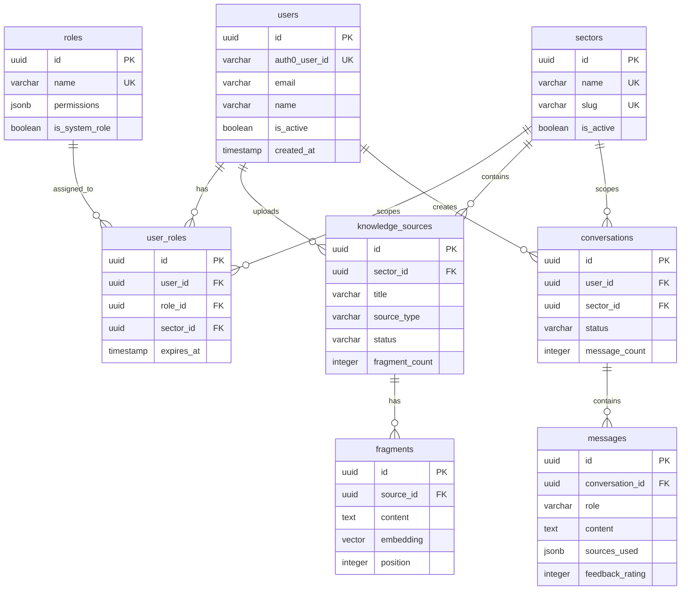

# Modelo de Datos - Context.ai
## Esquema de Base de Datos PostgreSQL + pgvector

---

## 1. Visión General

Context.ai utiliza **PostgreSQL 16** con la extensión **pgvector** para almacenar tanto datos relacionales como embeddings vectoriales. El modelo de datos está diseñado siguiendo principios de normalización y optimizado para búsquedas semánticas de alta performance.

### Stack de Persistencia

- **RDBMS**: PostgreSQL 16+
- **Extensión Vector**: pgvector 0.5.0+
- **ORM**: TypeORM 0.3+
- **Migraciones**: TypeORM CLI
- **Gestor de paquetes**: pnpm

---

## 2. Extensiones Requeridas

```sql
-- Habilitar extensión para vectores
CREATE EXTENSION IF NOT EXISTS vector;

-- Habilitar extensión para UUID v7 (time-ordered, mejor performance)
CREATE EXTENSION IF NOT EXISTS pg_uuidv7;

-- Habilitar extensión para funciones de texto
CREATE EXTENSION IF NOT EXISTS pg_trgm;
```

### ¿Por qué UUID v7?

**UUID v7** (RFC 9562) es superior a UUID v4 para aplicaciones modernas:

- ✅ **Ordenable por timestamp**: Primeros 48 bits son Unix timestamp (ms)
- ✅ **Mejor performance**: Reduce fragmentación de índices B-tree en ~40%
- ✅ **Menor I/O**: Inserciones casi secuenciales = menos page splits
- ✅ **Debugging**: Puedes inferir cuándo se creó el registro
- ✅ **Compatible**: Mismo formato UUID estándar (128 bits)

```
UUID v7: 019405f8-6d84-7000-8000-123456789abc
         └─timestamp─┘ ver └──random────────┘
```

---

## 3. Esquema de Tablas

### 3.1 Tabla: `users`

**Responsabilidad**: Almacenar información de usuarios sincronizados desde Auth0.

**Bounded Context**: Authorization Context

```sql
CREATE TABLE users (
    id UUID PRIMARY KEY DEFAULT uuid_generate_v7(),
    auth0_user_id VARCHAR(255) NOT NULL UNIQUE,
    email VARCHAR(255) NOT NULL,
    name VARCHAR(255) NOT NULL,
    is_active BOOLEAN DEFAULT true,
    created_at TIMESTAMP WITH TIME ZONE DEFAULT NOW(),
    updated_at TIMESTAMP WITH TIME ZONE DEFAULT NOW(),
    last_login_at TIMESTAMP WITH TIME ZONE
);

-- Índices
CREATE INDEX idx_users_auth0_id ON users(auth0_user_id);
CREATE INDEX idx_users_email ON users(email);
CREATE INDEX idx_users_active ON users(is_active) WHERE is_active = true;
```

**Campos clave**:
- `auth0_user_id`: Identificador único de Auth0 (formato: `auth0|123456` o `google-oauth2|123456`)
- `email`: Email del usuario (sincronizado desde Auth0)
- `is_active`: Soft delete (para desactivar usuarios sin eliminar datos)

---

### 3.2 Tabla: `roles`

**Responsabilidad**: Definir roles del sistema con sus permisos asociados.

**Bounded Context**: Authorization Context

```sql
CREATE TABLE roles (
    id UUID PRIMARY KEY DEFAULT uuid_generate_v7(),
    name VARCHAR(50) NOT NULL UNIQUE,
    description TEXT,
    permissions JSONB NOT NULL DEFAULT '[]'::jsonb,
    is_system_role BOOLEAN DEFAULT false,
    created_at TIMESTAMP WITH TIME ZONE DEFAULT NOW(),
    updated_at TIMESTAMP WITH TIME ZONE DEFAULT NOW(),
    
    CONSTRAINT chk_role_name CHECK (name ~ '^[A-Z_]+$')
);

-- Índices
CREATE INDEX idx_roles_name ON roles(name);
CREATE INDEX idx_roles_permissions ON roles USING gin(permissions);
```

**Campos clave**:
- `name`: Nombre del rol (formato: ADMIN, USER, CONTENT_MANAGER)
- `permissions`: Array JSON de permisos (ejemplo: `["knowledge:read", "knowledge:write", "chat:query"]`)
- `is_system_role`: Roles del sistema que no pueden eliminarse (ADMIN, USER)

**Ejemplo de datos**:
```json
{
  "name": "ADMIN",
  "permissions": [
    "knowledge:read",
    "knowledge:write",
    "knowledge:delete",
    "chat:query",
    "admin:manage_sectors",
    "admin:manage_roles"
  ],
  "is_system_role": true
}
```

---

### 3.3 Tabla: `sectors`

**Responsabilidad**: Representar departamentos o áreas de conocimiento de la organización.

**Bounded Context**: Organization Context (simplificado en MVP)

```sql
CREATE TABLE sectors (
    id UUID PRIMARY KEY DEFAULT uuid_generate_v7(),
    name VARCHAR(100) NOT NULL UNIQUE,
    description TEXT,
    slug VARCHAR(100) NOT NULL UNIQUE,
    color VARCHAR(7) DEFAULT '#3B82F6',
    icon VARCHAR(50),
    is_active BOOLEAN DEFAULT true,
    created_at TIMESTAMP WITH TIME ZONE DEFAULT NOW(),
    updated_at TIMESTAMP WITH TIME ZONE DEFAULT NOW(),
    
    CONSTRAINT chk_sector_slug CHECK (slug ~ '^[a-z0-9-]+$'),
    CONSTRAINT chk_sector_color CHECK (color ~ '^#[0-9A-Fa-f]{6}$')
);

-- Índices
CREATE INDEX idx_sectors_slug ON sectors(slug);
CREATE INDEX idx_sectors_active ON sectors(is_active) WHERE is_active = true;
```

**Campos clave**:
- `slug`: Identificador amigable para URLs (ejemplo: `rrhh`, `tech`, `ventas`)
- `color`: Color hexadecimal para UI
- `icon`: Nombre del icono (ejemplo: `users`, `code`, `chart`)

---

### 3.4 Tabla: `user_roles`

**Responsabilidad**: Asignación de roles a usuarios (puede ser global o por sector).

**Bounded Context**: Authorization Context

```sql
CREATE TABLE user_roles (
    id UUID PRIMARY KEY DEFAULT uuid_generate_v7(),
    user_id UUID NOT NULL REFERENCES users(id) ON DELETE CASCADE,
    role_id UUID NOT NULL REFERENCES roles(id) ON DELETE CASCADE,
    sector_id UUID REFERENCES sectors(id) ON DELETE CASCADE,
    assigned_by UUID REFERENCES users(id) ON DELETE SET NULL,
    assigned_at TIMESTAMP WITH TIME ZONE DEFAULT NOW(),
    expires_at TIMESTAMP WITH TIME ZONE,
    
    -- Un usuario no puede tener el mismo rol dos veces en el mismo sector
    CONSTRAINT uq_user_role_sector UNIQUE(user_id, role_id, sector_id)
);

-- Índices
CREATE INDEX idx_user_roles_user ON user_roles(user_id);
CREATE INDEX idx_user_roles_role ON user_roles(role_id);
CREATE INDEX idx_user_roles_sector ON user_roles(sector_id);
CREATE INDEX idx_user_roles_active ON user_roles(expires_at) 
    WHERE expires_at IS NULL OR expires_at > NOW();
```

**Campos clave**:
- `sector_id`: NULL = rol global, UUID = rol específico del sector
- `expires_at`: NULL = permanente, TIMESTAMP = temporal

**Ejemplos**:
```sql
-- Usuario con rol ADMIN global
INSERT INTO user_roles (user_id, role_id, sector_id) 
VALUES ('user-uuid', 'admin-role-uuid', NULL);

-- Usuario con rol USER en sector RRHH
INSERT INTO user_roles (user_id, role_id, sector_id) 
VALUES ('user-uuid', 'user-role-uuid', 'rrhh-sector-uuid');
```

---

### 3.5 Tabla: `knowledge_sources`

**Responsabilidad**: Almacenar metadatos de documentos subidos al sistema.

**Bounded Context**: Knowledge Context

```sql
CREATE TABLE knowledge_sources (
    id UUID PRIMARY KEY DEFAULT uuid_generate_v7(),
    sector_id UUID NOT NULL REFERENCES sectors(id) ON DELETE CASCADE,
    title VARCHAR(255) NOT NULL,
    source_type VARCHAR(20) NOT NULL,
    source_url TEXT,
    file_name VARCHAR(255),
    file_size INTEGER,
    mime_type VARCHAR(100),
    content_hash VARCHAR(64),
    version VARCHAR(64),
    metadata JSONB DEFAULT '{}'::jsonb,
    status VARCHAR(20) DEFAULT 'processing',
    uploaded_by UUID NOT NULL REFERENCES users(id) ON DELETE SET NULL,
    fragment_count INTEGER DEFAULT 0,
    total_tokens INTEGER DEFAULT 0,
    created_at TIMESTAMP WITH TIME ZONE DEFAULT NOW(),
    updated_at TIMESTAMP WITH TIME ZONE DEFAULT NOW(),
    indexed_at TIMESTAMP WITH TIME ZONE,
    
    CONSTRAINT chk_source_type CHECK (source_type IN ('PDF', 'MARKDOWN', 'WEB_LINK')),
    CONSTRAINT chk_source_status CHECK (status IN ('processing', 'completed', 'failed', 'deleted'))
);

-- Índices
CREATE INDEX idx_ksources_sector ON knowledge_sources(sector_id);
CREATE INDEX idx_ksources_status ON knowledge_sources(status);
CREATE INDEX idx_ksources_type ON knowledge_sources(source_type);
CREATE INDEX idx_ksources_uploaded_by ON knowledge_sources(uploaded_by);
CREATE INDEX idx_ksources_created ON knowledge_sources(created_at DESC);
CREATE INDEX idx_ksources_hash ON knowledge_sources(content_hash);
CREATE INDEX idx_ksources_metadata ON knowledge_sources USING gin(metadata);
```

**Campos clave**:
- `content_hash`: SHA-256 del contenido para detectar duplicados
- `version`: SHA-256 para trazabilidad (usado por ContentSourceOrigin en post-MVP)
- `metadata`: JSON flexible para datos específicos del tipo de source
- `status`: Estado del procesamiento

**Metadata examples**:
```json
// PDF
{
  "pages": 50,
  "author": "RRHH Team",
  "created_date": "2024-01-15",
  "pdf_version": "1.4"
}

// Markdown
{
  "word_count": 2500,
  "headings": ["Introducción", "Procedimiento", "Anexos"]
}
```

---

### 3.6 Tabla: `fragments`

**Responsabilidad**: Almacenar chunks (fragmentos) de documentos con sus embeddings vectoriales.

**Bounded Context**: Knowledge Context

```sql
CREATE TABLE fragments (
    id UUID PRIMARY KEY DEFAULT uuid_generate_v7(),
    source_id UUID NOT NULL REFERENCES knowledge_sources(id) ON DELETE CASCADE,
    content TEXT NOT NULL,
    embedding vector(768) NOT NULL,
    position INTEGER NOT NULL,
    token_count INTEGER NOT NULL,
    chunk_metadata JSONB DEFAULT '{}'::jsonb,
    created_at TIMESTAMP WITH TIME ZONE DEFAULT NOW(),
    
    CONSTRAINT chk_fragment_position CHECK (position >= 0),
    CONSTRAINT chk_fragment_tokens CHECK (token_count BETWEEN 10 AND 2000)
);

-- Índices críticos para performance
CREATE INDEX idx_fragments_source ON fragments(source_id);
CREATE INDEX idx_fragments_position ON fragments(source_id, position);

-- Índice vectorial para búsqueda semántica (CRITICAL!)
-- HNSW: Hierarchical Navigable Small World (superior a ivfflat en 2026)
CREATE INDEX idx_fragments_embedding ON fragments 
USING hnsw (embedding vector_cosine_ops) 
WITH (m = 16, ef_construction = 64);

-- Índice para búsqueda de texto completo (fallback)
CREATE INDEX idx_fragments_content_trgm ON fragments USING gin(content gin_trgm_ops);
```

**Campos clave**:
- `embedding`: Vector de 768 dimensiones (compatible con text-embedding-004 de Google)
- `position`: Orden del fragmento en el documento original
- `token_count`: Tokens aproximados (útil para validaciones)

**Chunk metadata example**:
```json
{
  "overlap_with_previous": 50,
  "start_char": 1200,
  "end_char": 1850,
  "page_number": 5,
  "section_title": "Política de Vacaciones"
}
```

**Notas sobre pgvector**:
- `vector(768)`: Dimensión del embedding (768 para text-embedding-004)
- `vector_cosine_ops`: Operador de similitud de coseno
- `HNSW`: Índice jerárquico navegable (mejor recall y velocidad que ivfflat)
- `m = 16`: Conexiones bidireccionales por capa (2-100, default 16)
- `ef_construction = 64`: Tamaño de lista durante construcción (mayor = mejor calidad)
- Búsqueda: `ORDER BY embedding <-> query_embedding LIMIT 5`

---

### 3.7 Tabla: `conversations`

**Responsabilidad**: Representar sesiones de chat de usuarios.

**Bounded Context**: Interaction Context

```sql
CREATE TABLE conversations (
    id UUID PRIMARY KEY DEFAULT uuid_generate_v7(),
    user_id UUID NOT NULL REFERENCES users(id) ON DELETE CASCADE,
    sector_id UUID NOT NULL REFERENCES sectors(id) ON DELETE CASCADE,
    title VARCHAR(255),
    status VARCHAR(20) DEFAULT 'active',
    message_count INTEGER DEFAULT 0,
    started_at TIMESTAMP WITH TIME ZONE DEFAULT NOW(),
    last_message_at TIMESTAMP WITH TIME ZONE DEFAULT NOW(),
    ended_at TIMESTAMP WITH TIME ZONE,
    
    CONSTRAINT chk_conv_status CHECK (status IN ('active', 'archived', 'deleted'))
);

-- Índices
CREATE INDEX idx_conversations_user ON conversations(user_id);
CREATE INDEX idx_conversations_sector ON conversations(sector_id);
CREATE INDEX idx_conversations_status ON conversations(status);
CREATE INDEX idx_conversations_last_msg ON conversations(last_message_at DESC);
CREATE INDEX idx_conversations_user_active ON conversations(user_id, status) 
    WHERE status = 'active';
```

**Campos clave**:
- `title`: Auto-generado del primer mensaje o NULL
- `message_count`: Desnormalizado para performance
- `status`: active (en curso), archived (finalizada), deleted (soft delete)

---

### 3.8 Tabla: `messages`

**Responsabilidad**: Almacenar mensajes individuales de las conversaciones.

**Bounded Context**: Interaction Context

```sql
CREATE TABLE messages (
    id UUID PRIMARY KEY DEFAULT uuid_generate_v7(),
    conversation_id UUID NOT NULL REFERENCES conversations(id) ON DELETE CASCADE,
    role VARCHAR(20) NOT NULL,
    content TEXT NOT NULL,
    sources_used JSONB DEFAULT '[]'::jsonb,
    metadata JSONB DEFAULT '{}'::jsonb,
    sentiment_score DECIMAL(3,2),
    sentiment_label VARCHAR(20),
    feedback_rating INTEGER,
    feedback_comment TEXT,
    feedback_at TIMESTAMP WITH TIME ZONE,
    created_at TIMESTAMP WITH TIME ZONE DEFAULT NOW(),
    
    CONSTRAINT chk_msg_role CHECK (role IN ('USER', 'ASSISTANT', 'SYSTEM')),
    CONSTRAINT chk_msg_sentiment_score CHECK (sentiment_score BETWEEN -1 AND 1),
    CONSTRAINT chk_msg_sentiment_label CHECK (
        sentiment_label IN ('positive', 'neutral', 'negative', 'mixed')
    ),
    CONSTRAINT chk_msg_feedback_rating CHECK (
        feedback_rating IS NULL OR feedback_rating BETWEEN 1 AND 5
    )
);

-- Índices
CREATE INDEX idx_messages_conversation ON messages(conversation_id);
CREATE INDEX idx_messages_role ON messages(role);
CREATE INDEX idx_messages_created ON messages(created_at DESC);
CREATE INDEX idx_messages_feedback ON messages(feedback_rating) 
    WHERE feedback_rating IS NOT NULL;
CREATE INDEX idx_messages_sources ON messages USING gin(sources_used);
CREATE INDEX idx_messages_metadata ON messages USING gin(metadata);
```

**Campos clave**:
- `role`: USER (pregunta), ASSISTANT (respuesta IA), SYSTEM (mensaje del sistema)
- `sources_used`: Array JSON de fragmentos citados
- `sentiment_score`: Score de -1 (negativo) a 1 (positivo)
- `feedback_rating`: Calificación del usuario (1-5 estrellas)

**Sources used example**:
```json
[
  {
    "fragment_id": "uuid-1",
    "source_id": "uuid-source",
    "source_title": "Manual de Vacaciones",
    "relevance_score": 0.89,
    "excerpt": "Las vacaciones deben solicitarse con 15 días..."
  },
  {
    "fragment_id": "uuid-2",
    "source_id": "uuid-source",
    "source_title": "Manual de Vacaciones",
    "relevance_score": 0.85,
    "excerpt": "El formulario se encuentra en el portal..."
  }
]
```

**Metadata example** (para respuestas ASSISTANT):
```json
{
  "model": "gemini-1.5-pro",
  "latency_ms": 2350,
  "tokens_used": 1240,
  "faithfulness_score": 0.87,
  "relevancy_score": 0.92,
  "prompt_version": "v1.2",
  "fragments_retrieved": 5
}
```

---

## 4. Diagrama de Relaciones (ERD)



---

## 5. Migraciones Iniciales

### 5.1 Migración 001: Extensiones

**Archivo**: `migrations/001_extensions.sql`

```sql
-- Enable required extensions
CREATE EXTENSION IF NOT EXISTS "pg_uuidv7";
CREATE EXTENSION IF NOT EXISTS "vector";
CREATE EXTENSION IF NOT EXISTS "pg_trgm";

-- Verify extensions
SELECT extname, extversion FROM pg_extension 
WHERE extname IN ('pg_uuidv7', 'vector', 'pg_trgm');
```

**Nota**: Si `pg_uuidv7` no está disponible en tu servidor PostgreSQL, puedes:
1. Instalarla: `pgxn install pg_uuidv7` o desde [github.com/fboulnois/pg_uuidv7](https://github.com/fboulnois/pg_uuidv7)
2. Alternativa temporal: Usar `uuid-ossp` con `uuid_generate_v4()` (menor performance)

---

### 5.2 Migración 002: Authorization Schema

**Archivo**: `migrations/002_authorization_schema.sql`

```sql
-- Create users table
CREATE TABLE users (
    id UUID PRIMARY KEY DEFAULT uuid_generate_v7(),
    auth0_user_id VARCHAR(255) NOT NULL UNIQUE,
    email VARCHAR(255) NOT NULL,
    name VARCHAR(255) NOT NULL,
    is_active BOOLEAN DEFAULT true,
    created_at TIMESTAMP WITH TIME ZONE DEFAULT NOW(),
    updated_at TIMESTAMP WITH TIME ZONE DEFAULT NOW(),
    last_login_at TIMESTAMP WITH TIME ZONE
);

CREATE INDEX idx_users_auth0_id ON users(auth0_user_id);
CREATE INDEX idx_users_email ON users(email);
CREATE INDEX idx_users_active ON users(is_active) WHERE is_active = true;

-- Create roles table
CREATE TABLE roles (
    id UUID PRIMARY KEY DEFAULT uuid_generate_v7(),
    name VARCHAR(50) NOT NULL UNIQUE,
    description TEXT,
    permissions JSONB NOT NULL DEFAULT '[]'::jsonb,
    is_system_role BOOLEAN DEFAULT false,
    created_at TIMESTAMP WITH TIME ZONE DEFAULT NOW(),
    updated_at TIMESTAMP WITH TIME ZONE DEFAULT NOW(),
    
    CONSTRAINT chk_role_name CHECK (name ~ '^[A-Z_]+$')
);

CREATE INDEX idx_roles_name ON roles(name);
CREATE INDEX idx_roles_permissions ON roles USING gin(permissions);

-- Create sectors table
CREATE TABLE sectors (
    id UUID PRIMARY KEY DEFAULT uuid_generate_v7(),
    name VARCHAR(100) NOT NULL UNIQUE,
    description TEXT,
    slug VARCHAR(100) NOT NULL UNIQUE,
    color VARCHAR(7) DEFAULT '#3B82F6',
    icon VARCHAR(50),
    is_active BOOLEAN DEFAULT true,
    created_at TIMESTAMP WITH TIME ZONE DEFAULT NOW(),
    updated_at TIMESTAMP WITH TIME ZONE DEFAULT NOW(),
    
    CONSTRAINT chk_sector_slug CHECK (slug ~ '^[a-z0-9-]+$'),
    CONSTRAINT chk_sector_color CHECK (color ~ '^#[0-9A-Fa-f]{6}$')
);

CREATE INDEX idx_sectors_slug ON sectors(slug);
CREATE INDEX idx_sectors_active ON sectors(is_active) WHERE is_active = true;

-- Create user_roles junction table
CREATE TABLE user_roles (
    id UUID PRIMARY KEY DEFAULT uuid_generate_v7(),
    user_id UUID NOT NULL REFERENCES users(id) ON DELETE CASCADE,
    role_id UUID NOT NULL REFERENCES roles(id) ON DELETE CASCADE,
    sector_id UUID REFERENCES sectors(id) ON DELETE CASCADE,
    assigned_by UUID REFERENCES users(id) ON DELETE SET NULL,
    assigned_at TIMESTAMP WITH TIME ZONE DEFAULT NOW(),
    expires_at TIMESTAMP WITH TIME ZONE,
    
    CONSTRAINT uq_user_role_sector UNIQUE(user_id, role_id, sector_id)
);

CREATE INDEX idx_user_roles_user ON user_roles(user_id);
CREATE INDEX idx_user_roles_role ON user_roles(role_id);
CREATE INDEX idx_user_roles_sector ON user_roles(sector_id);
CREATE INDEX idx_user_roles_active ON user_roles(expires_at) 
    WHERE expires_at IS NULL OR expires_at > NOW();
```

---

### 5.3 Migración 003: Knowledge Schema

**Archivo**: `migrations/003_knowledge_schema.sql`

```sql
-- Create knowledge_sources table
CREATE TABLE knowledge_sources (
    id UUID PRIMARY KEY DEFAULT uuid_generate_v7(),
    sector_id UUID NOT NULL REFERENCES sectors(id) ON DELETE CASCADE,
    title VARCHAR(255) NOT NULL,
    source_type VARCHAR(20) NOT NULL,
    source_url TEXT,
    file_name VARCHAR(255),
    file_size INTEGER,
    mime_type VARCHAR(100),
    content_hash VARCHAR(64),
    version VARCHAR(64),
    metadata JSONB DEFAULT '{}'::jsonb,
    status VARCHAR(20) DEFAULT 'processing',
    uploaded_by UUID NOT NULL REFERENCES users(id) ON DELETE SET NULL,
    fragment_count INTEGER DEFAULT 0,
    total_tokens INTEGER DEFAULT 0,
    created_at TIMESTAMP WITH TIME ZONE DEFAULT NOW(),
    updated_at TIMESTAMP WITH TIME ZONE DEFAULT NOW(),
    indexed_at TIMESTAMP WITH TIME ZONE,
    
    CONSTRAINT chk_source_type CHECK (source_type IN ('PDF', 'MARKDOWN', 'WEB_LINK')),
    CONSTRAINT chk_source_status CHECK (status IN ('processing', 'completed', 'failed', 'deleted'))
);

CREATE INDEX idx_ksources_sector ON knowledge_sources(sector_id);
CREATE INDEX idx_ksources_status ON knowledge_sources(status);
CREATE INDEX idx_ksources_type ON knowledge_sources(source_type);
CREATE INDEX idx_ksources_uploaded_by ON knowledge_sources(uploaded_by);
CREATE INDEX idx_ksources_created ON knowledge_sources(created_at DESC);
CREATE INDEX idx_ksources_hash ON knowledge_sources(content_hash);
CREATE INDEX idx_ksources_metadata ON knowledge_sources USING gin(metadata);

-- Create fragments table with vector column
CREATE TABLE fragments (
    id UUID PRIMARY KEY DEFAULT uuid_generate_v7(),
    source_id UUID NOT NULL REFERENCES knowledge_sources(id) ON DELETE CASCADE,
    content TEXT NOT NULL,
    embedding vector(768) NOT NULL,
    position INTEGER NOT NULL,
    token_count INTEGER NOT NULL,
    chunk_metadata JSONB DEFAULT '{}'::jsonb,
    created_at TIMESTAMP WITH TIME ZONE DEFAULT NOW(),
    
    CONSTRAINT chk_fragment_position CHECK (position >= 0),
    CONSTRAINT chk_fragment_tokens CHECK (token_count BETWEEN 10 AND 2000)
);

CREATE INDEX idx_fragments_source ON fragments(source_id);
CREATE INDEX idx_fragments_position ON fragments(source_id, position);

-- CRITICAL: Vector index for semantic search (HNSW)
CREATE INDEX idx_fragments_embedding ON fragments 
USING hnsw (embedding vector_cosine_ops) 
WITH (m = 16, ef_construction = 64);

CREATE INDEX idx_fragments_content_trgm ON fragments USING gin(content gin_trgm_ops);
```

---

### 5.4 Migración 004: Interaction Schema

**Archivo**: `migrations/004_interaction_schema.sql`

```sql
-- Create conversations table
CREATE TABLE conversations (
    id UUID PRIMARY KEY DEFAULT uuid_generate_v7(),
    user_id UUID NOT NULL REFERENCES users(id) ON DELETE CASCADE,
    sector_id UUID NOT NULL REFERENCES sectors(id) ON DELETE CASCADE,
    title VARCHAR(255),
    status VARCHAR(20) DEFAULT 'active',
    message_count INTEGER DEFAULT 0,
    started_at TIMESTAMP WITH TIME ZONE DEFAULT NOW(),
    last_message_at TIMESTAMP WITH TIME ZONE DEFAULT NOW(),
    ended_at TIMESTAMP WITH TIME ZONE,
    
    CONSTRAINT chk_conv_status CHECK (status IN ('active', 'archived', 'deleted'))
);

CREATE INDEX idx_conversations_user ON conversations(user_id);
CREATE INDEX idx_conversations_sector ON conversations(sector_id);
CREATE INDEX idx_conversations_status ON conversations(status);
CREATE INDEX idx_conversations_last_msg ON conversations(last_message_at DESC);
CREATE INDEX idx_conversations_user_active ON conversations(user_id, status) 
    WHERE status = 'active';

-- Create messages table
CREATE TABLE messages (
    id UUID PRIMARY KEY DEFAULT uuid_generate_v7(),
    conversation_id UUID NOT NULL REFERENCES conversations(id) ON DELETE CASCADE,
    role VARCHAR(20) NOT NULL,
    content TEXT NOT NULL,
    sources_used JSONB DEFAULT '[]'::jsonb,
    metadata JSONB DEFAULT '{}'::jsonb,
    sentiment_score DECIMAL(3,2),
    sentiment_label VARCHAR(20),
    feedback_rating INTEGER,
    feedback_comment TEXT,
    feedback_at TIMESTAMP WITH TIME ZONE,
    created_at TIMESTAMP WITH TIME ZONE DEFAULT NOW(),
    
    CONSTRAINT chk_msg_role CHECK (role IN ('USER', 'ASSISTANT', 'SYSTEM')),
    CONSTRAINT chk_msg_sentiment_score CHECK (sentiment_score BETWEEN -1 AND 1),
    CONSTRAINT chk_msg_sentiment_label CHECK (
        sentiment_label IN ('positive', 'neutral', 'negative', 'mixed')
    ),
    CONSTRAINT chk_msg_feedback_rating CHECK (
        feedback_rating IS NULL OR feedback_rating BETWEEN 1 AND 5
    )
);

CREATE INDEX idx_messages_conversation ON messages(conversation_id);
CREATE INDEX idx_messages_role ON messages(role);
CREATE INDEX idx_messages_created ON messages(created_at DESC);
CREATE INDEX idx_messages_feedback ON messages(feedback_rating) 
    WHERE feedback_rating IS NOT NULL;
CREATE INDEX idx_messages_sources ON messages USING gin(sources_used);
CREATE INDEX idx_messages_metadata ON messages USING gin(metadata);
```

---

## 6. Seed Data para MVP

### 6.1 Roles del Sistema

**Archivo**: `seeds/001_roles.sql`

```sql
-- Admin role: Full access
INSERT INTO roles (id, name, description, permissions, is_system_role) VALUES
(
    '00000000-0000-0000-0000-000000000001',
    'ADMIN',
    'Administrator with full system access',
    '["knowledge:read", "knowledge:write", "knowledge:delete", "chat:query", "admin:manage_sectors", "admin:manage_roles", "admin:manage_users"]'::jsonb,
    true
);

-- User role: Basic access
INSERT INTO roles (id, name, description, permissions, is_system_role) VALUES
(
    '00000000-0000-0000-0000-000000000002',
    'USER',
    'Standard user with read and chat access',
    '["knowledge:read", "chat:query"]'::jsonb,
    true
);

-- Content Manager role: Can manage documentation
INSERT INTO roles (id, name, description, permissions, is_system_role) VALUES
(
    '00000000-0000-0000-0000-000000000003',
    'CONTENT_MANAGER',
    'Can upload and manage documents in assigned sectors',
    '["knowledge:read", "knowledge:write", "knowledge:delete", "chat:query"]'::jsonb,
    false
);
```

---

### 6.2 Sectores Iniciales

**Archivo**: `seeds/002_sectors.sql`

```sql
-- RRHH Sector
INSERT INTO sectors (id, name, description, slug, color, icon) VALUES
(
    '10000000-0000-0000-0000-000000000001',
    'Recursos Humanos',
    'Documentación de políticas, procedimientos y beneficios',
    'rrhh',
    '#10B981',
    'users'
);

-- Tech Sector
INSERT INTO sectors (id, name, description, slug, color, icon) VALUES
(
    '10000000-0000-0000-0000-000000000002',
    'Tecnología',
    'Documentación técnica, arquitectura y procedimientos de desarrollo',
    'tech',
    '#3B82F6',
    'code'
);

-- Sales Sector
INSERT INTO sectors (id, name, description, slug, color, icon) VALUES
(
    '10000000-0000-0000-0000-000000000003',
    'Ventas',
    'Procesos comerciales, políticas de ventas y herramientas',
    'ventas',
    '#F59E0B',
    'chart'
);
```

---

## 7. Queries Críticas para el MVP

### 7.1 Búsqueda Semántica (RAG Core)

```sql
-- Buscar los 5 fragmentos más similares en un sector específico
-- 🔴 CRÍTICO: Filtrar status != 'deleted' para evitar "embeddings fantasma"
SELECT 
    f.id,
    f.content,
    ks.title as source_title,
    ks.id as source_id,
    1 - (f.embedding <=> $1::vector) as similarity
FROM fragments f
INNER JOIN knowledge_sources ks ON f.source_id = ks.id
WHERE ks.sector_id = $2
  AND ks.status = 'completed'  -- Solo documentos completados
  AND ks.status != 'deleted'   -- 🔴 Excluir documentos marcados como eliminados
ORDER BY f.embedding <=> $1::vector
LIMIT 5;
```

**Parámetros**:
- `$1`: Vector de embedding de la query (768 dimensiones)
- `$2`: UUID del sector

**Operador `<=>`**: Distancia de coseno (menor = más similar)

**⚠️ Nota de seguridad**: 
- El filtro `status != 'deleted'` es una **doble capa de protección**.
- El trigger `delete_fragments_on_source_deleted` ya elimina los fragments.
- Este WHERE defensivo previene bugs si el trigger falla o se desactiva.

---

### 7.2 Verificar Permisos de Usuario

```sql
-- Verificar si un usuario tiene un permiso específico en un sector
SELECT EXISTS (
    SELECT 1
    FROM user_roles ur
    INNER JOIN roles r ON ur.role_id = r.id
    WHERE ur.user_id = $1
      AND (ur.sector_id = $2 OR ur.sector_id IS NULL)
      AND (ur.expires_at IS NULL OR ur.expires_at > NOW())
      AND r.permissions @> $3::jsonb
) as has_permission;
```

**Parámetros**:
- `$1`: UUID del usuario
- `$2`: UUID del sector
- `$3`: Permiso a verificar (ejemplo: `'["chat:query"]'`)

---

### 7.3 Historial de Conversación

```sql
-- Obtener últimos 10 mensajes de una conversación
SELECT 
    m.id,
    m.role,
    m.content,
    m.sources_used,
    m.metadata,
    m.feedback_rating,
    m.created_at
FROM messages m
WHERE m.conversation_id = $1
ORDER BY m.created_at ASC
LIMIT 10;
```

---

### 7.4 Listar Documentos de un Sector

```sql
-- Listar documentos con estadísticas
SELECT 
    ks.id,
    ks.title,
    ks.source_type,
    ks.file_name,
    ks.status,
    ks.fragment_count,
    ks.total_tokens,
    ks.created_at,
    u.name as uploaded_by_name,
    COUNT(DISTINCT m.id) as times_cited
FROM knowledge_sources ks
LEFT JOIN users u ON ks.uploaded_by = u.id
LEFT JOIN messages m ON m.sources_used::jsonb @> jsonb_build_array(
    jsonb_build_object('source_id', ks.id::text)
)
WHERE ks.sector_id = $1
  AND ks.status != 'deleted'
GROUP BY ks.id, u.name
ORDER BY ks.created_at DESC;
```

---

## 8. Optimización y Performance

### 8.1 Ajuste del Índice Vectorial HNSW

El índice HNSW ofrece mejor performance que ivfflat sin necesidad de ajustes por volumen.

**Parámetros recomendados**:

| Parámetro | Valor Recomendado | Propósito |
|-----------|-------------------|-----------|
| `m` | 16 (default) | Conexiones por capa. Mayor = mejor recall, más memoria |
| `ef_construction` | 64 (default) | Calidad del índice. Mayor = mejor precisión, construcción más lenta |

**Para ajuste fino** (opcional):

```sql
-- Alta precisión (más memoria, construcción más lenta)
DROP INDEX idx_fragments_embedding;
CREATE INDEX idx_fragments_embedding ON fragments 
USING hnsw (embedding vector_cosine_ops) 
WITH (m = 32, ef_construction = 128);

-- Balance óptimo (recomendado para MVP)
DROP INDEX idx_fragments_embedding;
CREATE INDEX idx_fragments_embedding ON fragments 
USING hnsw (embedding vector_cosine_ops) 
WITH (m = 16, ef_construction = 64);
```

**Ajustar ef_search en tiempo de consulta** (mayor = más preciso, más lento):

```sql
-- Para queries individuales
SET hnsw.ef_search = 100;  -- Default: 40

-- Para la sesión completa
ALTER DATABASE contextai SET hnsw.ef_search = 100;
```

---

### 8.2 Análisis de Performance

```sql
-- Ver estadísticas de uso de índices
SELECT 
    schemaname,
    tablename,
    indexname,
    idx_scan,
    idx_tup_read,
    idx_tup_fetch
FROM pg_stat_user_indexes
WHERE schemaname = 'public'
ORDER BY idx_scan DESC;

-- Ver tamaño de tablas
SELECT 
    tablename,
    pg_size_pretty(pg_total_relation_size(schemaname||'.'||tablename)) as size
FROM pg_tables
WHERE schemaname = 'public'
ORDER BY pg_total_relation_size(schemaname||'.'||tablename) DESC;
```

---

### 8.3 Mantenimiento Recomendado

```sql
-- Vacuuming para liberar espacio y actualizar estadísticas
VACUUM ANALYZE fragments;
VACUUM ANALYZE messages;

-- Reindex para optimizar índices vectoriales (si es necesario)
REINDEX INDEX idx_fragments_embedding;

-- Verificar estadísticas del índice HNSW
SELECT * FROM pg_indexes WHERE indexname = 'idx_fragments_embedding';
```

---

## 9. Consideraciones de Seguridad en la BD

### 9.1 Row Level Security (RLS) - Opcional

Para ambientes multi-tenant avanzados:

```sql
-- Habilitar RLS en fragments
ALTER TABLE fragments ENABLE ROW LEVEL SECURITY;

-- Política: usuarios solo ven fragments de sus sectores
CREATE POLICY fragments_sector_isolation ON fragments
    FOR SELECT
    USING (
        source_id IN (
            SELECT ks.id 
            FROM knowledge_sources ks
            INNER JOIN user_roles ur ON ur.sector_id = ks.sector_id
            WHERE ur.user_id = current_setting('app.current_user_id')::uuid
        )
    );
```

**Nota**: En el MVP, el aislamiento se maneja en la capa de aplicación (más simple).

---

### 9.2 Encriptación de Datos Sensibles

```sql
-- Usar pgcrypto para datos sensibles (si aplica)
CREATE EXTENSION IF NOT EXISTS pgcrypto;

-- Ejemplo: encriptar feedback comments
UPDATE messages 
SET feedback_comment = pgp_sym_encrypt(feedback_comment, 'encryption-key')
WHERE feedback_comment IS NOT NULL;
```

---

## 10. Validaciones y Constraints Adicionales

### 10.1 Trigger: Actualizar message_count en conversations

```sql
CREATE OR REPLACE FUNCTION update_conversation_message_count()
RETURNS TRIGGER AS $$
BEGIN
    IF (TG_OP = 'INSERT') THEN
        UPDATE conversations
        SET message_count = message_count + 1,
            last_message_at = NEW.created_at
        WHERE id = NEW.conversation_id;
    END IF;
    RETURN NEW;
END;
$$ LANGUAGE plpgsql;

CREATE TRIGGER trigger_update_conversation_count
AFTER INSERT ON messages
FOR EACH ROW
EXECUTE FUNCTION update_conversation_message_count();
```

---

### 10.2 Trigger: Actualizar fragment_count en knowledge_sources

```sql
CREATE OR REPLACE FUNCTION update_source_fragment_count()
RETURNS TRIGGER AS $$
BEGIN
    IF (TG_OP = 'INSERT') THEN
        UPDATE knowledge_sources
        SET fragment_count = fragment_count + 1
        WHERE id = NEW.source_id;
    ELSIF (TG_OP = 'DELETE') THEN
        UPDATE knowledge_sources
        SET fragment_count = fragment_count - 1
        WHERE id = OLD.source_id;
    END IF;
    RETURN NULL;
END;
$$ LANGUAGE plpgsql;

CREATE TRIGGER trigger_update_fragment_count
AFTER INSERT OR DELETE ON fragments
FOR EACH ROW
EXECUTE FUNCTION update_source_fragment_count();
```

---

### 10.3 Trigger: Eliminar fragments cuando source se marca como deleted

**🔴 CRÍTICO para seguridad/privacidad**: Evitar "embeddings fantasma" en búsquedas RAG.

```sql
CREATE OR REPLACE FUNCTION delete_fragments_on_source_deleted()
RETURNS TRIGGER AS $$
BEGIN
    -- Si el source cambia a 'deleted', eliminar todos sus fragments
    IF NEW.status = 'deleted' AND OLD.status != 'deleted' THEN
        DELETE FROM fragments WHERE source_id = NEW.id;
        RAISE NOTICE 'Deleted % fragments from source %', OLD.fragment_count, NEW.id;
    END IF;
    RETURN NEW;
END;
$$ LANGUAGE plpgsql;

CREATE TRIGGER trigger_delete_fragments_on_source_deleted
AFTER UPDATE OF status ON knowledge_sources
FOR EACH ROW
WHEN (NEW.status = 'deleted')
EXECUTE FUNCTION delete_fragments_on_source_deleted();
```

**Alternativa: Hard delete en cascada** (si prefieres eliminación completa):

```sql
-- Si prefieres eliminar el source por completo en lugar de soft delete
DELETE FROM knowledge_sources WHERE id = $1;
-- Los fragments se eliminan automáticamente por ON DELETE CASCADE
```

---

### 10.4 Trigger: Actualizar timestamps automáticamente

```sql
CREATE OR REPLACE FUNCTION update_updated_at_column()
RETURNS TRIGGER AS $$
BEGIN
    NEW.updated_at = NOW();
    RETURN NEW;
END;
$$ LANGUAGE plpgsql;

-- Aplicar a todas las tablas con updated_at
CREATE TRIGGER trigger_users_updated_at
BEFORE UPDATE ON users
FOR EACH ROW
EXECUTE FUNCTION update_updated_at_column();

CREATE TRIGGER trigger_sectors_updated_at
BEFORE UPDATE ON sectors
FOR EACH ROW
EXECUTE FUNCTION update_updated_at_column();

CREATE TRIGGER trigger_roles_updated_at
BEFORE UPDATE ON roles
FOR EACH ROW
EXECUTE FUNCTION update_updated_at_column();

CREATE TRIGGER trigger_knowledge_sources_updated_at
BEFORE UPDATE ON knowledge_sources
FOR EACH ROW
EXECUTE FUNCTION update_updated_at_column();
```

---

### 10.5 Agregar Triggers en Migración

**Archivo**: `migrations/005_triggers.sql`

```sql
-- Trigger 1: Actualizar message_count en conversations
CREATE OR REPLACE FUNCTION update_conversation_message_count()
RETURNS TRIGGER AS $$
BEGIN
    IF (TG_OP = 'INSERT') THEN
        UPDATE conversations
        SET message_count = message_count + 1,
            last_message_at = NEW.created_at
        WHERE id = NEW.conversation_id;
    END IF;
    RETURN NEW;
END;
$$ LANGUAGE plpgsql;

CREATE TRIGGER trigger_update_conversation_count
AFTER INSERT ON messages
FOR EACH ROW
EXECUTE FUNCTION update_conversation_message_count();

-- Trigger 2: Actualizar fragment_count en knowledge_sources
CREATE OR REPLACE FUNCTION update_source_fragment_count()
RETURNS TRIGGER AS $$
BEGIN
    IF (TG_OP = 'INSERT') THEN
        UPDATE knowledge_sources
        SET fragment_count = fragment_count + 1
        WHERE id = NEW.source_id;
    ELSIF (TG_OP = 'DELETE') THEN
        UPDATE knowledge_sources
        SET fragment_count = fragment_count - 1
        WHERE id = OLD.source_id;
    END IF;
    RETURN NULL;
END;
$$ LANGUAGE plpgsql;

CREATE TRIGGER trigger_update_fragment_count
AFTER INSERT OR DELETE ON fragments
FOR EACH ROW
EXECUTE FUNCTION update_source_fragment_count();

-- Trigger 3: Eliminar fragments cuando source se marca como deleted (🔴 CRÍTICO)
CREATE OR REPLACE FUNCTION delete_fragments_on_source_deleted()
RETURNS TRIGGER AS $$
BEGIN
    IF NEW.status = 'deleted' AND OLD.status != 'deleted' THEN
        DELETE FROM fragments WHERE source_id = NEW.id;
        RAISE NOTICE 'Deleted % fragments from source %', OLD.fragment_count, NEW.id;
    END IF;
    RETURN NEW;
END;
$$ LANGUAGE plpgsql;

CREATE TRIGGER trigger_delete_fragments_on_source_deleted
AFTER UPDATE OF status ON knowledge_sources
FOR EACH ROW
WHEN (NEW.status = 'deleted')
EXECUTE FUNCTION delete_fragments_on_source_deleted();

-- Trigger 4: Actualizar updated_at automáticamente
CREATE OR REPLACE FUNCTION update_updated_at_column()
RETURNS TRIGGER AS $$
BEGIN
    NEW.updated_at = NOW();
    RETURN NEW;
END;
$$ LANGUAGE plpgsql;

CREATE TRIGGER trigger_users_updated_at
BEFORE UPDATE ON users
FOR EACH ROW
EXECUTE FUNCTION update_updated_at_column();

CREATE TRIGGER trigger_sectors_updated_at
BEFORE UPDATE ON sectors
FOR EACH ROW
EXECUTE FUNCTION update_updated_at_column();

CREATE TRIGGER trigger_roles_updated_at
BEFORE UPDATE ON roles
FOR EACH ROW
EXECUTE FUNCTION update_updated_at_column();

CREATE TRIGGER trigger_knowledge_sources_updated_at
BEFORE UPDATE ON knowledge_sources
FOR EACH ROW
EXECUTE FUNCTION update_updated_at_column();
```

---

## 11. Backup y Disaster Recovery

### 11.1 Estrategia de Backup

```bash
# Backup completo diario
pg_dump -h localhost -U contextai_user -d contextai -F c -f backup_$(date +%Y%m%d).dump

# Backup solo del esquema
pg_dump -h localhost -U contextai_user -d contextai --schema-only -f schema_$(date +%Y%m%d).sql

# Backup solo de datos
pg_dump -h localhost -U contextai_user -d contextai --data-only -f data_$(date +%Y%m%d).sql
```

---

### 11.2 Restore

```bash
# Restaurar desde backup
pg_restore -h localhost -U contextai_user -d contextai_new backup_20260203.dump

# Restaurar solo una tabla
pg_restore -h localhost -U contextai_user -d contextai -t fragments backup.dump
```

---

## 12. Integración con TypeORM

### 12.1 Configuración de Conexión

```typescript
// src/config/database.config.ts
import { TypeOrmModuleOptions } from '@nestjs/typeorm';

export const databaseConfig: TypeOrmModuleOptions = {
  type: 'postgres',
  host: process.env.DB_HOST || 'localhost',
  port: parseInt(process.env.DB_PORT) || 5432,
  username: process.env.DB_USER || 'contextai_user',
  password: process.env.DB_PASSWORD,
  database: process.env.DB_NAME || 'contextai',
  entities: ['dist/**/*.entity{.ts,.js}'],
  migrations: ['dist/migrations/*{.ts,.js}'],
  synchronize: false, // NEVER true in production
  logging: process.env.NODE_ENV === 'development',
  ssl: process.env.NODE_ENV === 'production' ? { rejectUnauthorized: false } : false,
};
```

---

### 12.2 Ejemplo de Entity

```typescript
// src/modules/knowledge/domain/entities/fragment.entity.ts
import { Entity, Column, PrimaryGeneratedColumn, ManyToOne, JoinColumn } from 'typeorm';
import { KnowledgeSource } from './knowledge-source.entity';

@Entity('fragments')
export class Fragment {
  @PrimaryGeneratedColumn('uuid')
  id: string;  // Generado automáticamente como UUID v7

  @Column({ name: 'source_id' })
  sourceId: string;

  @Column('text')
  content: string;

  @Column({
    type: 'vector',
    length: 768,
    transformer: {
      to: (value: number[]) => JSON.stringify(value),
      from: (value: string) => JSON.parse(value),
    },
  })
  embedding: number[];

  @Column('int')
  position: number;

  @Column({ name: 'token_count' })
  tokenCount: number;

  @Column({ type: 'jsonb', default: {} })
  chunkMetadata: Record<string, any>;

  @Column({ name: 'created_at', type: 'timestamp with time zone', default: () => 'CURRENT_TIMESTAMP' })
  createdAt: Date;

  @ManyToOne(() => KnowledgeSource, source => source.fragments, { onDelete: 'CASCADE' })
  @JoinColumn({ name: 'source_id' })
  source: KnowledgeSource;
}
```

---

## Resumen

El modelo de datos de Context.ai está diseñado para:

✅ **Escalabilidad**: Índices optimizados, queries eficientes  
✅ **Seguridad**: Constraints, validaciones, aislamiento por sectores  
✅ **Performance**: pgvector HNSW para búsqueda semántica sub-segundo  
✅ **Mantenibilidad**: Migraciones versionadas, triggers automáticos  
✅ **Observabilidad**: Metadata JSONB flexible para tracking  

**Total de tablas**: 8  
**Índices vectoriales**: 1 HNSW (superior recall y velocidad)  
**Índices B-tree**: 30+  
**Índices GIN**: 6 (para JSONB)  
**Triggers**: 5 (actualizaciones automáticas + limpieza de embeddings)  

---

**Documento elaborado siguiendo mejores prácticas de PostgreSQL, pgvector y diseño de bases de datos relacionales.**

