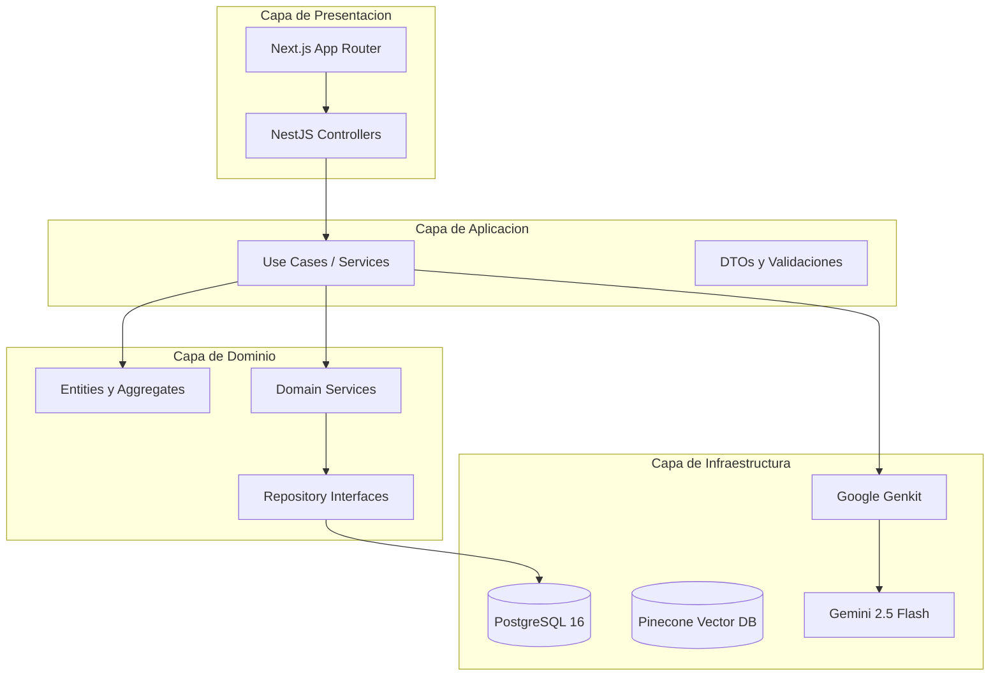
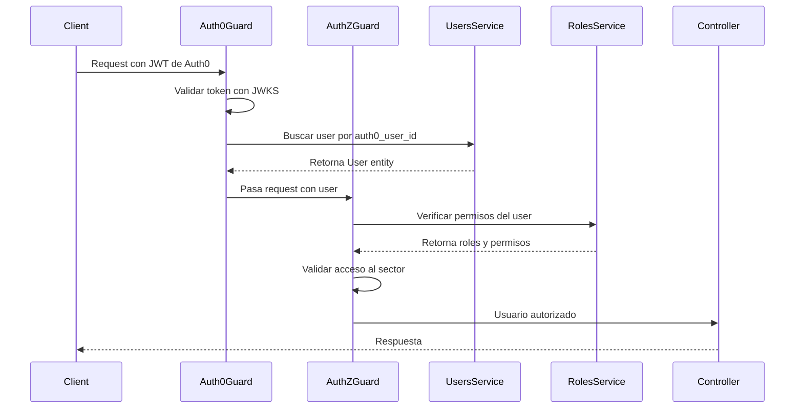
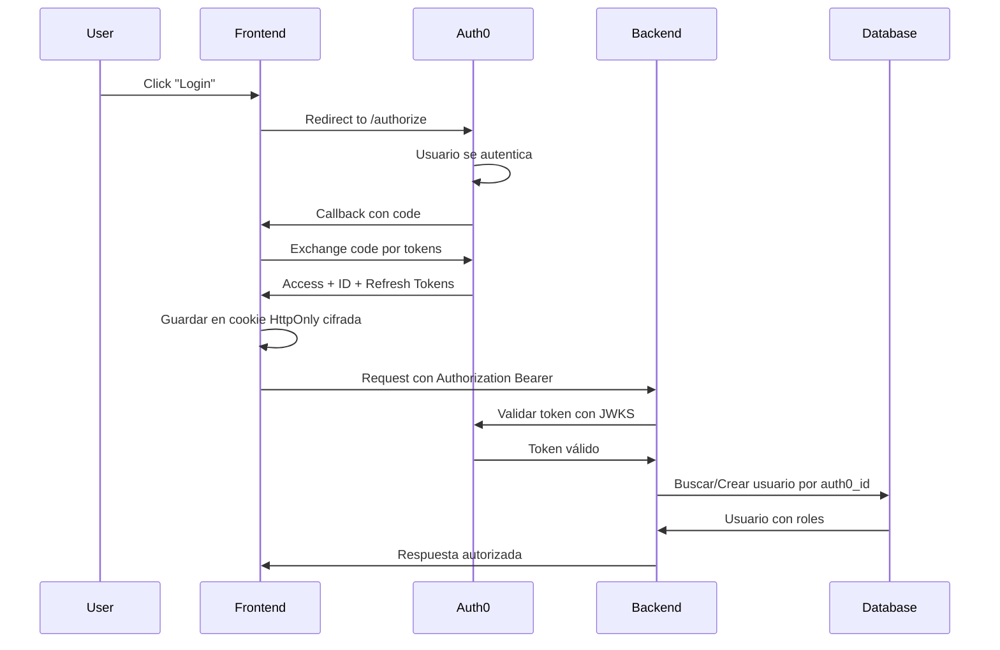

# Plan de Desarrollo: Context.ai MVP

## Fase 1: Documentación Técnica Crítica

Crear los documentos esenciales que guiarán el desarrollo:

### 1.1 Arquitectura Técnica (`005-arquitectura-tecnica.md`)

Definir:

- Diagrama de arquitectura hexagonal (Clean Architecture) mostrando las 4 capas: Presentación, Aplicación, Dominio, Infraestructura
- Estructura de carpetas completa para backend (NestJS) y frontend (Next.js)
- Módulos de NestJS organizados por bounded contexts: `AuthModule`, `AuthorizationModule`, `OrganizationModule`, `KnowledgeModule`, `InteractionModule`
- Dependencias entre módulos y comunicación entre capas
- Separación clara: `AuthModule` valida identidad (Auth0), `AuthorizationModule` gestiona permisos (interno)

**Diagrama propuesto:**




### 1.2 Modelo de Datos (`006-modelo-datos.md`)

Definir esquema PostgreSQL con:

- Tablas principales: `users`, `roles`, `permissions`, `user_roles`, `role_permissions`, `knowledge_sources`, `fragments`, `conversations`, `messages`, `audit_logs`
- Relaciones y foreign keys
- **`[ACTUALIZACIÓN]`** Embeddings NO se almacenan en PostgreSQL — se usan en **Pinecone** (servicio externo)
- **`[ACTUALIZACIÓN]`** No se requiere extensión pgvector ni índices vectoriales en PostgreSQL

**Esquema real implementado (TypeORM):**

- `users`: id (UUID), auth0UserId (unique), email, name, isActive, createdAt, updatedAt, lastLoginAt — ManyToMany con roles
- `roles`: id (UUID), name (ADMIN/CONTENT_MANAGER/USER/VIEWER), description, isSystemRole, createdAt, updatedAt — ManyToMany con users y permissions
- `permissions`: id (UUID), name, description, resource, action, isSystemPermission, createdAt, updatedAt
- `knowledge_sources`: id (UUID), title, sectorId, sourceType (PDF/MARKDOWN/WEB_LINK), content, status (PENDING/PROCESSING/COMPLETED/FAILED/DELETED), errorMessage, metadata (jsonb), createdAt, updatedAt, deletedAt (soft delete)
- `fragments`: id (UUID), sourceId, content, position, tokenCount, metadata (jsonb), createdAt, updatedAt — **Sin campo embedding**
- `conversations`: id (UUID), userId, sectorId, createdAt, updatedAt, deletedAt (soft delete) — OneToMany messages
- `messages`: id (UUID), conversationId, role (USER/ASSISTANT/SYSTEM), content, metadata (jsonb), createdAt
- `audit_logs`: id (UUID), eventType, userId, ipAddress, userAgent, metadata (jsonb), createdAt

### 1.3 Contratos API (`007-contratos-api.md`)

Especificar endpoints REST para el MVP:**Knowledge Context:**

- `POST /api/knowledge/sources` - Subir documento (UC2)
- `GET /api/knowledge/sources/:sectorId` - Listar documentos del sector
- `POST /api/knowledge/ingest` - Procesar y generar embeddings

**Interaction Context:**

- `POST /api/chat/query` - Enviar pregunta al asistente (UC5)
- `GET /api/chat/conversations/:userId` - Historial de conversaciones
- `POST /api/chat/feedback` - Calificar respuesta

**Authorization Context:**

- `POST /api/auth/sync` - Sincronizar usuario de Auth0 con BD interna
- `GET /api/roles` - Listar roles disponibles
- `PUT /api/users/:id/roles` - Asignar roles a usuario (admin only)
- `GET /api/users/me/permissions` - Obtener permisos del usuario actual

**DTOs esperados (definidos en `context-ai-shared`):**

```typescript
// IngestDocumentDto
export class IngestDocumentDto {
  sectorId: string;
  sourceType: SourceType;
  title: string;
  file: File; // Solo en frontend, backend recibe multipart
  metadata?: Record<string, any>;
}

// ChatQueryDto
export class ChatQueryDto {
  conversationId?: string;
  sectorId: string;
  message: string;
}

// ChatResponseDto
export class ChatResponseDto {
  response: string;
  sources: SourceFragment[];
  conversationId: string;
  timestamp: Date;
}
```


### 1.4 Roadmap MVP (`008-roadmap.md`)

Definir:

- **MVP Scope**: UC2 (Subir docs) + UC5 (Chat RAG) + Autenticación básica
- **Post-MVP**: UC1 (RBAC), UC3/UC6 (Multimedia/Onboarding), UC4/UC7 (Analytics)
- **Criterios de aceptación del MVP**:
- Usuario puede autenticarse
- Admin puede subir PDF/MD a un sector
- Usuario puede hacer preguntas y recibir respuestas basadas en los documentos
- Respuestas muestran las fuentes (chunks) utilizadas

---

## Fase 2: Setup del Proyecto

### 2.1 Estructura de Carpetas Multi-Repo

Crear tres repositorios independientes:**Repositorio 1: `context-ai-shared`** (Paquete de Tipos Compartidos)

```javascript
context-ai-shared/
├── src/
│   ├── dto/
│   │   ├── auth/
│   │   │   ├── login.dto.ts
│   │   │   └── user.dto.ts
│   │   ├── knowledge/
│   │   │   ├── ingest-document.dto.ts
│   │   │   ├── knowledge-source.dto.ts
│   │   │   └── fragment.dto.ts
│   │   ├── interaction/
│   │   │   ├── chat-query.dto.ts
│   │   │   ├── chat-response.dto.ts
│   │   │   └── message.dto.ts
│   │   └── index.ts
│   ├── types/
│   │   ├── entities/
│   │   │   ├── user.type.ts
│   │   │   ├── sector.type.ts
│   │   │   └── role.type.ts
│   │   ├── enums/
│   │   │   ├── source-type.enum.ts
│   │   │   ├── role-type.enum.ts
│   │   │   └── message-role.enum.ts
│   │   └── index.ts
│   ├── validators/
│   │   └── index.ts
│   └── index.ts
├── .npmrc
├── package.json
├── pnpm-lock.yaml
├── tsconfig.json
└── README.md
```

**Repositorio 2: `context-ai-api`** (Backend) — `[ACTUALIZACIÓN]` Estructura real implementada:

```javascript
context-ai-api/
├── src/
│   ├── modules/
│   │   ├── auth/                    # Autenticación + Autorización (combinado)
│   │   │   ├── guards/              # JwtAuthGuard, RbacGuard
│   │   │   ├── strategies/          # JwtStrategy (JWKS)
│   │   │   ├── application/services/# PermissionService
│   │   │   ├── infrastructure/persistence/models/  # RoleModel, PermissionModel
│   │   │   ├── auth.module.ts
│   │   │   └── auth.service.ts
│   │   ├── audit/                   # [NUEVO] Módulo de auditoría
│   │   │   ├── application/services/
│   │   │   └── infrastructure/persistence/models/
│   │   ├── users/                   # [NUEVO] Módulo de usuarios
│   │   │   ├── api/controllers/
│   │   │   ├── application/services/
│   │   │   └── infrastructure/persistence/models/
│   │   ├── knowledge/               # Gestión de conocimiento
│   │   │   ├── domain/entities/     # KnowledgeSource, Fragment
│   │   │   ├── application/use-cases/  # IngestDocument, DeleteSource
│   │   │   ├── infrastructure/
│   │   │   │   ├── persistence/     # TypeORM models, mappers, repos
│   │   │   │   └── services/        # DocumentParser, Chunking, Embedding, Pinecone
│   │   │   └── presentation/        # KnowledgeController, DTOs
│   │   └── interaction/             # Chat/RAG
│   │       ├── domain/entities/     # Conversation, Message
│   │       ├── application/use-cases/  # QueryAssistant
│   │       ├── infrastructure/persistence/
│   │       └── presentation/        # InteractionController, DTOs
│   ├── shared/
│   │   ├── constants/               # Shared constants
│   │   ├── decorators/              # CurrentUser, Roles
│   │   ├── genkit/                  # Genkit config, RAG flow, evaluators
│   │   ├── prompts/                 # System prompts
│   │   ├── types/                   # Shared types
│   │   └── validators/              # Domain validators
│   ├── config/
│   └── main.ts
├── test/
│   ├── unit/                        # Unit tests (Jest)
│   ├── integration/                 # Integration tests
│   ├── e2e/                         # E2E tests
│   ├── contract/                    # Contract tests
│   └── security/                    # Security tests
├── docs/                            # Code analysis docs
├── Dockerfile
├── .env.example
├── tsconfig.json
└── package.json
```

**Repositorio 3: `context-ai-front`** (Frontend) — `[ACTUALIZACIÓN]` Estructura real implementada:

```javascript
context-ai-front/
├── src/
│   ├── app/
│   │   ├── [locale]/               # next-intl locale routing (ES/EN)
│   │   │   ├── (auth)/             # Login page
│   │   │   ├── (protected)/        # Auth-required routes
│   │   │   │   ├── chat/           # Chat page
│   │   │   │   ├── knowledge/upload/  # Knowledge upload
│   │   │   │   ├── dashboard/      # Dashboard
│   │   │   │   └── layout.tsx      # Protected layout (auth check + providers)
│   │   │   ├── layout.tsx          # Root locale layout
│   │   │   └── page.tsx            # Landing page
│   │   └── api/auth/[...nextauth]/ # NextAuth.js v5 route handler
│   ├── components/
│   │   ├── chat/                   # ChatContainer, MarkdownRenderer, etc.
│   │   ├── knowledge/
│   │   ├── ui/                     # shadcn/ui components
│   │   └── shared/                 # ErrorBoundary, etc.
│   ├── hooks/                      # useCurrentUser, use-mobile, etc.
│   ├── lib/
│   │   ├── api/                    # client.ts, chat.api.ts, user.api.ts, error-handler.ts
│   │   ├── providers/              # QueryProvider, IntlProvider
│   │   └── utils/                  # image-config.ts, etc.
│   ├── stores/                     # Zustand: chat.store, user.store
│   ├── types/                      # TypeScript types
│   ├── auth.ts                     # NextAuth.js v5 config with Auth0 provider
│   ├── i18n.ts                     # next-intl config
│   └── test/setup.ts               # Vitest setup
├── e2e/                            # Playwright E2E tests
├── messages/                       # i18n: es.json, en.json
├── scripts/docker-entrypoint.sh    # Docker env injection
├── middleware.ts                    # next-intl locale middleware
├── Dockerfile
├── env.local.example
├── vitest.config.ts
├── playwright.config.ts
└── package.json
```

**Gestión de DTOs compartidos:**Los DTOs y tipos se centralizan en `context-ai-shared` y se publican como paquete npm privado `@context-ai/shared`.**Publicación:** GitHub Packages (vinculado al repositorio de GitHub) usando pnpm.**¿Por qué pnpm?**

- Espacio en disco: Usa enlaces simbólicos y un store global (ahorra ~50% de espacio)
- Velocidad: Instalaciones paralelas más rápidas que npm
- Seguridad: Estructura node_modules más estricta que previene acceso a dependencias no declaradas
- Monorepos: Mejor soporte nativo para workspaces

### 2.2 Configuración del Paquete Compartido

**`context-ai-shared/package.json`:** — `[ACTUALIZACIÓN]` Implementación real usa Zod en lugar de class-validator:

```json
{
  "name": "@context-ai/shared",
  "version": "0.1.0",
  "main": "dist/index.js",
  "types": "dist/index.d.ts",
  "files": ["dist"],
  "scripts": {
    "build": "tsc",
    "prepare": "pnpm build"
  },
  "dependencies": {
    "zod": "^3.24.4"
  },
  "devDependencies": {
    "typescript": "^5.8.3",
    "@types/node": "^22.15.17"
  }
}
```

**⚠️ NOTA IMPORTANTE - Estrategia de Publicación:**

Durante el desarrollo del MVP, **NO publicaremos** `@context-ai/shared` a GitHub Packages. En su lugar:
- Usaremos `pnpm link` para desarrollo local
- O configuraremos un monorepo con workspaces
- **La publicación a GitHub Packages se realizará AL FINALIZAR EL MVP**

Esto permite:
- ✅ Desarrollo más rápido (sin publicar en cada cambio)
- ✅ Iteración ágil en los DTOs
- ✅ Menos configuración de tokens durante desarrollo

**Publicar a GitHub Packages (POST-MVP):**

```bash
# Al finalizar el MVP, publicar versión 0.1.0
cd context-ai-shared
export GITHUB_TOKEN=ghp_tu_token_aqui
pnpm publish --access public
```

**`.npmrc` en la raíz de cada proyecto para consumir el paquete (POST-MVP):**

```javascript
@context-ai:registry=https://npm.pkg.github.com
//npm.pkg.github.com/:_authToken=${GITHUB_TOKEN}
```

**Configuración de pnpm:**

```bash
# Instalar pnpm globalmente si no está instalado
npm install -g pnpm

# O usando corepack (recomendado en Node.js 16.13+)
corepack enable
corepack prepare pnpm@latest --activate
```

**`.npmrc` adicional para pnpm (opcional en cada proyecto):**

```javascript
# Autoinstall peers
auto-install-peers=true

# Usar store compartido
store-dir=~/.pnpm-store

# Strictness (recomendado)
shamefully-hoist=false
```

**Ventajas de pnpm:**

- Ahorra espacio en disco usando enlaces simbólicos y store global
- Instalaciones más rápidas con paralelización inteligente
- Seguridad mejorada: no permite importar paquetes no declarados

### 2.3 Dependencias Backend — `[ACTUALIZACIÓN]` Stack real

Inicializar NestJS con pnpm:

```bash
# Crear proyecto NestJS 11+
pnpm dlx @nestjs/cli new context-ai-api --package-manager pnpm

# Instalar dependencias core
pnpm add @nestjs/core @nestjs/common @nestjs/config
pnpm add @nestjs/typeorm typeorm pg
pnpm add @genkit-ai/core @genkit-ai/googleai    # Genkit para RAG
pnpm add @pinecone-database/pinecone             # [ACTUALIZACIÓN] Vector store (reemplaza pgvector)
pnpm add jwks-rsa                                 # JWT validation con JWKS
pnpm add @nestjs/passport passport passport-jwt   # Passport JWT strategy
pnpm add class-validator class-transformer        # DTO validation
pnpm add helmet express-rate-limit                # Security
pnpm add pdf-parse                                # [ACTUALIZACIÓN] PDF parsing
pnpm add zod                                      # Schema validation
pnpm add winston nest-winston                     # Logging
pnpm add @context-ai/shared@latest

# Dependencias de desarrollo
pnpm add -D @types/node @types/passport typescript
pnpm add -D jest @types/jest ts-jest              # [ACTUALIZACIÓN] Jest (no Vitest)
```


### 2.4 Dependencias Frontend — `[ACTUALIZACIÓN]` Stack real

Inicializar Next.js con pnpm:

```bash
# Crear proyecto Next.js 16+ con React 19
pnpm dlx create-next-app@latest context-ai-front --typescript --tailwind --app --use-pnpm

# Instalar dependencias
pnpm add @tanstack/react-query axios zustand       # State & API
pnpm add next-auth@5.0.0-beta.30                   # [ACTUALIZACIÓN] NextAuth.js v5 (reemplaza @auth0/nextjs-auth0)
pnpm add next-intl@^4.8.2                          # [ACTUALIZACIÓN] i18n
pnpm add lucide-react                               # Icons
pnpm add react-markdown remark-gfm react-syntax-highlighter  # Markdown rendering
pnpm add date-fns                                   # Date formatting
pnpm add @sentry/nextjs                             # Error tracking
pnpm add @context-ai/shared@latest

# UI components via shadcn/ui (CLI)
pnpm dlx shadcn@latest init

# Dependencias de desarrollo
pnpm add -D @types/node
pnpm add -D vitest @testing-library/react @testing-library/jest-dom  # Unit tests
pnpm add -D @playwright/test                        # [ACTUALIZACIÓN] E2E tests
pnpm add -D @testing-library/user-event jsdom
```


### 2.4 Configuración PostgreSQL — `[ACTUALIZACIÓN]` Sin pgvector

`docker-compose.yml` en `context-ai-api/`:

```yaml
version: '3.8'

services:
  postgres:
    image: postgres:16-alpine    # [ACTUALIZACIÓN] No se necesita pgvector
    container_name: contextai-db
    environment:
      POSTGRES_DB: contextai
      POSTGRES_USER: dev
      POSTGRES_PASSWORD: dev123
    ports:
    - "5432:5432"
    volumes:
    - pgdata:/var/lib/postgresql/data
    healthcheck:
      test: ["CMD-SHELL", "pg_isready -U dev -d contextai"]
      interval: 10s
      timeout: 5s
      retries: 5

volumes:
  pgdata:
```

> **`[ACTUALIZACIÓN]`** No se requieren extensiones de PostgreSQL adicionales. Los embeddings se almacenan en **Pinecone** (servicio externo). TypeORM gestiona el esquema con `synchronize: true` en desarrollo.


### 2.6 Variables de Entorno

**Backend: `context-ai-api/.env.example`** — `[ACTUALIZACIÓN]` Variables reales:

```bash
# Server
NODE_ENV=development
PORT=3001
API_PREFIX=api/v1

# Database
DB_HOST=localhost
DB_PORT=5432
DB_USERNAME=dev
DB_PASSWORD=dev123
DB_DATABASE=contextai

# Auth0 / JWT
AUTH0_DOMAIN=your-tenant.auth0.com
AUTH0_AUDIENCE=https://api.contextai.com
JWKS_URI=https://your-tenant.auth0.com/.well-known/jwks.json

# AI Services - Genkit
GOOGLE_GENAI_API_KEY=your-gemini-api-key
GENKIT_ENV=dev

# Pinecone - [ACTUALIZACIÓN] Vector Store
PINECONE_API_KEY=your-pinecone-api-key
PINECONE_INDEX=context-ai

# Internal API Key (server-to-server sync)
INTERNAL_API_KEY=your-internal-api-key

# CORS & Security
FRONTEND_URL=http://localhost:3000

# Observability
SENTRY_DSN=your-sentry-dsn
```

**Frontend: `context-ai-front/.env.local.example`** — `[ACTUALIZACIÓN]` Usa NextAuth.js v5:

```bash
# NextAuth.js v5 con Auth0 provider
AUTH_SECRET=your-nextauth-secret
AUTH_AUTH0_ID=your-auth0-client-id
AUTH_AUTH0_SECRET=your-auth0-client-secret
AUTH_AUTH0_ISSUER=https://your-tenant.auth0.com

# API
NEXT_PUBLIC_API_URL=http://localhost:3001/api/v1
API_INTERNAL_KEY=your-internal-api-key

# Observability
NEXT_PUBLIC_SENTRY_DSN=your-sentry-dsn
SENTRY_AUTH_TOKEN=your-sentry-auth-token
```

---

## Fase 3: Implementación del Core - Knowledge Context

**Metodología: TDD (Test-Driven Development) - Ciclo Red-Green-Refactor**Cada feature se desarrollará siguiendo:

1. 🔴 **Red**: Escribir el test que falla
2. 🟢 **Green**: Escribir el código mínimo para que pase
3. 🔵 **Refactor**: Mejorar el código manteniendo tests en verde

### 3.1 Domain Layer (Knowledge) - TDD

**Paso 1: Tests primero** (`test/unit/modules/knowledge/domain/`)

```typescript
// entities/knowledge-source.entity.spec.ts
describe('KnowledgeSource', () => {
  it('should create a knowledge source with valid data', () => {
    // Red: Este test fallará inicialmente
    const source = new KnowledgeSource({
      title: 'Manual de Vacaciones',
      sectorId: 'sector-123',
      sourceType: SourceType.PDF,
    });
    
    expect(source.title).toBe('Manual de Vacaciones');
    expect(source.isValid()).toBe(true);
  });
  
  it('should fail with invalid sector', () => {
    expect(() => {
      new KnowledgeSource({ title: 'Test', sectorId: '', sourceType: SourceType.PDF });
    }).toThrow();
  });
});
```

**Paso 2: Implementación** (hacer que los tests pasen)Crear entidades siguiendo DDD en `context-ai-api/src/modules/knowledge/domain/`:

- `entities/knowledge-source.entity.ts` - Aggregate Root
- `entities/fragment.entity.ts` - Entidad para chunks
- `value-objects/vector-embedding.vo.ts`
- `repositories/knowledge.repository.interface.ts`

**Paso 3: Refactorizar** manteniendo tests en verde

### 3.2 Infrastructure Layer - TDD

**Tests primero** (`test/unit/modules/knowledge/infrastructure/`):

```typescript
// services/chunking.service.spec.ts
describe('ChunkingService', () => {
  it('should split text into chunks of 500 tokens', () => {
    const service = new ChunkingService({ chunkSize: 500, overlap: 50 });
    const text = 'Lorem ipsum...'; // texto largo
    const chunks = service.chunk(text);
    
    expect(chunks.length).toBeGreaterThan(0);
    expect(chunks[0].tokens).toBeLessThanOrEqual(500);
  });
  
  it('should create overlapping chunks', () => {
    const service = new ChunkingService({ chunkSize: 500, overlap: 50 });
    const chunks = service.chunk(longText);
    
    // Verificar que hay overlap entre chunks consecutivos
    expect(chunks[1].content).toContain(chunks[0].content.slice(-100));
  });
});

// services/embedding.service.spec.ts
describe('EmbeddingService', () => {
  it('should generate vector embeddings', async () => {
    const service = new EmbeddingService(mockGenkit);
    const embedding = await service.generateEmbedding('Test text');
    
    // [ACTUALIZACIÓN] gemini-embedding-001 genera embeddings de 3072 dimensiones
    expect(embedding).toHaveLength(3072);
    expect(embedding[0]).toBeTypeOf('number');
  });
});
```

Implementar en `context-ai-api/src/modules/knowledge/infrastructure/`:

- `repositories/typeorm-knowledge.repository.ts` - Implementación de repositorio
- `services/document-parser.service.ts` - Parsear PDFs/MD (usar `pdf-parse`, `marked`)
- `services/chunking.service.ts` - Fragmentación de texto (estrategia sliding window)
- `services/embedding.service.ts` - Generar embeddings con Genkit

**Chunking strategy:**

```typescript
// Fragmentar en bloques de 500 tokens con overlap de 50
chunkSize: 500
overlap: 50
```


### 3.3 Application Layer - TDD

**Tests de Use Cases primero** (`test/unit/modules/knowledge/application/`):

```typescript
// use-cases/ingest-document.use-case.spec.ts
describe('IngestDocumentUseCase', () => {
  let useCase: IngestDocumentUseCase;
  let mockRepository: MockKnowledgeRepository;
  let mockEmbeddingService: MockEmbeddingService;
  
  beforeEach(() => {
    mockRepository = new MockKnowledgeRepository();
    mockEmbeddingService = new MockEmbeddingService();
    useCase = new IngestDocumentUseCase(mockRepository, mockEmbeddingService);
  });
  
  it('should ingest a PDF document and create fragments', async () => {
    const dto = {
      sectorId: 'sector-123',
      file: pdfBuffer,
      title: 'Manual',
      sourceType: SourceType.PDF
    };
    
    const result = await useCase.execute(dto);
    
    expect(result.source.id).toBeDefined();
    expect(result.fragmentsCount).toBeGreaterThan(0);
    expect(mockRepository.save).toHaveBeenCalled();
  });
  
  it('should generate embeddings for each fragment', async () => {
    await useCase.execute(validDto);
    
    expect(mockEmbeddingService.generateEmbedding).toHaveBeenCalledTimes(expectedChunks);
  });
});
```

Crear use cases en `context-ai-api/src/modules/knowledge/application/`:

- `use-cases/ingest-document.use-case.ts`

1. Recibir archivo
2. Parsear contenido
3. Fragmentar texto
4. Generar embeddings por chunk
5. Guardar en DB con vector

### 3.4 Presentation Layer

Controlador REST en `context-ai-api/src/modules/knowledge/presentation/`:

- `controllers/knowledge.controller.ts`
- Endpoint `POST /api/knowledge/sources` con multipart/form-data
- Validación de DTOs con class-validator

---

## Fase 4: Implementación del Core - Interaction Context (RAG)

**Metodología: TDD - Ciclo Red-Green-Refactor**

### 4.1 Google Genkit Setup - TDD

**Tests de integración para Genkit** (`test/integration/genkit/`):

```typescript
// flows/rag-query.flow.spec.ts
describe('RAG Query Flow', () => {
  it('should retrieve relevant fragments and generate response', async () => {
    const input = {
      query: '¿Cómo pido vacaciones?',
      sectorId: 'rrhh-sector'
    };
    
    const result = await runFlow(ragQueryFlow, input);
    
    expect(result.response).toBeDefined();
    expect(result.sources).toHaveLength(5);
    expect(result.sources[0].similarity).toBeGreaterThan(0.7);
  });
});
```

Configurar en `context-ai-api/src/shared/genkit/`:

- `genkit.config.ts` - Inicializar Genkit con Gemini 2.5 Flash y gemini-embedding-001
- `flows/rag-query.flow.ts` - Definir flujo RAG
- `evaluators/` - Evaluadores de Faithfulness y Relevancy

**Flow structure:** — `[ACTUALIZACIÓN]` Implementación real:

```typescript
export const ragQueryFlow = defineFlow({
  name: 'ragQuery',
  inputSchema: z.object({ query: z.string(), sectorId: z.string() }),
  outputSchema: z.object({ response: z.string(), sources: z.array(...) })
}, async (input) => {
  // 1. Generate query embedding con gemini-embedding-001 (3072d)
  // 2. Similarity search en Pinecone (no pgvector)
  // 3. Build prompt con context y system prompt
  // 4. Call Gemini 2.5 Flash
  // 5. Return structured response con source citations
});
```


### 4.2 Domain Layer (Interaction)

Crear en `context-ai-api/src/modules/interaction/domain/`:

- `entities/conversation.entity.ts` - Aggregate Root
- `entities/message.entity.ts`
- `services/rag-orchestrator.service.ts` - Domain service para coordinar RAG

### 4.3 Application Layer

Implementar en `context-ai-api/src/modules/interaction/application/`:

- `use-cases/query-assistant.use-case.ts`

1. Validar permisos de usuario en sector
2. Llamar a Genkit flow
3. Persistir mensaje y respuesta
4. Retornar respuesta con fuentes

### 4.4 Vector Search — `[ACTUALIZACIÓN]` Pinecone en lugar de pgvector

La búsqueda vectorial se realiza contra **Pinecone**, no PostgreSQL:

```typescript
// PineconeVectorStoreService.search()
const results = await this.index.query({
  vector: queryEmbedding,      // 3072d embedding del query
  topK: 5,
  filter: { sectorId: { $eq: sectorId } },  // Filtro por sector
  includeMetadata: true,
});
```


### 4.5 Prompt Engineering

Definir system prompt en `context-ai-api/src/modules/interaction/application/prompts/`:

```javascript
Eres un asistente de onboarding para [Empresa].
Responde ÚNICAMENTE basándote en la documentación proporcionada.
Si no encuentras la respuesta, di "No tengo información sobre eso en la documentación actual".

Contexto:
{retrieved_chunks}

Pregunta: {user_query}
```

---

## Fase 5: Frontend - Chat Interface

### 5.1 Arquitectura Frontend

Crear en `context-ai-front/`:

- `app/chat/page.tsx` - Página principal del chat
- `components/chat/MessageList.tsx` - Historial de mensajes
- `components/chat/MessageInput.tsx` - Input para preguntas
- `components/chat/SourceCard.tsx` - Mostrar fuentes utilizadas
- `lib/api/chat.api.ts` - Cliente API con axios

### 5.2 State Management

Usar Zustand para estado global:

```typescript
// stores/chat.store.ts
interface ChatState {
  messages: Message[]
  isLoading: boolean
  sendMessage: (text: string) => Promise<void>
}
```


### 5.3 UI/UX

Implementar:

- Chat interface estilo moderno (inspirado en ChatGPT/Claude)
- Markdown rendering para respuestas
- Loading states con skeleton
- Error boundaries
- Expansión de fuentes citadas (acordeón)

---

## Fase 6: Autenticación con Auth0 y Autorización Interna

### 6.1 Backend: Validación de Tokens Auth0

Crear `context-ai-api/src/modules/auth/`:**Estrategia de validación:**

- `auth0.strategy.ts` - Validar tokens JWT de Auth0 usando JWKS
- `auth0.guard.ts` - Guard que valida el token y extrae el `auth0_user_id`
- Middleware que busca/crea usuario en BD al primer login

**Configuración:**

```typescript
// auth0.strategy.ts
import { passportJwtSecret } from 'jwks-rsa';

export const auth0Strategy = {
  secretOrKeyProvider: passportJwtSecret({
    cache: true,
    rateLimit: true,
    jwksUri: `https://${process.env.AUTH0_DOMAIN}/.well-known/jwks.json`
  }),
  audience: process.env.AUTH0_AUDIENCE,
  issuer: `https://${process.env.AUTH0_DOMAIN}/`,
  algorithms: ['RS256']
};
```


### 6.2 Backend: Sistema de Autorización con Roles

Crear `context-ai-api/src/modules/authorization/`:**Gestión de roles interna:**

- `roles.service.ts` - CRUD de roles y permisos
- `authorization.guard.ts` - Guard que verifica permisos basados en roles
- `decoradores/require-permission.decorator.ts` - `@RequirePermission('knowledge:write')`
- `decoradores/require-sector-access.decorator.ts` - `@RequireSectorAccess()`

**Flujo de autorización:**



**Ejemplo de uso:**

```typescript
@Controller('knowledge')
@UseGuards(Auth0Guard, AuthorizationGuard)
export class KnowledgeController {
  
  @Post('sources')
  @RequirePermission('knowledge:write')
  @RequireSectorAccess()
  async uploadDocument(
    @CurrentUser() user: User,
    @Body() dto: IngestDocumentDto
  ) {
    // Usuario ya está autenticado y autorizado
    return this.knowledgeService.ingest(dto, user);
  }
}
```

**Modelo de permisos:**

- `knowledge:read` - Leer documentos
- `knowledge:write` - Subir documentos
- `chat:query` - Hacer consultas al asistente
- `admin:manage_sectors` - Gestionar sectores
- `admin:manage_roles` - Gestionar roles

### 6.3 Frontend: Integración con Auth0 — `[ACTUALIZACIÓN]` NextAuth.js v5

> **Cambio importante:** Se migró de `@auth0/nextjs-auth0` a **NextAuth.js v5** (`next-auth@5.0.0-beta.30`) con Auth0 como provider. Esto permite mayor flexibilidad y mejor integración con el ecosistema de Next.js.

**Setup en `src/auth.ts`:**

```typescript
// src/auth.ts - NextAuth.js v5 configuration
import NextAuth from 'next-auth';
import Auth0Provider from 'next-auth/providers/auth0';

export const { handlers, signIn, signOut, auth } = NextAuth({
  providers: [
    Auth0Provider({
      clientId: process.env.AUTH_AUTH0_ID!,
      clientSecret: process.env.AUTH_AUTH0_SECRET!,
      issuer: process.env.AUTH_AUTH0_ISSUER!,
    }),
  ],
  callbacks: {
    async jwt({ token, account }) {
      if (account) {
        token.accessToken = account.access_token;
      }
      return token;
    },
    async session({ session, token }) {
      // Sync user with backend on session
      session.accessToken = token.accessToken as string;
      return session;
    },
  },
});
```

**API Route handler:**

```typescript
// src/app/api/auth/[...nextauth]/route.ts
import { handlers } from '@/auth';
export const { GET, POST } = handlers;
```

**Protected layout:**

```typescript
// src/app/[locale]/(protected)/layout.tsx
import { auth } from '@/auth';
import { redirect } from 'next/navigation';

export default async function ProtectedLayout({ children }) {
  const session = await auth();
  if (!session) redirect('/auth/login');
  
  return (
    <SessionProvider session={session}>
      <QueryProvider>
        {children}
      </QueryProvider>
    </SessionProvider>
  );
}
```

**Middleware (combinado con i18n):**

```typescript
// middleware.ts
import createMiddleware from 'next-intl/middleware';

export default createMiddleware({
  locales: ['es', 'en'],
  defaultLocale: 'es',
  localePrefix: 'always',
});
```

**Componente de login:**

```typescript
// Usa useSession de next-auth/react
'use client';
import { useSession, signIn, signOut } from 'next-auth/react';

export function LoginButton() {
  const { data: session, status } = useSession();
  
  if (status === 'loading') return <div>Loading...</div>;
  
  if (session) {
    return <button onClick={() => signOut()}>Logout</button>;
  }
  
  return <button onClick={() => signIn('auth0')}>Login</button>;
}
```


### 6.4 Sincronización de Usuarios

**Al primer login:**

1. Usuario hace clic en "Login" → Redirige a Auth0
2. Auth0 autentica al usuario
3. Auth0 redirige al callback con authorization code
4. SDK de Auth0 intercambia el code por tokens (Access + ID + Refresh)
5. Tokens se almacenan en cookie HttpOnly cifrada
6. Frontend redirige a `/chat` (ruta protegida)
7. Primera request al backend incluye `Authorization: Bearer <ACCESS_TOKEN>`
8. Backend valida el token con Auth0 y extrae `sub` (auth0_user_id)
9. Si el usuario no existe en BD, se crea automáticamente
10. Se asignan roles por defecto (ej: 'user')

**Flujo de seguridad:**



**Endpoint de sincronización:** — `[ACTUALIZACIÓN]` Implementado en `UserController`:

```typescript
// src/modules/users/api/controllers/user.controller.ts
@Post('sync')
async syncUser(@Body() dto: SyncUserDto) {
  // Llamado desde el frontend via NextAuth.js JWT callback
  return this.userService.syncUser({
    auth0UserId: dto.auth0UserId,
    email: dto.email,
    name: dto.name,
  });
}

@Get('profile')
@UseGuards(JwtAuthGuard)
async getProfile(@CurrentUser() user: AuthenticatedUser) {
  return this.userService.getProfile(user.userId);
}
```

**Sincronización desde NextAuth.js:** El callback JWT de NextAuth.js sincroniza automáticamente el usuario con el backend en cada inicio de sesión, usando un API key interno (`INTERNAL_API_KEY`) para la comunicación server-to-server.---

## Fase 7: Consolidación de Tests e Integración

**Nota**: Con TDD, los tests ya están escritos en cada fase. Esta fase se enfoca en:

### 7.1 Tests de Integración E2E

**Backend E2E** (`test/e2e/`):

```typescript
// flows/complete-rag-flow.e2e-spec.ts
describe('Complete RAG Flow (E2E)', () => {
  let app: INestApplication;
  let authToken: string;
  
  beforeAll(async () => {
    // Setup de la aplicación completa
    app = await createTestApp();
    authToken = await getTestAuthToken();
  });
  
  it('should complete full workflow: upload doc -> query -> get response', async () => {
    // 1. Subir documento
    const uploadResponse = await request(app.getHttpServer())
      .post('/api/knowledge/sources')
      .set('Authorization', `Bearer ${authToken}`)
      .attach('file', 'test/fixtures/manual-vacaciones.pdf')
      .field('sectorId', 'rrhh')
      .expect(201);
    
    // Esperar a que se procese
    await waitForProcessing(uploadResponse.body.sourceId);
    
    // 2. Hacer consulta
    const queryResponse = await request(app.getHttpServer())
      .post('/api/chat/query')
      .set('Authorization', `Bearer ${authToken}`)
      .send({
        message: '¿Cómo pido vacaciones?',
        sectorId: 'rrhh'
      })
      .expect(200);
    
    // 3. Verificar respuesta
    expect(queryResponse.body.response).toContain('15 días');
    expect(queryResponse.body.sources).toHaveLength(5);
    expect(queryResponse.body.sources[0].sourceId).toBe(uploadResponse.body.sourceId);
  });
  
  it('should isolate information by sector', async () => {
    // Subir doc en sector Tech
    await uploadDocument('tech-manual.pdf', 'tech');
    
    // Intentar consultar desde sector RRHH
    const response = await queryChat('contenido de tech-manual', 'rrhh');
    
    // No debería encontrar información del otro sector
    expect(response.sources).not.toContainSourceFrom('tech');
  });
});
```


### 7.2 Coverage y Calidad de Tests

**Configuración de coverage (Backend - Jest):**

```typescript
// package.json jest config (context-ai-api)
// [ACTUALIZACIÓN] El backend usa Jest 30
{
  "jest": {
    "coverageThreshold": {
      "global": {
        "branches": 80,
        "functions": 80,
        "lines": 80,
        "statements": 80
      }
    },
    "collectCoverageFrom": [
      "src/**/*.ts",
      "!src/main.ts",
      "!src/**/*.interface.ts",
      "!src/**/*.module.ts"
    ]
  }
}
```

**Scripts en package.json (Backend):**

```json
{
  "scripts": {
    "test": "jest",
    "test:watch": "jest --watch",
    "test:cov": "jest --coverage",
    "test:e2e": "jest --config ./test/jest-e2e.json",
    "test:integration": "jest --config ./test/jest-integration.json --runInBand",
    "test:contract": "jest test/contract/ --verbose",
    "test:security": "jest test/security/ --verbose"
  }
}
```

**Configuración de coverage (Frontend - Vitest):**

```typescript
// vitest.config.ts (context-ai-front)
export default defineConfig({
  test: {
    coverage: {
      provider: 'v8',
      thresholds: { lines: 80, branches: 70, functions: 75, statements: 80 },
    },
  },
});
```

**Scripts en package.json (Frontend):**

```json
{
  "scripts": {
    "test": "vitest",
    "test:watch": "vitest --watch",
    "test:cov": "vitest --coverage",
    "test:e2e": "playwright test",
    "test:e2e:ui": "playwright test --ui"
  }
}
```


### 7.3 Tests Frontend

**Component tests con Vitest + Testing Library**:

```typescript
// components/chat/MessageList.test.tsx
describe('MessageList', () => {
  it('should render messages with sources', () => {
    const messages = [
      { role: 'user', content: '¿Cómo pido vacaciones?' },
      { 
        role: 'assistant', 
        content: 'Debes pedirlas con 15 días de antelación',
        sources: [{ title: 'Manual RRHH', page: 5 }]
      }
    ];
    
    render(<MessageList messages={messages} />);
    
    expect(screen.getByText('¿Cómo pido vacaciones?')).toBeInTheDocument();
    expect(screen.getByText(/15 días/)).toBeInTheDocument();
    expect(screen.getByText('Manual RRHH')).toBeInTheDocument();
  });
});
```


### 7.4 Validación MVP

Verificar criterios de aceptación con tests automatizados:**Checklist de Tests E2E**:

- [x] Test: Usuario puede hacer login con Auth0
- [x] Test: Admin puede subir documento PDF a sector "Tech"
- [x] Test: Usuario pregunta "¿Cómo pido vacaciones?" y recibe respuesta correcta
- [x] Test: Respuesta muestra qué documento fue consultado
- [x] Test: No se mezcla información de diferentes sectores
- [x] Test: Access token en cookie HttpOnly es validado correctamente
- [x] Test: Autorización por roles funciona correctamente

**Comando para validar MVP**:

```bash
# Backend: Todos los tests
pnpm test:cov
pnpm test:e2e

# Frontend: Todos los tests
pnpm test
pnpm test:e2e  # Si usas Playwright

# Verificar que coverage cumple umbrales
pnpm test:cov -- --coverageThreshold='{"global":{"lines":80}}'
```

---

## Consideraciones de Implementación

### Metodología de Desarrollo: TDD

**Ciclo Red-Green-Refactor en cada feature:**

1. 🔴 **Red**: Escribir el test que define el comportamiento esperado (test falla)
2. 🟢 **Green**: Escribir el código mínimo para que el test pase
3. 🔵 **Refactor**: Mejorar el código sin cambiar funcionalidad (tests siguen en verde)

**Beneficios:**

- Diseño emergente y mejor arquitectura
- Código más testeable por diseño
- Documentación viva (los tests explican el comportamiento)
- Confianza para refactorizar
- Menos bugs en producción

**Estructura de tests:**

```javascript
context-ai-api/
├── src/
└── test/
    ├── unit/               # Tests unitarios (rápidos, aislados)
    │   └── modules/
    │       ├── knowledge/
    │       └── interaction/
    ├── integration/        # Tests de integración (BD, APIs externas)
    │   ├── repositories/
    │   └── genkit/
    └── e2e/               # Tests end-to-end (flujo completo)
        └── flows/
```

**Coverage mínimo requerido**: 80% en líneas, branches, functions y statements

### Observabilidad desde el Inicio

- Configurar Sentry en ambas apps
- Logging estructurado con Winston
- Genkit UI para debug de flows: `genkit start`

### Performance

- Índices en PostgreSQL para queries frecuentes
- Caching de embeddings generados
- Lazy loading en frontend

### Security

**Autenticación y Autorización:**

- Access Token JWT validado con JWKS en cada request al backend
- Cookies HttpOnly para almacenar tokens (protección contra XSS)
- SameSite=lax para protección contra CSRF
- Cookies cifradas con AUTH0_SECRET
- Refresh Token para renovación automática de sesión

**Comunicación Frontend-Backend:**

- CORS configurado para aceptar solo el dominio del frontend
- Access Token enviado en header `Authorization: Bearer <TOKEN>`
- Cookies no accesibles desde JavaScript del lado del cliente
- HTTPS obligatorio en producción

**Validación de Datos:**

- Validación de tipos de archivo (whitelist: pdf, md)
- Sanitización de inputs con class-validator
- Rate limiting en endpoints de IA (express-rate-limit)
- Secrets management con dotenv

**Headers de Seguridad:**

```typescript
// Backend: main.ts
app.use(helmet({
  contentSecurityPolicy: false,  // Next.js lo maneja
  crossOriginEmbedderPolicy: false,
}));

app.enableCors({
  origin: process.env.FRONTEND_URL,
  credentials: true,  // Permitir cookies
  methods: ['GET', 'POST', 'PUT', 'DELETE', 'PATCH'],
  allowedHeaders: ['Content-Type', 'Authorization'],
});
```


### Comunicación entre Repositorios

**Gestión de tipos compartidos con `context-ai-shared`:**

**🚀 Durante el desarrollo del MVP (Recomendado):**

Usar `pnpm link` para desarrollo local sin publicar:

```bash
# 1. En context-ai-shared (una sola vez)
cd context-ai-shared
pnpm link --global

# 2. En context-ai-api
cd ../context-ai-api
pnpm link --global @context-ai/shared

# 3. En context-ai-front
cd ../context-ai-front
pnpm link --global @context-ai/shared

# Ahora cualquier cambio en shared se refleja inmediatamente en api/front
```

**📦 Post-MVP: Flujo de trabajo con publicación:**

1. **Definir DTOs**: Crear/actualizar DTOs en `context-ai-shared/src/dto/`
2. **Publicar nueva versión**: `pnpm version patch && pnpm publish` en `context-ai-shared`
3. **Actualizar dependencia**: `pnpm update @context-ai/shared` en backend y frontend
4. **Versionado**: Usar semantic versioning (patch para fixes, minor para features, major para breaking changes)

**Flujo de trabajo (POST-MVP):**

```bash
# 1. Agregar nuevo DTO en context-ai-shared
cd context-ai-shared
# Editar src/dto/knowledge/new-feature.dto.ts
pnpm version minor
pnpm publish

# 2. Actualizar en backend
cd ../context-ai-api
pnpm update @context-ai/shared

# 3. Actualizar en frontend
cd ../context-ai-front
pnpm update @context-ai/shared
```

**Ejemplo de uso:** — `[ACTUALIZACIÓN]` Usa Zod en lugar de class-validator:

```typescript
// En context-ai-shared/src/dto/interaction/chat-query.dto.ts
import { z } from 'zod';

export const ChatQuerySchema = z.object({
  query: z.string().min(1).max(2000),
  conversationId: z.string().uuid().optional(),
  sectorId: z.string().min(1),
});

export type ChatQueryDto = z.infer<typeof ChatQuerySchema>;

// En context-ai-shared/src/types/enums/source-type.enum.ts
export enum SourceType {
  PDF = 'PDF',
  MARKDOWN = 'MARKDOWN',
  WEB_LINK = 'WEB_LINK',
}

// En context-ai-api (Backend)
import { SourceType } from '@context-ai/shared';
// Backend usa class-validator para DTOs de controller, shared para enums/types

// En context-ai-front (Frontend)
import { SourceType, MessageRole } from '@context-ai/shared';
// Frontend importa enums y tipos compartidos
```

**Ventajas:**

- Single source of truth para tipos
- Validaciones compartidas (class-validator)
- Autocompletado en ambos proyectos
- Refactoring seguro (cambiar en un lugar, actualizar en todos)

**Desarrollo local:**

- Backend corre en `localhost:3001`
- Frontend corre en `localhost:3000`
- CORS configurado en backend para aceptar requests del frontend con `credentials: true`
- Cookies funcionan en localhost (no requieren HTTPS en desarrollo)

### CI/CD Independiente

Cada repositorio tendrá su propio pipeline:**context-ai-shared:**

- Tests de tipos y validaciones
- Build del paquete TypeScript
- Publicación automática a GitHub Packages en tag/release

**context-ai-api:**

- Tests unitarios y e2e
- Build de Docker image
- Deploy a plataforma cloud (por definir)
- **Opciones recomendadas**: Railway, Render, Fly.io, AWS ECS, GCP Cloud Run, DigitalOcean App Platform, Azure Container Apps

**context-ai-front:**

- Tests de componentes
- Build de Next.js
- Deploy a plataforma de hosting (por definir)
- **Opciones recomendadas**: Vercel (optimizado para Next.js), Netlify, Cloudflare Pages, AWS Amplify

### Consideraciones para Selección de Plataforma de Deployment

**Backend (context-ai-api):**Requisitos:

- Soporte para contenedores Docker
- PostgreSQL 16 (sin extensiones especiales — `[ACTUALIZACIÓN]` pgvector ya no requerido)
- Acceso a Pinecone API (vector store externo)
- Variables de entorno seguras
- Escalabilidad automática
- Logs y monitoreo

Opciones a evaluar:| Plataforma | Pros | Contras | Precio Estimado (MVP) ||------------|------|---------|----------------------|| **Railway** | Setup sencillo, PostgreSQL incluido, Git deploy | Costos pueden crecer | ~$20-40/mes || **Render** | Free tier generoso, fácil setup | Cold starts en free tier | Free - $25/mes || **Fly.io** | Excelente performance, deploy global | Curva de aprendizaje | ~$10-30/mes || **GCP Cloud Run** | Serverless, escala a 0, integración con Cloud SQL | Más complejo de configurar | Pay-per-use || **DigitalOcean App Platform** | Precio predecible, simple | Menos flexible que contenedores directos | ~$30/mes || **AWS ECS/Fargate** | Muy escalable, muchos servicios | Complejo, curva de aprendizaje alta | ~$40+/mes |**Frontend (context-ai-front):**Requisitos:

- Soporte para Next.js con App Router
- Edge functions para Auth0
- Variables de entorno
- CDN global
- Preview deployments

Opciones a evaluar:| Plataforma | Pros | Contras | Precio Estimado (MVP) ||------------|------|---------|----------------------|| **Vercel** | Mejor experiencia para Next.js, creadores de Next.js | Vendor lock-in | Free - $20/mes || **Netlify** | Generoso free tier, fácil de usar | Performance menor que Vercel para Next.js | Free - $19/mes || **Cloudflare Pages** | CDN excelente, workers incluidos | Limitaciones en algunas features de Next.js | Free - $20/mes || **AWS Amplify** | Integración con AWS | Más complejo | ~$15+/mes |**Base de Datos:** — `[ACTUALIZACIÓN]` Solo PostgreSQL estándar (sin pgvector):

- PostgreSQL 16 estándar (no requiere extensiones especiales)
- Embeddings almacenados en **Pinecone** (servicio gestionado externo)
- Backups automáticos para PostgreSQL

Opciones PostgreSQL:

- Incluido en Railway/Render
- Supabase, Neon (serverless)
- Cloud SQL (GCP), RDS (AWS), Azure Database

Opciones Vector Store:

- **Pinecone** (actual, plan gratuito disponible para MVP)

**Recomendación para empezar (MVP):**

- **Backend**: Railway o Render (más fácil para empezar)
- **Frontend**: Vercel (mejor experiencia con Next.js)
- **BD**: Usar el PostgreSQL incluido en Railway/Render

### Próximos Pasos Post-MVP

Una vez validado el MVP:

1. **📦 Publicar `@context-ai/shared` en GitHub Packages**
   - Crear GitHub Personal Access Token con scope `write:packages`
   - Publicar versión 0.1.0 como paquete público (o privado según decisión)
   - Actualizar `context-ai-api` y `context-ai-front` para consumir desde GitHub Packages
   - Documentar proceso de actualización de versiones
   
2. Implementar UC1 (RBAC completo con roles granulares)
3. Implementar UC3/UC6 (Generación multimedia y onboarding playlists)
4. Implementar UC4/UC7 (Analytics dashboard y feedback loop)
5. Optimizar embeddings (probar diferentes modelos)
6. Implementar caché de respuestas frecuentes
7. Setup CI/CD con GitHub Actions para los 3 repositorios